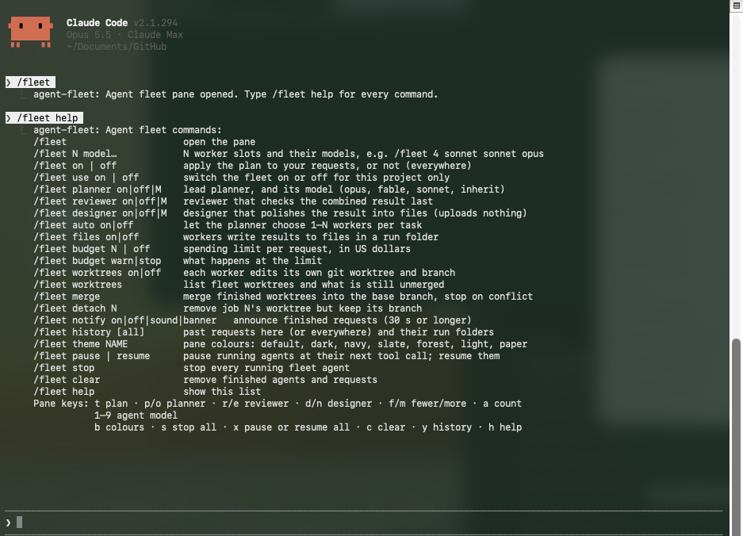
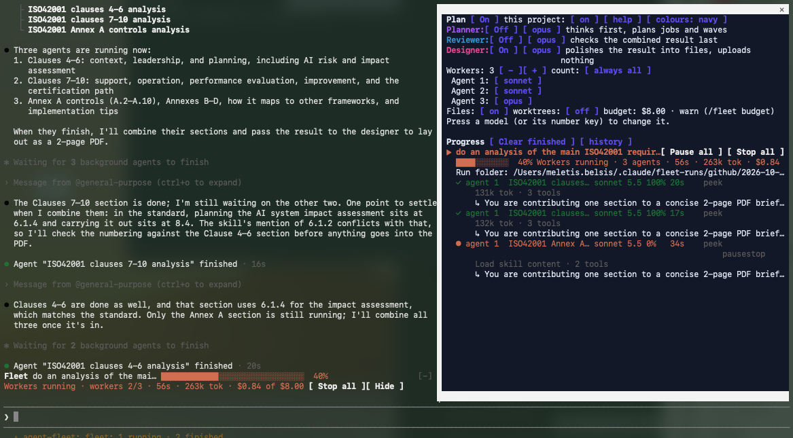
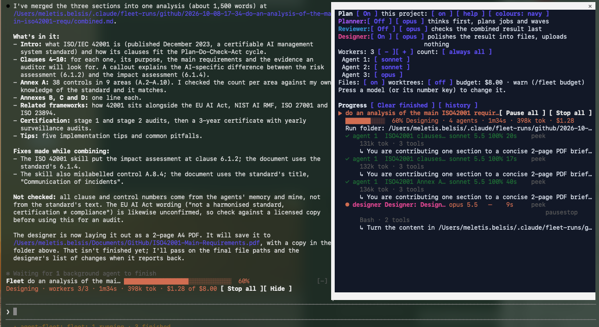
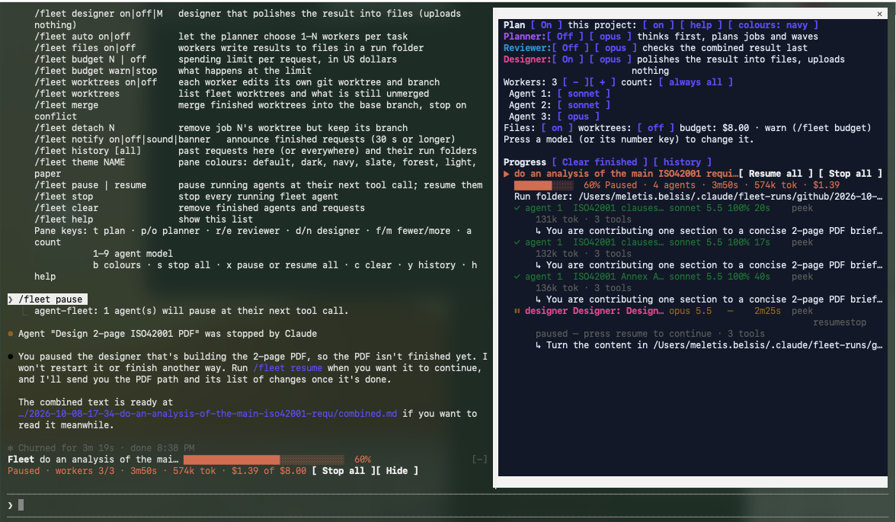
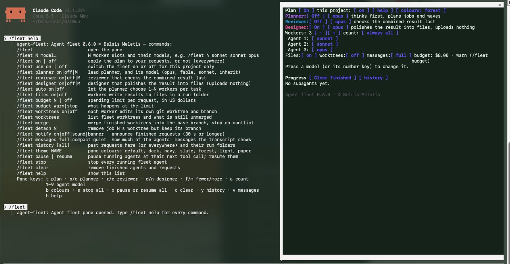
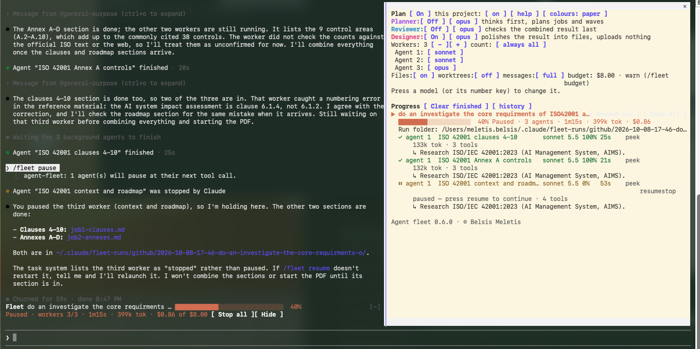
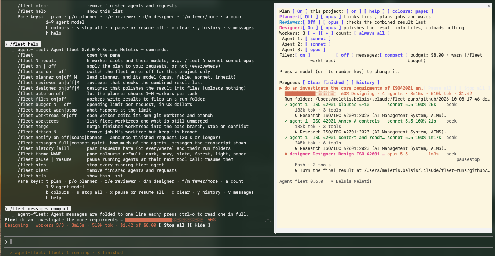
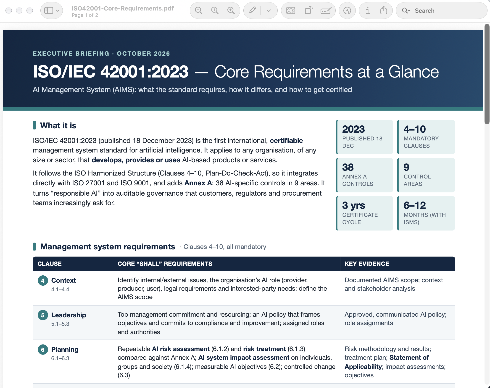

# Agent fleet for Claude Code

A Claude Code plugin that splits each task you give Claude across a fleet of subagents you configure — a lead planner, workers on the models you choose, a reviewer and a designer — and shows you what every one of them is doing.

Version 0.6.1 · © 2026 Belsis Meletis · free to use, see [Licence and disclaimer](#licence-and-disclaimer). This is a test plugin: try it on work you can afford to redo.

## How a request flows

```
you type a task
   │
   ▼
Planner ──── thinks it through, names the deliverable, writes one brief per worker,
   │         marks which jobs need others first ("## Job 3 … (after 1, 2)")
   ▼
Workers ──── run in parallel, wave by wave, each on its slot's model,
   │         each writing its result to the run folder
   ▼
Claude ───── combines the results
   ▼
Reviewer ─── checks facts and consistency, corrects the draft          (optional)
   ▼
Designer ─── turns it into finished files: .docx/.pdf, .pptx, a better (optional)
             web page, charts — on your laptop only
```

Every stage is optional except the workers, and each lead agent (planner, reviewer, designer) has its own model.

## Screenshots

`/fleet help` lists every command:



Three workers running in parallel. The pane shows the plan, each agent's model, progress, time, current step and the job it was given; the band above the prompt shows the request's overall progress and cost against its budget:



The workers are done and Claude has combined their sections; the designer (pink) is now laying the result out as a PDF:



The designer paused with `/fleet pause`: it stopped at its next tool call, the request shows *Paused*, and *Resume all* is offered. Claude waits instead of finishing without it:



Colour schemes — *forest* here — and the copyright footer:



The *paper* scheme, with one worker paused while the other two have finished:



`/fleet messages compact` folds the agents' notices in the transcript; the designer is at work:



The designer's result for a "2-page ISO 42001 briefing" request — a PDF built on the laptop, nothing uploaded:



## Features

### The fleet

- **Worker slots:** how many subagents a task uses (1–10) and which model each runs on: `/fleet 4 sonnet sonnet opus inherit`. Agents launched together always get distinct slots, so slot N's model is really used for one of them.
- **Lead planner** (on by default): thinks the task through, names the deliverable (report, slides, website, code or data) and writes one self-contained brief per worker. A job can depend on others — `## Job 3: UI (after 1, 2)` — and the fleet runs such jobs in **waves**, refusing to start one before the jobs it needs have finished and handing it their result files.
- **Automatic sizing** (`/fleet auto on`): the planner chooses between 1 and N workers per task instead of always N.
- **Reviewer** (off by default): checks the combined draft against the workers' "unverified or conflicting" notes and corrects it.
- **Designer** (off by default): turns the reviewed result into finished files by deliverable type — an improved Markdown copy plus `.docx` and `.pdf` for a report; a `.pptx` for slides (one message per slide, charts for numbers, speaker notes); browser-checked fixes to layout, spacing, contrast and accessibility for a web page; charts for data. It writes into the run folder's `design/` with a `CHANGES.md`, never adds facts, never overwrites the original, and **uploads nothing**: tools that would publish or send work off the laptop are refused for it. It is also the most thorough stage, so it can be the most expensive; `/fleet designer sonnet` keeps it cheaper.
- **Run folders** (on by default): each request gets `~/.claude/fleet-runs/<project>/<date>-<title>/` with the request, the plan, each worker's result (`job-N.md`), the combined result, the designer's `design/` and a `summary.md`.

### Watching and controlling it

- **The pane** (`/fleet`): the plan and its settings, then each request with its agents — role, model, completion, time, tool calls, tokens, current step and the task each was given. The planner (violet), reviewer (blue) and designer (pink) are coloured apart from the workers.
- **Status band** above the prompt: the current request's stage (Planning, Workers running, Combining, Reviewing, Designing, Paused, Done), an overall progress bar, time, tokens and cost.
- **Real progress:** workers report their steps through a small progress tool, so each row shows a true percentage and the step it is on.
- **Peek:** open any agent to see its latest output and tool call, refreshed while it runs.
- **Rerun:** run a finished agent again with the same brief plus a note ("cut it to 6,000 words").
- **Pause and resume** — see [Pausing agents](#pausing-agents).
- **Stop:** per agent, *Stop all* for a request, or `/fleet stop`.
- **Fewer messages** — see [Quieter transcript](#quieter-transcript).
- **Finish notification:** a request of 30 seconds or longer ends with a chime (rising when finished, falling when stopped) and, on macOS, a system banner. `/fleet notify on | off | sound | banner`.
- **History:** finished requests are kept across sessions; `/fleet history` (this project) or `/fleet history all`, and a *history* section in the pane with an *open* button for each run folder.
- **Budget** — see [Budget](#budget).
- **Per project:** `/fleet use off` switches the fleet off in one project only.
- **Colours:** seven schemes for the pane (`b` or `/fleet theme`), navy by default.

## Pausing agents

**A pause takes effect at the agent's next tool call — not immediately.** Claude Code has no way to freeze an agent in the middle of its thinking, so the fleet waits for the next point where nothing is half-done: when the agent next tries to read a file, search, run a command or write, that call is refused and the agent is stopped there. An agent that is only thinking or writing a long answer keeps going until it reaches that point — usually seconds, sometimes longer. Meanwhile its row says *pausing*.

- Pause one agent with its *pause* button, a whole request with *Pause all* (`x`), or every running agent with `/fleet pause`. Resume the same ways (`/fleet resume`).
- Nothing is left half-written: the refused call never ran, and the agent is told so, so it repeats it after resuming.
- While paused an agent costs nothing. The request stays open, the band says *Paused*, and Claude is told not to relaunch the agent or finish without it.
- *Resume* wakes the agent with a message and it continues with its full context. If it cannot be woken, the fleet starts it again with its original brief, how far it had got and its partial result file, and says so.
- A pause lasts for the session: agents belong to the session that started them, so resume them before you close it, or they end stopped.
- *Stop* on a paused agent ends it for good. The budget keeps counting after a resume.

## Quieter transcript

Agents fill the transcript with completion notices and reports. `/fleet messages` (or the pane's *messages* button, `v`) chooses how much of that you see:

| Mode | What you see |
|---|---|
| `full` (default) | everything, as Claude Code shows it |
| `compact` | each agent notice or report folded into one dim line — who, what happened, its first words — `▸ agent completed · 2m31s — …  (ctrl+o for all)` |
| `quiet` | as compact, and Claude keeps its own progress updates to one short line while agents run; the routine "finished" line is dropped (the chime and banner still come) |

Press **ctrl+o** to read any folded row in full. Only what you see changes: Claude still reads every report in full, so the quality of the work is unaffected.

## Budget

`/fleet budget 5` sets a spending limit per request in US dollars; `/fleet budget warn` (default) or `/fleet budget stop` chooses what happens at the limit; `/fleet budget off` removes it.

- The cost is read every second from the same running total `/cost` shows, counted from the moment you send the request — the main conversation's share included.
- It warns at 80% and at the limit, with a toast and a line that stays in the transcript. With **stop**, it stops the request's agents, refuses any further agent until your next message, and tells Claude why.
- **It is a tripwire, not a hard cap.** Cost is counted only when a model response finishes, and responses already running when the stop happens still complete, so a request with several agents can end noticeably above the limit (in testing, $1.32 against $0.50). Set it below what you can tolerate.
- On a subscription such as Claude Max the figure is what the usage would cost at API prices, not what you are billed.

## Worktrees: how parallel code changes come back together

With `/fleet worktrees on`, every worker edits its own git worktree on its own branch, so parallel workers never overwrite each other. The rules are built to never lose or overwrite code:

- Worktrees live outside the repository (`~/.claude/fleet-worktrees/<repo>/`), on branches `fleet/<request>/job-N`, all cut from the commit you were on when the request started.
- A worker may only write inside its worktree (and the run folder). File edits under your main checkout, shell commands that name it, and git commands that move or publish branches (push, checkout, switch, rebase, reset --hard, stash, merge, branch -D …) are refused.
- When a worker finishes, anything it left uncommitted is committed on its branch. A worktree with no changes is removed.
- Nothing is merged automatically. `/fleet merge` (or *Merge finished* in the pane) merges the finished branches into the base branch one at a time, in job order, with `--no-ff`. It refuses to start if your checkout has uncommitted changes, a merge is in progress, a worker is still running, or a different branch is checked out. On the first conflict it runs `git merge --abort`, so your checkout is exactly as before that branch, names the conflicting files, and stops. Resolve with `git merge <branch>` yourself, then run `/fleet merge` again to continue.
- A worktree is removed, and its branch deleted with the safe `git branch -d`, only after the branch is confirmed merged. Nothing is ever forced.
- The list of fleet worktrees is kept across sessions. Each new session in the repository reminds you of branches that still hold unmerged work; `/fleet worktrees` lists them, and `/fleet detach N` removes a worktree folder while keeping its branch.

## Install on any laptop

### What you need

- **Claude Code 2.1.294 or later.** The fleet is a plugin of *function hooks* (the plugin API Claude Code calls "mods"), which older versions do not load. Check with `claude --version`; update with `claude update`.
- **git**, if you will use worktrees.
- Nothing else: no Node, npm or build step. Claude Code compiles the TypeScript itself.

### Option A — from GitHub

Inside any Claude Code session:

```
/plugin install agent-fleet --marketplace mbelsis/Claude-Fleet
```

Answer `y` to add the marketplace, then choose **user** scope so it loads in every project. It is active straight away.

The repository is private, so the laptop must be able to clone it: signed in to GitHub with access to `mbelsis/Claude-Fleet` (for example through `gh auth login`, a credential manager, or an SSH key). If the install says the marketplace cannot be fetched, check access with `git clone https://github.com/mbelsis/Claude-Fleet.git` first.

### Option B — from a copy of this folder

1. Get the folder onto the laptop: `git clone https://github.com/mbelsis/Claude-Fleet.git "claude fleet"`, or copy it.
2. Register the folder as a plugin marketplace and install from it:

   ```bash
   claude plugin marketplace add "/path/to/claude fleet"
   claude plugin install agent-fleet@belsis-plugins --scope user
   ```

3. Start a new Claude Code session and type `/fleet`.

Claude Code reads the plugin straight from that folder: after you edit or `git pull` it, run `/reload-plugins` in a session. No reinstall is needed.

### First-time setup

The plan starts **off**. A sensible start:

```
/fleet 3 sonnet sonnet opus     # three workers and their models (also turns the plan on)
/fleet planner opus             # lead planner on the newest Opus
/fleet reviewer on              # check facts before you see the result
/fleet budget 5                 # warn when a request passes $5
/fleet messages compact         # fold the agents' messages
```

Settings are saved per user and follow you to every project. `/fleet use off` turns the fleet off in one project; `/fleet off` everywhere.

### Check, update, remove

```bash
claude plugin list                                  # shows agent-fleet and the folder it is read from
claude plugin update agent-fleet@belsis-plugins     # for a GitHub install; a local folder just needs /reload-plugins
claude plugin uninstall agent-fleet@belsis-plugins
claude plugin marketplace remove belsis-plugins
```

Uninstalling leaves your run folders (`~/.claude/fleet-runs/`) and any fleet worktrees (`~/.claude/fleet-worktrees/`) in place. Merge or detach worktrees first (`/fleet worktrees`, `/fleet merge`).

### Troubleshooting

- **`/fleet` is not recognised:** the plugin is not loaded. Run `claude plugin list`; if it is missing, repeat the install; if it is listed, start a new session. `claude --debug` shows why a plugin did not load.
- **The pane text is hard to read:** your Claude Code theme and terminal background disagree. Run `/theme` and pick the matching one, or change the pane with `/fleet theme`.
- **"could not create a worktree":** the project is not a git repository, or git refused. Turn worktrees off with `/fleet worktrees off`, or fix the repository.
- **A paused agent says it was "stopped":** that is how Claude Code lists a paused agent; `/fleet resume` wakes it.

## Commands

`/fleet` opens the pane; `/fleet help` lists:

```
/fleet N model…            N worker slots and their models, e.g. /fleet 4 sonnet sonnet opus
/fleet on | off            apply the plan to your requests, or not (everywhere)
/fleet use on | off        switch the fleet on or off for this project only
/fleet planner on|off|M    lead planner, and its model (opus, fable, sonnet, inherit)
/fleet reviewer on|off|M   reviewer that checks the combined result last
/fleet designer on|off|M   designer that polishes the result into files (uploads nothing)
/fleet auto on|off         let the planner choose 1–N workers per task
/fleet files on|off        workers write results to files in a run folder
/fleet budget N | off      spending limit per request, in US dollars
/fleet budget warn|stop    what happens at the limit
/fleet worktrees on|off    each worker edits its own git worktree and branch
/fleet worktrees           list fleet worktrees and what is still unmerged
/fleet merge               merge finished worktrees into the base branch, stop on conflict
/fleet detach N            remove job N's worktree but keep its branch
/fleet notify on|off|sound|banner   announce finished requests (30 s or longer)
/fleet messages full|compact|quiet  how much of the agents' messages the transcript shows
/fleet history [all]       past requests here (or everywhere) and their run folders
/fleet theme NAME          pane colours: default, dark, navy, slate, forest, light, paper
/fleet pause | resume      pause running agents at their next tool call; resume them
/fleet stop                stop every running fleet agent
/fleet clear               remove finished agents and requests
/fleet help                show this list
```

Pane keys: `t` plan · `u` this project · `p`/`o` planner · `r`/`e` reviewer · `d`/`n` designer · `f`/`m` fewer/more workers · `a` count · `1–9` agent model · `l` files · `w` worktrees · `v` messages · `b` colours · `x` pause or resume all · `s` stop all · `c` clear · `y` history · `g` merge · `h` help.

## Develop

```bash
claude plugin validate .   # what the module hooks and calls, and anything the engine would refuse
claude plugin test .       # runs tests/*.test.ts against the engine
```

How it is built, how each feature works inside, and how to extend it: **[docs/TECHNICAL-GUIDE.md](docs/TECHNICAL-GUIDE.md)**.

## Contents

- `hooks/`, `types/`, `tests/`, `fx/`, `.claude-plugin/` — the plugin (see the technical guide).
- `docs/TECHNICAL-GUIDE.md` — architecture, design decisions and how to extend the fleet.
- `docs/GRC-Tool-Specification.md` — a product specification for a GRC tool produced by a fleet run (planner, four workers, reviewer): 428 requirements, every Must with acceptance criteria.
- `Screenshots/` — the images above.

## Licence and disclaimer

Copyright © 2026 Belsis Meletis.

You may use this plugin free of charge, for any purpose, and copy, change or customise it as you want.

**This is a test plugin.** It is provided as is, with no warranty of any kind. The creator accepts no responsibility for any action, loss or damage that results from installing, using or customising it, including lost or overwritten code, model usage charges, or anything an agent does while it runs. Use it at your own risk.

The full terms are in [LICENSE](LICENSE).
