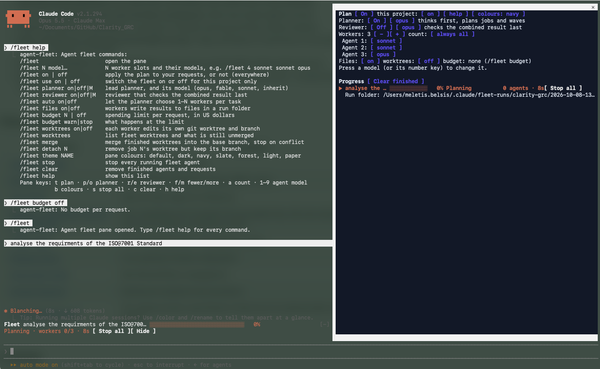
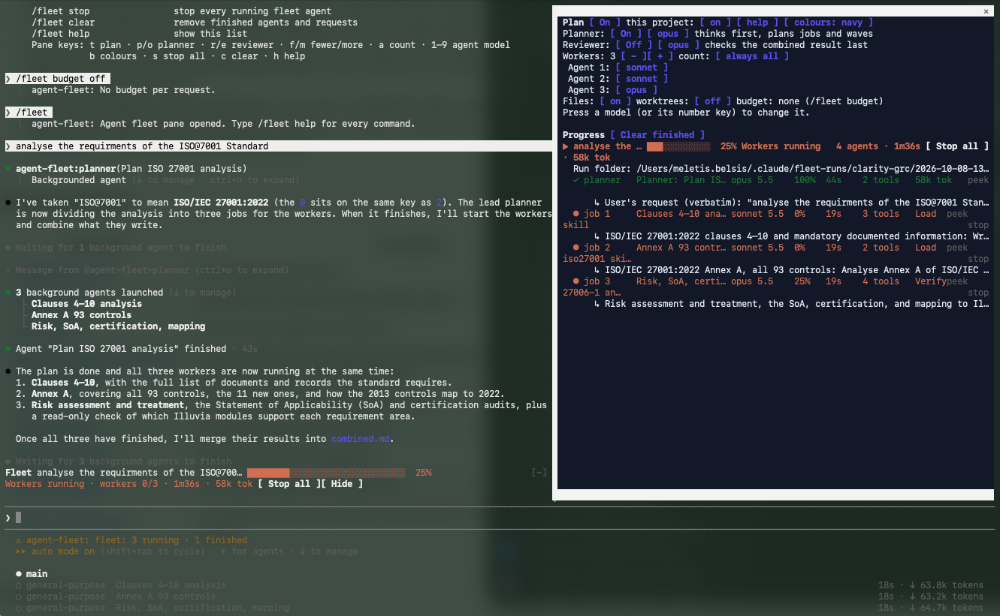

# Agent fleet for Claude Code

A Claude Code plugin that splits each task across a fleet of subagents you configure, and shows their progress.

- **Worker slots:** choose how many subagents a task uses (1–10) and which model each one runs on.
- **Lead planner** (optional, on by default): thinks the task through first and writes one self-contained brief per worker. A job can depend on others (`## Job 3: … (after 1, 2)`); the fleet runs such jobs in waves and refuses to start a job before the jobs it needs have finished.
- **Reviewer** (optional): checks and corrects the combined result last.
- **Designer** (optional, off by default): after the review, polishes the result into finished files according to what the planner says the deliverable is — a report becomes an improved Markdown copy plus `.docx` and `.pdf`; slides become a `.pptx` (one message per slide, charts for numbers, speaker notes); a website or app screen is checked in the browser at desktop and phone widths and its layout, spacing, contrast and accessibility are fixed in the code (on its own branch when worktrees are on); data gets charts and a summary table. It works in the run folder's `design/` and writes `CHANGES.md` saying what it changed and why. It never adds facts, never overwrites the original, and **uploads nothing**: tools that would publish or send work off the laptop (artifacts, claude.ai documents, design sync and the like) are refused for it. `/fleet designer on | off | <model>`.
- **Automatic sizing** (optional): the planner chooses between 1 and N workers per task.
- **Run folders** (on by default): each request gets `~/.claude/fleet-runs/<project>/<date>-<title>/` holding the request, the plan, each worker's result (`job-N.md`), the combined result and a summary. Later waves receive the result files of the jobs they depend on.
- **Progress:** a pane listing each request and its agents (model, completion, time, tool calls, tokens, the job each was given), a status band above the prompt with an overall progress bar and live cost, and Stop controls.
- **Pause and resume:** *pause* on an agent (or *Pause all* / `x` on a request, or `/fleet pause`) stops it at a safe point, and *resume* (or `/fleet resume`) lets it carry on with everything it had already read and done. See *Pausing agents* below for exactly when the pause happens.
- **Role colours:** in the pane the planner (violet), reviewer (blue) and designer (pink) stand out from the workers; the labels of their settings rows use the same colours as a key.
- **Peek and rerun:** open any agent to see its latest output and tool call; rerun a finished agent with the same brief plus a note ("cut it to 6,000 words").
- **Budget:** a spending limit per request in US dollars (`/fleet budget 5`), read every second from the same running total `/cost` shows, counted from the moment you send the request. It warns at 80% and at the limit; with `/fleet budget stop` it stops the request's agents, refuses any further agent until your next message, and tells Claude why. Each event also leaves a line in the transcript.
  It is a tripwire, not a hard cap: cost is only counted when a model response finishes, and responses already running when the stop happens still complete, so a request with several agents can end noticeably above the limit (in testing, $1.32 against $0.50 with three agents searching the web). Set the limit below what you can tolerate. On a subscription such as Claude Max, the figure is what the usage would cost at API prices, not what you are billed.
- **Per project:** `/fleet use off` switches the fleet off in one project only.
- **Finish notification:** a request that ran 30 seconds or longer ends with a short chime (rising when finished, falling when stopped) and, on macOS, a system banner, so you notice it with the terminal in the background. Every finish also leaves a line in the transcript. `/fleet notify on | off | sound | banner`.
- **History:** finished requests are kept across sessions with their time, agents, cost and run folder. `/fleet history` lists this project's, `/fleet history all` every project's; the pane's *history* button (`y`) shows them with an *open* button for each run folder.
- **Worktrees** (optional, off by default): see below.
- **Colours:** the pane has selectable colour schemes; navy is the default.

## Screenshots

The lead planner at work: `/fleet help` on the left, and on the right the pane with the plan (planner on, three workers on sonnet, sonnet and opus), the request in its Planning stage and its run folder. The status band above the prompt shows the overall progress.



The plan has been shared out: the planner has finished (✓, 100%), and three workers run in parallel, each with its model, progress, elapsed time, tool count and current step, and under each the job it was given. Each row has *peek* and *stop*.



## Worktrees: how parallel code changes come back together

With `/fleet worktrees on`, every worker edits its own git worktree on its own branch, so parallel workers never overwrite each other. The rules are built to never lose or overwrite code:

- Worktrees live outside the repository (`~/.claude/fleet-worktrees/<repo>/`), on branches `fleet/<request>/job-N`, all cut from the commit you were on when the request started.
- A worker may only write inside its worktree (and the run folder). File edits under your main checkout, shell commands that name it, and git commands that move or publish branches (push, checkout, switch, rebase, reset --hard, stash, merge, branch -D …) are refused.
- When a worker finishes, anything it left uncommitted is committed on its branch. A worktree with no changes is removed.
- Nothing is merged automatically. `/fleet merge` (or *Merge finished* in the pane) merges the finished branches into the base branch one at a time, in job order, with `--no-ff`. It refuses to start if your checkout has uncommitted changes, a merge is in progress, a worker is still running, or a different branch is checked out. On the first conflict it runs `git merge --abort`, so your checkout is exactly as before that branch, names the conflicting files, and stops. Resolve with `git merge <branch>` yourself, then run `/fleet merge` again to continue.
- A worktree is removed, and its branch deleted with the safe `git branch -d`, only after the branch is confirmed merged. Nothing is ever forced.
- The list of fleet worktrees is kept across sessions. Each new session in the repository reminds you of branches that still hold unmerged work; `/fleet worktrees` lists them, and `/fleet detach N` removes a worktree folder while keeping its branch.

## Pausing agents

**A pause takes effect at the agent's next tool call — not immediately.** Claude Code has no way to freeze an agent in the middle of its thinking, so the fleet waits for the next point where nothing is half-done: when the agent next tries to read a file, search, run a command or write, that call is refused and the agent is stopped there. An agent that is only thinking or writing a long answer keeps going until it reaches that point — usually seconds, sometimes longer. While it waits the pane shows *pausing*.

- Nothing is left half-written: the refused call never ran, and the agent is told so, so it repeats it after resuming.
- A paused agent costs nothing while paused. The request stays open, its status band says *Paused*, and Claude is told not to relaunch the agent or finish without it.
- *Resume* wakes the agent with a message; it continues with its full context. If it cannot be woken, the fleet starts it again with its original brief, how far it had got and its partial result file, and says so.
- A pause lasts for the session. Agents belong to the session that started them, so resume them before you close it; otherwise they end stopped.
- *Stop* on a paused agent ends it for good. The budget keeps counting after a resume.

## Install on any laptop

### What you need

- **Claude Code 2.1.294 or later.** The fleet is a plugin of *function hooks* (the plugin API Claude Code calls "mods"), which older versions do not load. Check with `claude --version`; update with `claude update` (or reinstall from https://claude.com/claude-code).
- **git**, if you will use worktrees, in any project you use them in.
- Nothing else: no Node, npm or build step. Claude Code compiles the TypeScript itself.

### Option A — from GitHub

Inside any Claude Code session, at the prompt:

```
/plugin install agent-fleet --marketplace mbelsis/Claude-Fleet
```

Answer `y` to add the marketplace, then choose **user** scope so it loads in every project. It is active straight away.

The repository is private, so the laptop must be able to clone it: signed in to GitHub with access to `mbelsis/Claude-Fleet` (for example through `gh auth login`, a credential manager, or an SSH key). If the install says the marketplace cannot be fetched, check access with `git clone https://github.com/mbelsis/Claude-Fleet.git` first.

### Option B — from a copy of this folder

1. Get the folder onto the laptop: `git clone https://github.com/mbelsis/Claude-Fleet.git "claude fleet"`, or copy the folder (a USB stick or a shared drive is fine).
2. In a terminal, register the folder as a plugin marketplace and install from it:

   ```bash
   claude plugin marketplace add "/path/to/claude fleet"
   claude plugin install agent-fleet@belsis-plugins --scope user
   ```

3. Start a new Claude Code session and type `/fleet` — the pane opens. `/fleet help` lists every command.

Because the marketplace is a local folder, Claude Code reads the plugin from that folder directly: after you edit or `git pull` it, run `/reload-plugins` in a session to pick up the change. No reinstall is needed.

### First-time setup

The plan starts **off**. A sensible start:

```
/fleet 4 sonnet sonnet opus inherit     # four workers and their models (also turns the plan on)
/fleet planner opus                     # lead planner on the newest Opus
/fleet budget 5                         # warn when a request passes $5
```

Settings are saved per user (your plan, budget, colours) and follow you to every project. `/fleet use off` turns the fleet off in one project only.

### Check, update, remove

```bash
claude plugin list                                  # shows agent-fleet and the folder it is read from
claude plugin update agent-fleet@belsis-plugins     # for a GitHub install; a local folder just needs /reload-plugins
claude plugin uninstall agent-fleet@belsis-plugins
claude plugin marketplace remove belsis-plugins
```

Uninstalling leaves your run folders (`~/.claude/fleet-runs/`) and any fleet worktrees (`~/.claude/fleet-worktrees/`) in place. Merge or detach worktrees first (`/fleet worktrees`, `/fleet merge`) so no branch is left behind.

### Troubleshooting

- **`/fleet` is not recognised:** the plugin is not loaded. Run `claude plugin list`; if it is missing, repeat the install; if it is listed, start a new session. Run `claude --debug` to see why a plugin did not load.
- **The pane text is hard to read:** your Claude Code theme and your terminal background disagree (for example a light theme on a dark terminal). Run `/theme` and pick the matching one, or change the pane with `/fleet theme navy`.
- **"could not create a worktree":** the project is not a git repository, or git refused (for example a branch of that name already exists). Turn worktrees off with `/fleet worktrees off`, or fix the repository.

## Use

`/fleet` opens the pane. `/fleet help` lists every command:

```
/fleet N model…            N worker slots and their models, e.g. /fleet 4 sonnet sonnet opus
/fleet on | off            apply the plan to your requests, or not (everywhere)
/fleet use on | off        switch the fleet on or off for this project only
/fleet planner on|off|M    lead planner, and its model (opus, fable, sonnet, inherit)
/fleet reviewer on|off|M   reviewer that checks the combined result last
/fleet designer on|off|M   designer that polishes the result into files (uploads nothing)
/fleet auto on|off         let the planner choose 1–N workers per task
/fleet files on|off        workers write results to files in a run folder
/fleet budget N | off      spending limit per request, in US dollars
/fleet budget warn|stop    what happens at the limit
/fleet worktrees on|off    each worker edits its own git worktree and branch
/fleet worktrees           list fleet worktrees and what is still unmerged
/fleet merge               merge finished worktrees into the base branch, stop on conflict
/fleet detach N            remove job N's worktree but keep its branch
/fleet notify on|off|sound|banner   announce finished requests (30 s or longer)
/fleet history [all]       past requests here (or everywhere) and their run folders
/fleet theme NAME          pane colours
/fleet pause | resume      pause running agents at their next tool call; resume them
/fleet stop · clear · help
```

While the plan is on it applies to every task in every project, so turn it off (`/fleet off`) for small jobs.

## Develop

```bash
claude plugin validate .   # what the module hooks and calls, and anything the engine would refuse
claude plugin test .       # runs tests/*.test.ts against the engine
```

`fx/` holds the two notification chimes. `hooks/register.tsx` holds everything that talks to Claude Code; `hooks/lib.ts` the pure logic (texts, parsing, waves, guards); `types/index.d.ts` declares the state it keeps.

## Contents

- `docs/GRC-Tool-Specification.md` — a product specification for a GRC tool, produced by a fleet run (planner, four workers, reviewer): 428 requirements, every Must with acceptance criteria. Appendix B lists the open points, Appendix C the reviewer's changes.

## Licence and disclaimer

Copyright © 2026 Belsis Meletis.

You may use this plugin free of charge, for any purpose, and copy, change or customise it as you want.

**This is a test plugin.** It is provided as is, with no warranty of any kind. The creator accepts no responsibility for any action, loss or damage that results from installing, using or customising it, including lost or overwritten code, model usage charges, or anything an agent does while it runs. Use it at your own risk.

The full terms are in [LICENSE](LICENSE).
