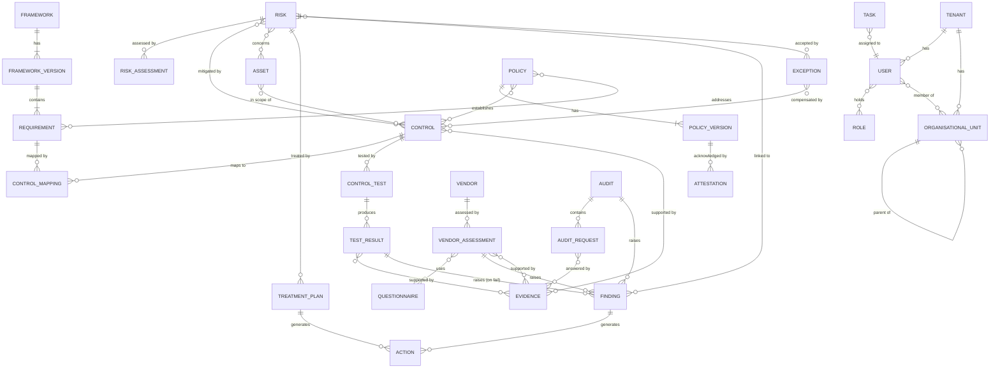

# GRC Tool — Product Specification

**Status:** reviewed draft (fleet run: planner, four workers, reviewer) · **Date:** 8 October 2026 · **Scope:** a multi-tenant SaaS governance, risk and compliance tool for mid-sized organisations

## Contents

1 Introduction · 2 Personas and journeys · 3 Domain model · 4 Functional requirements (4.1 CMP · 4.2 CTL · 4.3 RISK · 4.4 POL · 4.5 VEN · 4.6 AUD · 4.7 FND · 4.8 WFL · 4.9 RPT) · 5 Non-functional requirements · 6 Access control model · 7 Integrations and API · 8 Release plan · 9 Glossary · Appendix A Traceability index · Appendix B Open points · Appendix C Review log

**Requirements:** 428 (325 Must, 89 Should, 14 Could).

---
# 1 Introduction

## 1.1 Purpose

This document specifies a multi-tenant software-as-a-service tool for governance, risk and compliance (GRC). It is written so that a product team can prioritise and plan from it, and engineers can design, build and test from it. It states what the system must do and how well. It does not prescribe a technology stack.

## 1.2 Product vision and problems solved

**Vision.** One system of record in which a regulated organisation can see, at any moment, which obligations apply to it, which controls meet them, what evidence proves it, which risks threaten it and who is doing something about each gap.

**Problems solved.**

1. **Spreadsheet sprawl.** Control lists, risk registers, policy trackers and audit request lists live in separate files with no shared identifiers, no history and no access control. The system replaces them with linked records.
2. **Duplicated evidence across frameworks.** The same access review is evidenced separately for ISO/IEC 27001:2022, SOC 2 and NIS2. The system lets one Control satisfy many Requirements through Control Mappings, and one piece of Evidence support many Control Tests.
3. **No live risk picture.** Risk registers are refreshed once or twice a year and disconnected from control health and audit findings. The system links Risks to Controls, Findings and Exceptions so that the picture changes when the underlying facts change.
4. **Audit scramble.** Preparing for an audit means chasing owners by e-mail. The system keeps evidence current continuously and gives auditors a scoped, read-only workspace.
5. **Unowned work.** Actions, reviews and attestations lapse because nobody is reminded or escalated to. The system runs every deadline through one workflow, task and notification engine.
6. **Unconvincing board reporting.** Executives receive slides assembled by hand. The system produces a repeatable report pack with defined metrics, so a figure means the same thing every quarter.

## 1.3 Scope

**In scope.** Framework and requirement management; controls, control testing and evidence; risk management including exceptions and risk acceptance; policy lifecycle and attestation; third-party risk; audit engagements; findings and actions; workflow, tasks and notifications; reporting and dashboards; role-based access control; an immutable Audit Trail; SSO; import and export; integrations and a public API.

**Explicitly out of scope.**

- Full IT service management (incident, change and problem management, a configuration management database). The system links to tickets in an external tool but does not replace it.
- Security information and event management, log analysis, vulnerability scanning and endpoint management. Their outputs may arrive as Evidence or as Findings from an integration.
- A human-resources system of record. User and organisational data is received by import, SSO or SCIM.
- Executing remediation in external systems. The system tracks Actions and may create linked tickets; it never changes configuration in a customer's cloud, identity or ticketing platform.
- Legal advice or certification. The system does not decide that an organisation is compliant with a regulation.
- Financial accounting, contract lifecycle management and general-purpose document management beyond Policies and Evidence.

## 1.4 Audience and how to read the document

| Reader | Start with | Then |
|---|---|---|
| Product management | 1, 2, 8 | 4 (priorities), 9 |
| Engineering | 3, 4 | 5, 6, 7 |
| Quality assurance | 4 (acceptance criteria) | 5, 2 (journeys as end-to-end test seeds) |
| Security and privacy reviewers | 5, 6, 7 | 4.8 |
| Customer stakeholders | 1, 2 | 4.9 |

Chapter 3 is the authority on entity names and relationships. Chapter 4 is organised by module; each module opens with a short statement of intent and then lists numbered requirements. Chapter 6 defines the permission matrix; module chapters say which role performs an action but do not grant it. The glossary (chapter 9) defines every capitalised term.

## 1.5 Conventions

**Modal verbs.** "Shall" is mandatory within the stated priority and phase. "Should" is recommended and may be deferred with a recorded reason. "May" is optional. Text is in British English.

**Requirement IDs.**

| Family | Pattern | Prefixes |
|---|---|---|
| Functional | FR-\<MOD\>-NNN | CMP, CTL, RISK, POL, VEN, AUD, FND, WFL, RPT, CORE |
| Non-functional | NFR-\<CAT\>-NNN | SEC, TEN, IAM, LOG, RET, AVL, PERF, A11Y, PRV, I18N, OPS |
| Integration | INT-\<SYS\>-NNN | IDP, SCIM, TKT, CLD, MSG, EML, API, WHK |

Numbers start at 001 per prefix and rise by one with no gaps. An ID is never reused once published.

**Priority (MoSCoW).** *Must*: the release for its phase cannot ship without it. *Should*: important, with a workaround if late. *Could*: desirable if capacity allows. *Won't (this release)*: recorded but deliberately excluded.

**Phases.**

| Phase | Content |
|---|---|
| 1 (MVP) | CORE, CMP, CTL, RISK, FND; POL (versioning, approval, publishing, single-policy attestation); basic WFL; basic RPT; SSO (OIDC and SAML); RBAC; Audit Trail; CSV import and export |
| 2 | VEN, AUD, SCIM, ticketing integration, public REST API and webhooks, attestation campaigns at scale, scheduled reports |
| 3 | Cloud posture integrations, quantitative risk (FAIR-style), advanced analytics, AI-assisted drafting |

A Phase 1 Must blocks the MVP. In later phases, Must means required in that phase.

**Block format.**

```
**FR-XXX-001 — Short title** · Priority: Must|Should|Could|Won't (this release) · Phase: 1|2|3
The system shall …
Acceptance criteria: AC1: Given …, when …, then …
Related: …
```

Acceptance criteria are required for every Must and optional for Should. "Related" points to chapters or module codes only.

## 1.6 Assumptions and constraints

**Assumptions.**

- Customers are mid-sized organisations (about 200–5,000 staff) with a small compliance function of between two and fifteen people, plus many occasional contributors.
- Customers hold or pursue ISO/IEC 27001:2022, SOC 2, and sometimes NIST CSF 2.0, GDPR, NIS2 or DORA obligations; most hold several at once.
- Most customers have an identity provider supporting OIDC or SAML, and many use a ticketing tool.
- Users work in a modern browser; there is no native mobile application in scope, but all task and approval screens must work on a phone browser.
- Framework content (Requirement text) is supplied as importable libraries; the system does not author regulation.

**Constraints.**

- Tenant data must be isolated logically and by access control (chapter 5, TEN).
- Personal data of EU and UK residents must be handled in line with GDPR (chapter 5, PRV).
- The system is the system of record for GRC data only; authoritative identity data stays in the customer's identity provider.
- Timestamps are stored in UTC and displayed in the user's time zone.

## 1.7 Success measures

| # | KPI | Definition | Target after 12 months of use |
|---|---|---|---|
| K1 | Audit preparation time | Working days from audit kick-off to evidence package complete, median across tenants | Reduced by 50% against the tenant's declared baseline |
| K2 | Controls with current evidence | Share of in-scope Controls whose latest required Evidence is within its validity period | At least 90% |
| K3 | Evidence reuse | Average number of Requirements satisfied per Control, across frameworks adopted | At least 1.8 for tenants with two or more frameworks |
| K4 | On-time task completion | Tasks completed on or before due date ÷ tasks closed | At least 85% |
| K5 | Overdue Action ratio | Open Actions past due ÷ open Actions | Below 10% |
| K6 | Risk register freshness | Risks reviewed within their review cycle ÷ open Risks | At least 95% |
| K7 | Time to onboard | Days from tenant creation to first framework with mapped Controls | 10 days or fewer |
| K8 | Board pack effort | Person-hours to produce the quarterly executive pack | Under 2 hours |

---

# 2 Personas and journeys

## 2.1 Personas

Frequency is for a typical mid-sized tenant. The screens named are indicative and are specified by module chapters.

**Platform Operator.** Employee of the product vendor who runs the service. Provisions Tenants, manages licences, monitors service health, and has no access to tenant content by default. Uses the system daily. Screens: tenant directory, licence and plan settings, service status, support-access request log. Pain point: needs to help customers without seeing their data.

**Tenant Administrator.**
- *Responsibilities:* configure the tenant, identity integration, Organisational Units, branding, workflows and retention settings; assign Roles.
- *Goals:* a correctly scoped, secure set-up that needs little maintenance; clear evidence of who can do what.
- *Pain points:* manual user maintenance; unclear impact of configuration changes.
- *Frequency:* heavy at onboarding, then weekly.
- *Screens:* settings, user and role management, SSO setup, workflow designer, Audit Trail viewer, import centre.

**Compliance Manager.**
- *Responsibilities:* owns frameworks, applicability decisions, Control Mappings and readiness; coordinates audits and chases owners.
- *Goals:* know coverage per framework at any moment; reuse controls; pass audits without a scramble.
- *Pain points:* re-mapping the same controls for each framework; chasing evidence by e-mail; stale spreadsheets.
- *Frequency:* daily.
- *Screens:* framework and requirement browser, coverage dashboard, mapping matrix, evidence freshness view, overdue work list.

**Risk Manager.**
- *Responsibilities:* maintains the Risk register, runs Risk Assessments, reviews Treatment Plans and Exceptions.
- *Goals:* a current, defensible risk picture; consistent scoring.
- *Pain points:* risks unconnected to controls; acceptances that quietly expire.
- *Frequency:* several times a week.
- *Screens:* risk register, heat map, assessment form, Treatment Plan view, Exception register.

**Control Owner.**
- *Responsibilities:* operates assigned Controls, performs or supports Control Tests, supplies Evidence, remediates Findings.
- *Goals:* know exactly what is due and what "good" evidence looks like; spend minutes, not hours.
- *Pain points:* repeated requests for the same evidence; unclear expectations.
- *Frequency:* weekly, with quarterly peaks.
- *Screens:* My Tasks, control detail, test execution form, evidence upload, my Actions.

**Risk Owner.**
- *Responsibilities:* accountable for named Risks; decides treatment, requests acceptance.
- *Goals:* understand exposure and decide quickly.
- *Pain points:* receives risks without context or a deadline.
- *Frequency:* monthly.
- *Screens:* my risks, risk detail, acceptance request, approval task.

**Policy Owner.**
- *Responsibilities:* drafts and maintains Policies, runs reviews and approvals, requests Attestations.
- *Goals:* publish once and know who has read and accepted.
- *Pain points:* version confusion; manual attestation tracking.
- *Frequency:* weekly to monthly.
- *Screens:* policy library, editor and version history, approval status, attestation progress.

**Internal Auditor.**
- *Responsibilities:* plans and runs internal Audits, tests Controls independently, raises Findings.
- *Goals:* independent view of control state; complete working papers.
- *Pain points:* data copied between tools; no tamper-evident history.
- *Frequency:* during engagements, several days a week.
- *Screens:* audit plan, engagement workspace, Audit Requests, finding editor.

**External Auditor (guest).**
- *Responsibilities:* reviews scoped evidence and raises requests during an engagement.
- *Goals:* find what is needed without asking twice.
- *Pain points:* inconsistent evidence formats; waiting for answers.
- *Frequency:* intensive for weeks per year.
- *Screens:* scoped engagement workspace, request list, evidence viewer, Finding drafts.

**Vendor Manager.**
- *Responsibilities:* onboards and tiers Vendors, issues Questionnaires, reviews Vendor Assessments, tracks vendor Findings.
- *Goals:* a current vendor register and fast, consistent reviews.
- *Pain points:* questionnaires in e-mail; renewals missed.
- *Frequency:* weekly.
- *Screens:* vendor register, assessment queue, questionnaire builder, tiering view.

**Vendor Contact (external guest).**
- *Responsibilities:* completes Questionnaires and supplies documents for their own organisation.
- *Goals:* answer once, with a clear deadline.
- *Pain points:* long, repeated questionnaires.
- *Frequency:* a few times a year.
- *Screens:* questionnaire form, document upload, request status.

**Executive Viewer.**
- *Responsibilities:* oversight; reviews posture and takes decisions on escalated Risks.
- *Goals:* a reliable, short picture; no navigation effort.
- *Pain points:* inconsistent figures; dense reports.
- *Frequency:* monthly or quarterly.
- *Screens:* executive dashboard, board report pack, approval tasks for acceptances.

**Employee.**
- *Responsibilities:* reads Policies and gives Attestations; completes assigned training-style tasks; reports issues.
- *Goals:* finish quickly.
- *Pain points:* unclear what is mandatory; repeated reminders.
- *Frequency:* a few times a year.
- *Screens:* my attestations, policy reader, my tasks.

## 2.2 End-to-end journeys

**J1 Adopting a new framework and reusing existing controls** (CMP, CTL, WFL, RPT)
1. The Compliance Manager imports the NIS2 library as a Framework Version (CMP).
2. They set applicability for each Requirement, recording a reason for exclusions (CMP).
3. The system proposes Control Mappings from existing Controls; the manager accepts, adjusts coverage between full and partial, and flags unmapped Requirements (CMP, CTL).
4. For each gap, the manager creates a Control and assigns an owner; a Task is generated for each (CTL, WFL).
5. Owners accept the Tasks and define test frequency (CTL, WFL).
6. The manager opens the framework coverage dashboard and sees coverage rise as mappings are accepted (RPT).

**J2 Quarterly control testing with evidence collection** (WFL, CTL, FND, RPT)
1. The scheduling engine creates Control Test Tasks for the quarter and notifies owners (WFL).
2. A Control Owner opens the Task, follows the test procedure and attaches Evidence, reusing existing items where valid (CTL).
3. They record the Test Result; the Control Test reviewer checks it (CTL, WFL).
4. A failed Test Result creates a Finding with an Action, owner and due date (FND).
5. Reminders and escalation run for overdue Tasks (WFL).
6. The Compliance Manager checks evidence freshness and test completion on the dashboard (RPT).

**J3 A risk identified, assessed, treated and accepted** (RISK, WFL, FND, RPT)
1. An employee or manager registers a Risk and names a Risk Owner (RISK).
2. The Risk Manager runs a Risk Assessment recording inherent and residual scores (RISK).
3. The owner proposes a Treatment Plan with Actions (RISK, FND).
4. For the remainder, the owner requests an Exception for risk acceptance; a workflow routes it to the approver (RISK, WFL).
5. The Exception is approved with an expiry date; the Audit Trail records the decision (RISK, CORE).
6. As expiry nears, the system raises a review Task (WFL); the heat map reflects the position throughout (RPT).

**J4 Policy publishing and employee attestation** (POL, WFL, RPT)
1. The Policy Owner edits a draft Policy Version (POL).
2. A review and approval workflow runs: reviewers in parallel, then the executive approver in sequence (WFL, POL).
3. The approved Version is published; the previous Version is superseded (POL).
4. Employees in the target Organisational Units receive an attestation Task (POL, WFL).
5. Employees read and attest; non-responders are reminded and then escalated to their line manager (WFL).
6. The Policy Owner views attestation progress by Organisational Unit (RPT).

**J5 Vendor onboarding** (VEN, WFL, FND, RPT)
1. The Vendor Manager creates the Vendor and assigns a tier from criticality (VEN).
2. They send a Questionnaire to the Vendor Contact, who completes it through a guest link (VEN).
3. The Vendor Manager reviews answers and documents, and completes a Vendor Assessment (VEN).
4. Gaps become Findings with remediation Actions agreed with the vendor (FND).
5. An approval workflow decides whether to onboard, and the next reassessment is scheduled (WFL, VEN).
6. Vendor tiering and open vendor Findings appear in the dashboards (RPT).

**J6 An external audit engagement through to closure of its findings** (AUD, CTL, FND, WFL, RPT)
1. The Compliance Manager creates the Audit and scopes it by Framework and Organisational Units (AUD).
2. The External Auditor is invited as a guest, limited to that scope (AUD, CORE).
3. The auditor raises Audit Requests; each becomes a Task for the relevant owner (AUD, WFL).
4. Owners respond with Evidence from the library (CTL).
5. The auditor raises Findings; owners agree Actions and due dates (FND).
6. The Audit closes once the report is final and every Finding is closed or has an agreed Action with owner and due date; the Actions are then remediated and verified in the Findings register (FND, AUD).
7. The audit status dashboard shows progress throughout (RPT).

**J7 A board report** (RPT, CMP, RISK, FND)
1. The Executive Viewer or Compliance Manager chooses the board pack template (RPT).
2. The system generates posture per framework, top risks, overdue actions and audit status as of a chosen date (RPT, CMP, RISK, FND).
3. The Compliance Manager adds commentary to each section and previews with tenant branding (RPT).
4. The pack is frozen as a snapshot, approved, and exported as PDF (RPT, WFL).
5. In the next quarter the same pack shows trends against the stored snapshot (RPT).

---

# 3 Domain model

This chapter defines every canonical entity in the product. Other chapters use these names exactly and refer here for their meaning. Where another chapter specifies behaviour (for example the Finding lifecycle in 4.7 or permissions in chapter 6), this chapter defines only the record, its relationships and its states.

## 3.1 Principles

**P1 — Map once, comply many.** The Control is the backbone of the model. A Tenant maintains one library of Controls written in neutral language: they describe what the organisation does, not what any one Framework asks for. Requirements from many Frameworks are linked to those Controls through Control Mappings. A Control that is tested once, with Evidence collected once, therefore contributes to every Requirement it is mapped to, in every Framework the Tenant has adopted. No Framework owns a Control, and removing a Framework never removes a Control.

**P2 — One Tenant per record.** Every business record belongs to exactly one Tenant, identified by an immutable `tenant_id` set at creation. No record is shared between Tenants. Shipped library content (Framework Versions, Requirements and the common baseline of Controls) is published by the Platform Operator as read-only reference content, and a Tenant receives its own copy or adoption record when it chooses to use it. Isolation itself is specified in chapter 5.

**P3 — Archive, do not delete.** Business records are never hard-deleted through the product. A record leaves active use by being archived (or by reaching a terminal state such as closed or retired). An archived record keeps its relationships, stays readable to authorised Users and can be restored. Permanent erasure happens only through the retention and privacy rules in chapter 5.

**P4 — Every change is versioned.** Every create, update, state transition, archive and restore of a business record writes an entry to the Audit Trail, holding the before and after values, the acting User (or system process) and a timestamp. Records whose content has legal or audit weight (Framework Version, Policy Version, Evidence, Test Result, Risk Assessment, Attestation) are additionally versioned as separate immutable records rather than edited in place.

**P5 — Derived, not typed.** Control effectiveness, Requirement status, Evidence freshness and (by default) residual risk are calculated from underlying records using the rules in 3.4. A person may override a derived value only where 3.4 allows it, with a justification, and the override is shown as an override.

**P6 — One owner.** Every Control, Risk, Policy, Vendor, Finding, Action and Treatment Plan has exactly one accountable owner (a User). Groups may be assigned as contributors, but accountability is never shared.

**P7 — One issue type.** Every deficiency, whatever its origin, is a Finding. The source of the Finding is an attribute, not a separate entity type.

### 3.1.1 Common attributes

Every entity in 3.2 carries the following attributes in addition to those listed for it. They are not repeated in each table.

| Attribute | Type | Required | Notes |
|---|---|---|---|
| id | UUID | Yes | System-generated, immutable. |
| tenant_id | reference (Tenant) | Yes | Immutable. Absent only on Tenant itself and on platform library content. |
| reference | string | Yes | Human-readable key unique within the Tenant and entity type, for example `RSK-0042`. Prefix configurable per entity type. |
| created_at, created_by | timestamp, reference (User) | Yes | Set by the system. |
| updated_at, updated_by | timestamp, reference (User) | Yes | Set by the system. |
| archived_at, archived_by | timestamp, reference (User) | No | Present only when archived. |
| version | integer | Yes | Incremented on every change; used for optimistic concurrency. |
| tags | list of Tag | No | See FR-CORE-003. |
| custom_fields | map | No | Values for Tenant-defined fields; see FR-CORE-004. |

All timestamps are stored in UTC. Dates without a time (due dates, validity dates) are calendar dates interpreted in the Tenant's configured time zone.

## 3.2 Entity catalogue

Lifecycle transitions are written as `from → to`. "Archive" and "restore" are available on every entity unless stated otherwise and are not repeated in each list. An archived record cannot be edited until it is restored.

### 3.2.1 Tenant

**Purpose.** A customer organisation and the boundary of all its data, configuration and Users.
**Owner role.** Platform Operator (provisioning); Tenant Administrator (configuration).

| Attribute | Type | Req. | Notes |
|---|---|---|---|
| name | string | Yes | Legal or trading name. |
| slug | string | Yes | Unique across the platform; used in URLs. |
| data_region | enum | Yes | Hosting region; fixed after activation. |
| time_zone, locale | string | Yes | Defaults for dates and formatting. |
| plan | string | Yes | Commercial plan; governs enabled modules. |
| risk_matrix | Risk Matrix (supporting record, 3.2.31) | Yes | Created with the default 5×5 configuration. |
| settings | structured | Yes | Freshness windows, reference prefixes, approval thresholds and similar configuration named in chapter 4. |

**Lifecycle.** `provisioning → active`; `active → suspended`; `suspended → active`; `active | suspended → offboarding`; `offboarding → closed`. A closed Tenant is retained and then erased under chapter 5. A Tenant is never archived.

### 3.2.2 User

**Purpose.** A person who signs in, or an external guest invited for a bounded purpose.
**Owner role.** Tenant Administrator.

| Attribute | Type | Req. | Notes |
|---|---|---|---|
| email | string | Yes | Unique within the Tenant. |
| display_name | string | Yes | |
| user_kind | enum | Yes | `member`, `external_guest` (External Auditor, Vendor Contact). |
| roles | list of Role | Yes | At least one. |
| organisational_units | list of Organisational Unit | No | Membership; one may be marked primary. |
| manager | reference (User) | No | Used for escalation in 4.8. |
| identity_source | enum | Yes | `local`, `sso`, `scim`. |
| access_expires_on | date | Conditional | Required for external guests. |

**Lifecycle.** `invited → active`; `active → deactivated`; `deactivated → active`; `invited → expired` (invitation not accepted in time). A User is deactivated, never deleted, so that ownership and the Audit Trail stay intact. Deactivating an owner raises a reassignment Task (see FR-CORE-002).

### 3.2.3 Role

**Purpose.** A named bundle of permissions assigned to Users. The fixed role list and the permission matrix are defined in chapter 6; this chapter only records that Role is an entity.
**Owner role.** Tenant Administrator (assignment); Platform Operator (system role definitions).

| Attribute | Type | Req. | Notes |
|---|---|---|---|
| name | string | Yes | One of the fixed roles in chapter 6. |
| is_system | boolean | Yes | System roles cannot be renamed or removed. |
| scope | list of Organisational Unit | No | Optional restriction of a role assignment to part of the organisation; semantics in chapter 6. |

**Lifecycle.** System roles are permanent. Any Tenant-defined role (if chapter 6 permits them) follows `active → retired`.

### 3.2.4 Organisational Unit

**Purpose.** A node in the Tenant's organisational hierarchy (for example division, department, team, legal entity), used for scoping, ownership, reporting roll-ups and Attestation audiences.
**Owner role.** Tenant Administrator.

| Attribute | Type | Req. | Notes |
|---|---|---|---|
| name | string | Yes | |
| unit_type | enum | Yes | `legal_entity`, `division`, `department`, `team`, `location`; values configurable. |
| parent | reference (Organisational Unit) | No | Self-referencing tree; no cycles. |
| head | reference (User) | No | |

**Lifecycle.** `active → archived`; `archived → active`. A unit with active children cannot be archived.

### 3.2.5 Framework

**Purpose.** A named standard, regulation, contractual obligation or internal requirement set, independent of edition (for example "ISO/IEC 27001" or "DORA").
**Owner role.** Platform Operator (shipped library); Compliance Manager (custom Frameworks and Tenant adoption).

| Attribute | Type | Req. | Notes |
|---|---|---|---|
| name | string | Yes | |
| framework_kind | enum | Yes | `standard`, `regulation`, `contract`, `internal`, `common_baseline`. |
| publisher | string | Yes | For example ISO/IEC, AICPA, NIST, European Union. |
| origin | enum | Yes | `library` (shipped) or `custom` (Tenant-created). |
| content_licence | enum | Yes | `full_text`, `reference_and_summary`, `tenant_supplied`; see FR-CMP-002. |
| jurisdiction | list of string | No | For regulations. |

**Lifecycle (library).** `draft → published`; `published → deprecated`. **Adoption by a Tenant.** Tenant adoption is held in a supporting Framework Adoption record (3.2.31) with states `adopted → in_scope_review → active → retired`.

### 3.2.6 Framework Version

**Purpose.** One edition of a Framework with a fixed set of Requirements (for example ISO/IEC 27001:2022). Mappings, applicability and readiness are always recorded against a version.
**Owner role.** Platform Operator (library); Compliance Manager (custom).

| Attribute | Type | Req. | Notes |
|---|---|---|---|
| framework | reference (Framework) | Yes | |
| version_label | string | Yes | For example "2022", "2.0", "2017 (rev. 2022 points of focus)". |
| effective_from | date | No | Publication or application date. |
| superseded_by | reference (Framework Version) | No | Set when a successor is published. |
| content_hash | string | Yes | Hash of the Requirement set; changes only by publishing a new version. |
| source_citation | string | Yes | Official title and identifier of the source document. |

**Lifecycle.** `draft → published`; `published → superseded`; `superseded → withdrawn`. A published Framework Version is immutable: corrections are issued as a new Framework Version (a patch label such as "2022 r2") and handled by the upgrade process in FR-CMP-021 to FR-CMP-025.

### 3.2.7 Requirement

**Purpose.** One assessable obligation within a Framework Version (a clause, Annex A control, criterion, subcategory or article paragraph).
**Owner role.** Inherits from its Framework Version; applicability decisions owned by the Compliance Manager.

| Attribute | Type | Req. | Notes |
|---|---|---|---|
| framework_version | reference (Framework Version) | Yes | |
| code | string | Yes | Official identifier, for example "A.5.23", "CC6.1", "PR.AA-01", "Art. 21(2)(d)". Unique within the version. |
| title | string | Conditional | Shipped only where the content licence allows. |
| summary | text | Yes | Product-authored plain-language summary, or official text where licensed. |
| tenant_text | text | No | Licensed text supplied by the Tenant; visible only to that Tenant. |
| parent | reference (Requirement) | No | Hierarchy (domain, category, clause). |
| is_assessable | boolean | Yes | False for grouping nodes, which have no status of their own. |
| guidance | text | No | Product-authored implementation notes. |
| sort_order | integer | Yes | |

**Lifecycle.** Inherits the Framework Version lifecycle; individual Requirements cannot change after publication. Applicability for a Tenant is held in an Applicability Decision (3.2.31).

### 3.2.8 Control

**Purpose.** A safeguard the Tenant operates, written neutrally so that it can satisfy Requirements across Frameworks.
**Owner role.** Control Owner (operation); Compliance Manager (library curation).

| Attribute | Type | Req. | Notes |
|---|---|---|---|
| title | string | Yes | |
| description | text | Yes | What is done, by whom, how often, and what proves it. |
| baseline_ref | reference (baseline Control) | No | Set when adopted from the common baseline; keeps the link for baseline updates. |
| control_type | enum | Yes | `preventive`, `detective`, `corrective`. |
| nature | enum | Yes | `manual`, `automated`, `hybrid`. |
| frequency | enum | Yes | `continuous`, `daily`, `weekly`, `monthly`, `quarterly`, `semi_annual`, `annual`, `event_driven`. |
| owner | reference (User) | Yes | Exactly one. |
| organisational_units | list of Organisational Unit | No | Where the Control operates. |
| assets | list of Asset | No | What the Control protects. |
| domain | enum | Yes | Taxonomy category of the common baseline (configurable). |
| is_key | boolean | Yes | Key Controls drive the effectiveness rule in 3.4.1. Default false. |
| effectiveness | derived | — | See 3.4.1. |
| implementation_status | enum | Yes | See lifecycle. |

**Lifecycle.** `draft → planned`; `planned → implemented`; `draft → implemented`; `implemented → under_review`; `under_review → implemented`; `implemented → retired`; `retired → implemented` (reinstate). Only `implemented` Controls contribute to Requirement status. Retiring a Control with active Control Mappings requires a confirmation listing the affected Requirements.

### 3.2.9 Control Mapping

**Purpose.** The many-to-many link between a Requirement and a Control, stating how much of the Requirement the Control covers.
**Owner role.** Compliance Manager.

| Attribute | Type | Req. | Notes |
|---|---|---|---|
| requirement | reference (Requirement) | Yes | |
| control | reference (Control) | Yes | Unique pair with requirement while active. |
| coverage | enum | Yes | `full` or `partial`. |
| rationale | text | Conditional | Required for `partial`; recommended for `full`. |
| origin | enum | Yes | `manual`, `library` (shipped with the baseline), `suggested`, `migrated`, `imported`. |
| confirmed_by, confirmed_at | User, timestamp | Conditional | Required before a mapping counts towards status. |

**Lifecycle.** `suggested → confirmed`; `suggested → rejected`; `confirmed → under_review` (raised by a Framework Version upgrade or a Control change); `under_review → confirmed`; `under_review → removed`; `confirmed → removed`. Only `confirmed` mappings count in 3.4.2. Removed and rejected mappings are kept for history.

A supporting **Requirement Group Sufficiency** flag may be set on a Requirement by a Compliance Manager to declare that its `partial` mappings together give full coverage (3.4.2).

### 3.2.10 Control Test

**Purpose.** The plan for testing one Control: what is tested, how, how often and by whom. A Control may have several Control Tests (for example one design test and one operating test).
**Owner role.** Control Owner (self-assessment tests); Compliance Manager or Internal Auditor (independent tests).

| Attribute | Type | Req. | Notes |
|---|---|---|---|
| control | reference (Control) | Yes | |
| test_kind | enum | Yes | `design` or `operating`. |
| method | enum | Yes | `inquiry`, `observation`, `inspection`, `reperformance`, `automated`, `self_assessment`. |
| procedure | text | Yes | Steps and pass criteria. |
| frequency | enum | Yes | Same values as Control.frequency; may differ from the Control's own frequency. |
| sampling | structured | No | Population description, sample size rule, selection method (see FR-CTL-012). |
| tester | reference (User) | Yes | Default assignee; must not be the Control owner unless method is `self_assessment`. |
| automated_source | string | Conditional | Required when method is `automated`; identifies the integration check (chapter 7). |
| is_required | boolean | Yes | Required tests count towards effectiveness. Default true. |
| next_due_on | date | Derived | From frequency and the last Test Result. |

**Lifecycle.** `draft → active`; `active → paused` (with reason and resume date); `paused → active`; `active → retired`.

### 3.2.11 Test Result

**Purpose.** The outcome of one execution of a Control Test. Immutable once submitted.
**Owner role.** The tester who performed it; reviewed by the Compliance Manager or Internal Auditor.

| Attribute | Type | Req. | Notes |
|---|---|---|---|
| control_test | reference (Control Test) | Yes | |
| period_start, period_end | date | Yes | The period of operation the test covers. |
| performed_on | timestamp | Yes | |
| performed_by | User or integration | Yes | |
| outcome | enum | Yes | `pass`, `pass_with_exceptions`, `fail`, `inconclusive`, `not_applicable`. |
| sample_details | structured | No | Items tested and per-item outcome. |
| exceptions_noted | integer | No | Number of sample items that failed. |
| conclusion | text | Conditional | Required for any outcome other than `pass`. |
| evidence | list of Evidence | Conditional | At least one for manual methods (FR-CTL-016). |
| reviewer, reviewed_at | User, timestamp | No | |

**Lifecycle.** `in_progress → submitted`; `submitted → accepted`; `submitted → returned` (reviewer sends back with reason); `returned → submitted`; `accepted → superseded` (only by a correcting Test Result that references it). An accepted Test Result is never edited. A Test Result with outcome `fail` or `pass_with_exceptions` raises a Finding as specified in FR-CTL-021.

### 3.2.12 Evidence

**Purpose.** Proof that a Control operates or a Requirement is met: an uploaded file, a link to an external location, or a record collected by the system from an integration. Evidence has a validity period.
**Owner role.** The User who supplied it; reviewed by the Control Owner, Compliance Manager or Internal Auditor.

| Attribute | Type | Req. | Notes |
|---|---|---|---|
| title | string | Yes | |
| evidence_kind | enum | Yes | `file`, `link`, `system_record`. |
| file | binary reference | Conditional | For `file`; with name, media type, size and SHA-256 content hash. |
| url | string | Conditional | For `link`. |
| system_payload | structured | Conditional | For `system_record`; includes the source integration and collection time. |
| collected_on | date | Yes | When the evidence was produced or captured. |
| valid_from, valid_to | date | Yes / No | `valid_to` null means no fixed expiry (see 3.4.3). |
| links | list (Control, Test Result, Requirement, Audit Request, Finding, Vendor Assessment, Risk, Exception, Policy) | No | One Evidence may be linked to many records (reuse). |
| reviewer, review_note | User, text | No | |
| supersedes | reference (Evidence) | No | Previous version. |
| confidentiality | enum | Yes | `normal` or `restricted`; restricted Evidence is visible only to explicitly named Users and roles (chapter 6). |

**Lifecycle.** `draft → submitted`; `submitted → accepted`; `submitted → rejected`; `rejected → submitted` (only by uploading a replacement, which creates a new version); `accepted → superseded` (a newer version is accepted); `accepted → expired` (derived when `valid_to` passes; see 3.4.3). After acceptance, content, hash, collected date and validity dates are immutable; only links and tags may change.

### 3.2.13 Risk

**Purpose.** An uncertain event that could affect the Tenant's objectives, held in the risk register.
**Owner role.** Risk Owner (accountable); Risk Manager (register curation).

| Attribute | Type | Req. | Notes |
|---|---|---|---|
| title | string | Yes | |
| description | text | Yes | Recommended structure: cause, event, consequence. |
| category | reference (Risk Category) | Yes | Taxonomy; supporting record 3.2.31. |
| owner | reference (User) | Yes | Risk Owner. |
| organisational_units, assets | lists | No | Scope. |
| threat_source | string | No | |
| current_assessment | reference (Risk Assessment) | Derived | Latest approved assessment. |
| inherent_score, residual_score, target_score | integer | Derived | From the current assessment. |
| treatment_option | enum | Conditional | `mitigate`, `transfer`, `avoid`, `accept`; required from `assessed` onwards. |
| review_due_on | date | Derived | From the reassessment rule (FR-RISK-026). |
| appetite_status | derived | — | `within`, `tolerance`, `breach` (FR-RISK-012). |

**Lifecycle.** `identified → assessed`; `assessed → in_treatment`; `assessed → accepted`; `in_treatment → monitored`; `accepted → monitored`; `monitored → assessed` (reassessment); any non-closed state `→ closed` (with reason: `realised`, `no_longer_applicable`, `merged`, `avoided`); `closed → identified` (reopen). `accepted` requires an approved Exception of kind `risk_acceptance` (3.2.16).

### 3.2.14 Risk Assessment

**Purpose.** A dated, scored judgement of one Risk: inherent, residual and target likelihood and impact. Each reassessment creates a new Risk Assessment, so the history of scores is preserved.
**Owner role.** Risk Owner (performs); Risk Manager (approves).

| Attribute | Type | Req. | Notes |
|---|---|---|---|
| risk | reference (Risk) | Yes | |
| matrix_version | reference (Risk Matrix version) | Yes | The matrix configuration in force when scored. |
| inherent_likelihood, inherent_impact | integer | Yes | Levels on the matrix scales. |
| residual_likelihood, residual_impact | integer | Yes | Manual or derived (3.4.4). |
| residual_mode | enum | Yes | `derived` or `manual`. |
| target_likelihood, target_impact | integer | No | Required when treatment option is `mitigate`. |
| impact_dimensions | map | No | Optional per-dimension impact levels (financial, operational, legal, reputational, safety); the overall impact is their maximum. |
| scores and ratings | derived | — | L × I and band, for each of inherent, residual and target. |
| rationale | text | Yes | |
| quantitative | structured | No | Phase 3 FAIR-style inputs and outputs (FR-RISK-033 onwards). |
| assessed_on, assessor | timestamp, User | Yes | |

**Lifecycle.** `draft → submitted`; `submitted → approved`; `submitted → returned`; `returned → submitted`; `approved → superseded` (when a newer assessment is approved). Approved assessments are immutable.

### 3.2.15 Treatment Plan

**Purpose.** The plan for bringing a Risk from residual to target level, composed of Actions and, where relevant, new or improved Controls.
**Owner role.** Risk Owner.

| Attribute | Type | Req. | Notes |
|---|---|---|---|
| risk | reference (Risk) | Yes | One active plan per Risk at a time. |
| option | enum | Yes | `mitigate`, `transfer`, `avoid`. (Acceptance is an Exception, not a Treatment Plan.) |
| description | text | Yes | |
| actions | list of Action | Conditional | At least one before approval for `mitigate` and `avoid`. |
| planned_controls | list of Control | No | Controls to be implemented or improved. |
| transfer_details | structured | Conditional | For `transfer`: counterparty (may be a Vendor), instrument (insurance, contract), coverage and expiry. |
| budget | money | No | |
| target_date | date | Yes | |
| progress | derived | — | Percentage of linked Actions completed. |

**Lifecycle.** `draft → submitted`; `submitted → approved`; `submitted → returned`; `approved → in_progress`; `in_progress → completed` (all Actions closed); `in_progress → cancelled` (reason required); `completed` triggers a reassessment Task for the Risk.

### 3.2.16 Exception

**Purpose.** A time-bound, approved acceptance of something that is not as it should be: a Risk above appetite that the organisation chooses to accept, a Control gap (a Requirement or Control not met), or a deviation from a Policy.
**Owner role.** Requester (any member User); approved per the authority rule in FR-RISK-029.

| Attribute | Type | Req. | Notes |
|---|---|---|---|
| exception_kind | enum | Yes | `risk_acceptance`, `control_gap`, `policy_deviation`. |
| subject | reference | Yes | A Risk (`risk_acceptance`); a Control or Requirement (`control_gap`); a Policy (`policy_deviation`). |
| related_risk | reference (Risk) | Conditional | Required for `control_gap` and `policy_deviation`: the Risk created or reused to express the exposure. |
| justification | text | Yes | |
| compensating_controls | list of Control | No | Strongly recommended; required where the rating is High or Critical. |
| rating | derived | — | Residual rating of the related Risk at request time. |
| scope | structured | No | Organisational Units, Assets or Vendors the Exception applies to. |
| starts_on, expires_on | date | Yes | Maximum duration by rating (FR-RISK-030). |
| approvers | list of approval records | Yes | User, decision, timestamp, comment. |
| renewal_of | reference (Exception) | No | |

**Lifecycle.** `draft → requested`; `requested → approved`; `requested → rejected`; `requested → draft` (returned for changes); `approved → active` (on `starts_on`); `active → expired` (on `expires_on`); `active → revoked` (reason required); `active → closed` (the gap was remediated); `active → renewal_requested`; `renewal_requested → active` (a new Exception linked by `renewal_of` is approved and the old one is closed); `renewal_requested → expired`.

### 3.2.17 Policy

**Purpose.** A governed document stating the organisation's rules (for example an Information Security Policy). The Policy is the stable record; its content lives in Policy Versions.
**Owner role.** Policy Owner.

| Attribute | Type | Req. | Notes |
|---|---|---|---|
| title | string | Yes | |
| policy_type | enum | Yes | `policy`, `standard`, `procedure`, `guideline`. |
| owner | reference (User) | Yes | |
| current_version | reference (Policy Version) | Derived | The published version. |
| review_frequency | enum | Yes | Default annual. |
| next_review_on | date | Derived | |
| controls, requirements | lists | No | The Controls it establishes and the Requirements it addresses. |
| audience | list of Organisational Unit or Role | No | Who must attest. |

**Lifecycle.** `draft → active` (first version published); `active → under_review`; `under_review → active`; `active → retired`. Behaviour is specified in 4.4.

### 3.2.18 Policy Version

**Purpose.** One immutable edition of a Policy's content.
**Owner role.** Policy Owner.

| Attribute | Type | Req. | Notes |
|---|---|---|---|
| policy | reference (Policy) | Yes | |
| version_label | string | Yes | For example "3.1". |
| content | rich text or file | Yes | |
| change_summary | text | Yes | |
| approvals | list of approval records | Yes on publish | |
| published_on, effective_on | date | Conditional | |

**Lifecycle.** `draft → in_review`; `in_review → approved`; `in_review → draft`; `approved → published`; `published → superseded`. Published content is immutable.

### 3.2.19 Attestation

**Purpose.** A User's recorded acknowledgement that they have read and will comply with a specific Policy Version.
**Owner role.** The attesting User; campaigns run by the Policy Owner or Compliance Manager.

| Attribute | Type | Req. | Notes |
|---|---|---|---|
| policy_version | reference (Policy Version) | Yes | |
| user | reference (User) | Yes | |
| campaign | reference | No | Phase 2 campaign grouping (4.4). |
| due_on | date | Yes | |
| attested_at | timestamp | Conditional | |
| statement | text | Yes | The exact wording the User accepted. |

**Lifecycle.** `pending → attested`; `pending → overdue` (derived); `overdue → attested`; `pending | overdue → waived` (reason required); `pending | overdue → declined` (with reason, which may lead to a `policy_deviation` Exception). Attested records are immutable.

### 3.2.20 Vendor

**Purpose.** A third party that supplies goods or services and may introduce risk.
**Owner role.** Vendor Manager (programme); a named business owner (User) per Vendor.

| Attribute | Type | Req. | Notes |
|---|---|---|---|
| name | string | Yes | |
| services | text | Yes | |
| owner | reference (User) | Yes | |
| criticality / tier | enum | Yes | Derived from inherent-risk profiling (4.5) or set manually. |
| data_access | enum | No | Categories of data processed. |
| contacts | list of User (Vendor Contact) | No | |
| assets, risks | lists | No | |
| contract_end_on | date | No | |

**Lifecycle.** `prospective → onboarding`; `onboarding → active`; `onboarding → rejected`; `active → offboarding`; `offboarding → terminated`. Behaviour in 4.5.

### 3.2.21 Vendor Assessment

**Purpose.** One due-diligence assessment of a Vendor at a point in time, using one or more Questionnaires and Evidence.
**Owner role.** Vendor Manager.

| Attribute | Type | Req. | Notes |
|---|---|---|---|
| vendor | reference (Vendor) | Yes | |
| questionnaires | list of Questionnaire response sets | No | |
| evidence | list of Evidence | No | For example a vendor's SOC 2 report or certificate. |
| outcome_rating | enum | Conditional | Required on completion. |
| findings | list of Finding | No | Source `vendor_assessment`. |
| due_on | date | Yes | |

**Lifecycle.** `planned → sent`; `sent → in_progress`; `in_progress → submitted`; `submitted → under_review`; `under_review → completed`; `under_review → in_progress` (returned to vendor); any non-completed `→ cancelled`.

### 3.2.22 Questionnaire

**Purpose.** A reusable template of questions with answer types and scoring, and, when issued, its response set.
**Owner role.** Vendor Manager (templates); Vendor Contact (responses).

| Attribute | Type | Req. | Notes |
|---|---|---|---|
| title, version | string | Yes | Templates are versioned; a published template is immutable. |
| sections, questions | structured | Yes | Answer types: choice, multi-choice, text, number, date, file. |
| scoring | structured | No | Weights and risk flags per answer. |
| requirement_links | list of Requirement | No | Lets answers be reused as evidence of Requirements. |

**Lifecycle (template).** `draft → published`; `published → retired`. **Response set.** `not_started → in_progress → submitted → reviewed`.

### 3.2.23 Audit

**Purpose.** An audit engagement (internal or external) with a scope, a period, a team and a set of Audit Requests. Not to be confused with the Audit Trail.
**Owner role.** Internal Auditor (internal audits); Compliance Manager (hosting external audits).

| Attribute | Type | Req. | Notes |
|---|---|---|---|
| title | string | Yes | |
| audit_kind | enum | Yes | `internal`, `external_certification`, `external_attestation`, `regulatory`, `customer`. |
| framework_versions | list | No | Scope by Framework Version. |
| scope | structured | No | Organisational Units, Controls, Assets, Vendors. |
| period_start, period_end | date | Yes | Period under audit. |
| lead, team | User, list of User | Yes / No | External Auditors as guests. |
| opinion | text | No | |

**Lifecycle.** `planned → fieldwork`; `fieldwork → reporting`; `reporting → closed`; `planned | fieldwork → cancelled`. Behaviour in 4.6.

### 3.2.24 Audit Request

**Purpose.** A request from an auditor for information or Evidence, within one Audit (often called a "PBC" or provided-by-client item).
**Owner role.** The assignee who answers it; raised by the Internal Auditor or External Auditor.

| Attribute | Type | Req. | Notes |
|---|---|---|---|
| audit | reference (Audit) | Yes | |
| description | text | Yes | |
| controls, requirements | lists | No | |
| assignee | reference (User) | Yes | |
| due_on | date | Yes | |
| evidence | list of Evidence | No | Existing Evidence can be reused rather than re-uploaded. |

**Lifecycle.** `open → in_progress`; `in_progress → submitted`; `submitted → accepted`; `submitted → returned`; `returned → in_progress`; `open → withdrawn`.

### 3.2.25 Finding

**Purpose.** The single type for any identified deficiency, observation or nonconformity, whatever its source.
**Owner role.** The Finding owner (a User); triaged by the Compliance Manager, Risk Manager or Internal Auditor according to source.

| Attribute | Type | Req. | Notes |
|---|---|---|---|
| title, description | string, text | Yes | |
| source | enum | Yes | `audit`, `control_test`, `vendor_assessment`, `self_identified`, `integration`. |
| source_record | reference | Conditional | Required unless source is `self_identified`: the Audit, Test Result, Vendor Assessment or integration event. |
| severity | enum | Yes | `low`, `medium`, `high`, `critical`. |
| owner | reference (User) | Yes | |
| controls, requirements, risks, assets, vendor | references | No | |
| root_cause | text | No | |
| due_on | date | Yes | Defaulted from severity (4.7). |
| actions | list of Action | No | |
| exception | reference (Exception) | No | Where the issue is accepted rather than fixed. |

**Lifecycle.** Defined in 4.7. For the purpose of this model the minimum states are `open → in_remediation → pending_verification → closed`, plus `open → accepted` (an approved Exception exists) and `open → dismissed` (with reason).

### 3.2.26 Action

**Purpose.** A single remediation item with one owner and one due date. Actions are created by Findings and by Treatment Plans.
**Owner role.** The Action owner.

| Attribute | Type | Req. | Notes |
|---|---|---|---|
| title, description | string, text | Yes | |
| parent | reference (Finding or Treatment Plan) | Yes | Exactly one parent. |
| owner | reference (User) | Yes | Exactly one, and always a member User (`user_kind = member`); an external guest cannot own an Action (NFR-IAM-016, FR-VEN-028). |
| due_on | date | Yes | |
| completion_note | text | Conditional | Required to complete. |
| evidence | list of Evidence | No | |

**Lifecycle.** `open → in_progress`; `in_progress → completed`; `completed → verified` (where the parent requires verification); `completed → in_progress` (verification rejected); `open | in_progress → cancelled` (reason required). Due-date changes are recorded with a reason.

### 3.2.27 Asset

**Purpose.** A lightweight scope object (system, application, data store, process, site or service) used to scope Controls, Risks, Findings, Vendors and Audits. It is not a configuration-management database.
**Owner role.** The Asset owner (a User).

| Attribute | Type | Req. | Notes |
|---|---|---|---|
| name | string | Yes | |
| asset_type | enum | Yes | Configurable list. |
| owner | reference (User) | Yes | |
| classification | enum | No | For example public, internal, confidential, restricted. |
| criticality | enum | No | |
| external_ref | string | No | Identifier in an external inventory (chapter 7). |

**Lifecycle.** `active → retired`; `retired → active`.

### 3.2.28 Task

**Purpose.** A unit of work assigned to a User or Role through workflow (for example "perform this Control Test", "approve this Exception", "attest to this Policy Version"). Behaviour is specified in 4.8.
**Owner role.** The assignee.

| Attribute | Type | Req. | Notes |
|---|---|---|---|
| task_type | enum | Yes | For example `perform_test`, `review`, `approve`, `attest`, `respond`, `reassign`. |
| subject | reference | Yes | The record the work is about. |
| assignee | User or Role | Yes | |
| due_on | date | No | |
| outcome | enum | No | For approval tasks: `approved`, `rejected`, `returned`. |

**Lifecycle.** `open → in_progress`; `in_progress → done`; `open | in_progress → cancelled` (system, when the subject changes state). Tasks are system records and are not archived by users.

### 3.2.29 Audit Trail

**Purpose.** The system's immutable, append-only change log. It is a property of the platform, not a GRC module, and must never be confused with the Audit entity.
**Owner role.** None; written only by the system.

| Attribute | Type | Req. | Notes |
|---|---|---|---|
| occurred_at | timestamp | Yes | |
| actor | User, integration or system process | Yes | Including the acting-as context for delegated or support access. |
| entity_type, entity_id | string, UUID | Yes | |
| event | enum | Yes | `create`, `update`, `transition`, `archive`, `restore`, `link`, `unlink`, `view_restricted`, `export`, `login`, and similar. |
| before, after | structured | Conditional | Changed fields only. |
| request_context | structured | No | Source IP, client, correlation identifier. |

**Lifecycle.** None. Entries are never modified or deleted through the product. Retention and integrity protection are specified in chapter 5.

### 3.2.30 Tag and custom field definitions

Two supporting records serve FR-CORE-003 and FR-CORE-004. **Tag**: name, colour, optional description; Tenant-scoped; `active → archived`. **Custom Field Definition**: entity type, key, label, data type (`text`, `long_text`, `number`, `date`, `single_select`, `multi_select`, `user`, `boolean`, `url`), allowed values, required flag, help text; `active → retired` (retired fields keep their stored values, read-only).

### 3.2.31 Other supporting records

These records support the canonical entities and are named here so other chapters use consistent terms. They are not canonical entities.

| Record | Purpose | Key attributes |
|---|---|---|
| Framework Adoption | A Tenant's use of a Framework Version. | framework_version, status, target date, owner (Compliance Manager), scope statement. |
| Applicability Decision | The Statement of Applicability entry for one Requirement in one Framework Adoption. | requirement, applicable (yes/no), justification, implementation statement, decided_by, decided_on. |
| Risk Matrix | The Tenant's scoring configuration. Versioned. | likelihood scale (levels, labels, descriptions), impact scale and dimensions, band thresholds, colours. |
| Risk Category | Node in the risk taxonomy. | name, parent, appetite statement, appetite threshold, tolerance threshold. |
| Key Risk Indicator | A measured metric attached to a Risk. | risk, unit, direction, green/amber/red thresholds, measurement frequency, readings. |
| Risk–Control Link | A mitigating Control on a Risk. | risk, control, likelihood_reduction (steps), impact_reduction (steps), rationale. |

## 3.3 Relationships

### 3.3.1 Relationship table

Cardinalities read left to right: "1 : 0..n" means one record on the left relates to zero or more on the right.

| From | Relationship | To | Cardinality | Notes |
|---|---|---|---|---|
| Tenant | owns | every business entity | 1 : 0..n | P2. |
| Organisational Unit | parent of | Organisational Unit | 1 : 0..n | Tree. |
| User | holds | Role | n : n | At least one. |
| User | member of | Organisational Unit | n : n | |
| Framework | has | Framework Version | 1 : 1..n | |
| Framework Version | contains | Requirement | 1 : 1..n | |
| Requirement | parent of | Requirement | 1 : 0..n | Hierarchy. |
| Requirement | mapped by | Control Mapping | 1 : 0..n | |
| Control | mapped by | Control Mapping | 1 : 0..n | Requirement ↔ Control is n : n through Control Mapping. |
| Control | tested by | Control Test | 1 : 0..n | |
| Control Test | produces | Test Result | 1 : 0..n | |
| Test Result | supported by | Evidence | n : n | |
| Control | supported by | Evidence | n : n | Evidence reuse. |
| Test Result | raises | Finding | 1 : 0..n | When outcome is `fail` or `pass_with_exceptions`. |
| Finding | generates | Action | 1 : 0..n | |
| Risk | assessed by | Risk Assessment | 1 : 0..n | One current. |
| Risk | mitigated by | Control (via Risk–Control Link) | n : n | |
| Risk | concerns | Asset | n : n | |
| Risk | treated by | Treatment Plan | 1 : 0..n | At most one active. |
| Treatment Plan | generates | Action | 1 : 0..n | |
| Risk | linked to | Finding | n : n | A Finding may raise or raise the score of a Risk. |
| Risk | accepted by | Exception | 1 : 0..n | At most one active `risk_acceptance`. |
| Exception | compensated by | Control | n : n | |
| Exception | concerns | Control, Requirement or Policy | n : 1 | By kind. |
| Policy | has | Policy Version | 1 : 1..n | |
| Policy Version | acknowledged by | Attestation | 1 : 0..n | |
| Policy | establishes | Control | n : n | |
| Policy | addresses | Requirement | n : n | |
| Vendor | assessed by | Vendor Assessment | 1 : 0..n | |
| Vendor Assessment | uses | Questionnaire | n : n | |
| Vendor Assessment | raises | Finding | 1 : 0..n | |
| Vendor Assessment | supported by | Evidence | n : n | |
| Vendor | linked to | Risk, Asset | n : n | |
| Audit | contains | Audit Request | 1 : 0..n | |
| Audit | raises | Finding | 1 : 0..n | |
| Audit Request | answered by | Evidence | n : n | Reuse of existing Evidence. |
| Audit | scoped to | Framework Version, Control | n : n | |
| Asset | in scope of | Control, Finding, Vendor, Audit | n : n | |
| Task | about | any business record | n : 1 | |
| Audit Trail entry | records change to | any record | n : 1 | |

### 3.3.2 Entity-relationship diagram



The Audit Trail is omitted from the diagram because it relates to every record.

## 3.4 Derived states and their rules

Derived values are recalculated whenever an input changes (a Test Result is accepted, Evidence expires, a mapping is confirmed, a date passes) and at least once a day. Each derived value stores the time it was calculated and the inputs that produced it, so that a reader can see why a value is what it is.

### 3.4.1 Control effectiveness

Values: `effective`, `partially_effective`, `ineffective`, `not_tested`.

**Inputs.** For each Control, take its *required* Control Tests in state `active` (paused and retired tests are ignored). For each such test, take its *latest accepted* Test Result whose `period_end` falls inside the **effectiveness window**. The window for a test is its frequency interval plus a grace period (default: annual 12 months + 30 days; semi-annual 6 months + 30 days; quarterly 3 months + 15 days; monthly 1 month + 7 days; weekly and daily 2 intervals; continuous 72 hours; event-driven 12 months). Results with outcome `inconclusive` or `not_applicable` are ignored.

**Rules, applied in order (first match wins):**

1. If the Control's implementation status is not `implemented` → no effectiveness value is shown; the Control is reported by its implementation status.
2. If the latest in-window result of any required `design` test is `fail` → `ineffective`.
3. If the Control is a key Control (`is_key = true`) and the latest in-window result of any required `operating` test is `fail` → `ineffective`.
4. If every required test with an in-window result has outcome `fail` → `ineffective`.
5. If no required test has an in-window result → `not_tested`.
6. If any required test has an in-window result of `fail` or `pass_with_exceptions`, or any required test has no in-window result → `partially_effective`, with a reason code (`failed_test`, `exceptions_noted`, `incomplete_testing`).
7. Otherwise (every required test has an in-window `pass`) → `effective`.

A Control with no required Control Tests at all is `not_tested`. Effectiveness is never entered by hand; the Compliance Manager may instead add an annotation, which is displayed alongside the derived value but does not change it.

### 3.4.2 Requirement status

Values: `met`, `partially_met`, `not_met`, `not_assessed`, `not_applicable`. Computed per Requirement within a Framework Adoption. Grouping Requirements (`is_assessable = false`) have no status; they show a roll-up count of their children.

**Inputs.** The Applicability Decision; the Requirement's `confirmed` Control Mappings to Controls whose implementation status is `implemented`; those Controls' effectiveness (3.4.1); and the Requirement Group Sufficiency flag.

**Rules, applied in order:**

1. Applicability Decision says not applicable → `not_applicable`.
2. No qualifying mappings → `not_met` with reason `no_control`.
3. At least one `full` mapping to an `effective` Control → `met`.
4. The Requirement has the Group Sufficiency flag, it has at least two `partial` mappings, and every partially mapped Control is `effective` → `met`.
5. Every mapped Control is `not_tested` → `not_assessed`.
6. At least one mapped Control is `effective` or `partially_effective` → `partially_met`.
7. Otherwise (all mapped Controls are `ineffective`, or a mix of `ineffective` and `not_tested`) → `not_met`.

**Annotations.** If an `active` Exception of kind `control_gap` covers the Requirement or one of its mapped Controls, the status is shown with the annotation "gap accepted until \<date\>"; the underlying status is not changed and readiness figures report accepted gaps separately (FR-CMP-028). A Compliance Manager may record a manual status override only where no Control can sensibly be mapped (for example a purely organisational clause evidenced directly); the override requires a justification, at least one Evidence item and an expiry date of at most 12 months, and is shown as an override.

### 3.4.3 Evidence freshness

Values: `current`, `expiring`, `expired`, `undated`, and not applicable for Evidence not in state `accepted`.

| Condition (Evidence is `accepted`) | Freshness |
|---|---|
| `valid_to` is set and today > `valid_to` | `expired` |
| `valid_to` is set and today ≥ `valid_to` − warning window | `expiring` |
| `valid_to` is set otherwise | `current` |
| `valid_to` is null and `collected_on` is older than the stale-after period | `expired` |
| `valid_to` is null and within the stale-after period | `undated` (treated as current, flagged for review) |

The warning window defaults to 30 days and is configurable per Tenant. The stale-after period for undated Evidence defaults to 12 months. Evidence with `system_record` kind expires by the rule of the automated test that collected it (normally one effectiveness window). Expired Evidence remains linked and visible but is not counted as current support for a Control (FR-CTL-027). A Control Test whose only supporting Evidence for its latest Test Result is expired is flagged, but the Test Result itself stays valid for its tested period: freshness affects readiness signalling, while effectiveness depends on Test Result timing.

### 3.4.4 Residual risk

Risk scoring uses the Tenant's Risk Matrix: **score = likelihood level × impact level**, rated by band (defaults in FR-RISK-005).

**Manual mode.** The assessor enters residual likelihood and impact directly with a rationale.

**Derived mode (default when at least one mitigating Control is linked).** Each Risk–Control Link declares `likelihood_reduction` and `impact_reduction` as whole numbers of matrix steps (0–2 each by default). The credit each link gives depends on the Control's current effectiveness:

| Control effectiveness | Credit |
|---|---|
| `effective` | full declared reduction |
| `partially_effective` | declared reduction halved, rounded down |
| `ineffective`, `not_tested`, or not `implemented` | 0 |

Residual likelihood = max(1, inherent likelihood − min(sum of likelihood credits, inherent likelihood − 1, cap)), and likewise for impact, where the cap (default 3 steps per axis) prevents stacking many Controls into an implausible reduction. Residual score = residual likelihood × residual impact.

When the derived residual score changes because a Control's effectiveness changed, the system records the new derived value on the Risk, flags the Risk for reassessment and notifies the Risk Owner; it does not alter the approved Risk Assessment. An assessor may switch to manual mode with a justification; a manual residual that is lower than the derived value is highlighted to the approver.

Target score is always entered manually and must not exceed the residual score.

## 3.5 Cross-cutting CORE rules

**FR-CORE-001 — Single accountable owner** · Priority: Must · Phase: 1
The system shall require exactly one owner (an active User) on every Control, Risk, Policy, Vendor, Asset, Finding, Action and Treatment Plan, and shall allow additional Users to be recorded as contributors without accountability.
Acceptance criteria: AC1: Given a new Control form, when the user saves without an owner, then the save is refused with a message naming the owner field. AC2: Given a Risk, when the user tries to set two owners, then only one can be selected. AC3: Given a saved record, when its owner changes, then the Audit Trail records the previous and new owner.
Related: chapter 6.

**FR-CORE-002 — Ownership reassignment on deactivation** · Priority: Must · Phase: 1
The system shall, when a User who owns records is deactivated, create a reassignment Task for the Tenant Administrator listing every owned record, and shall keep the deactivated User shown as owner (marked inactive) until reassignment.
Acceptance criteria: AC1: Given a User who owns 3 Controls and 2 Actions, when the User is deactivated, then one reassignment Task lists all 5 records. AC2: Given that Task, when the administrator bulk-reassigns them to another User, then each record shows the new owner and the Task closes.
Related: 4.8.

**FR-CORE-003 — Tagging** · Priority: Must · Phase: 1
The system shall let authorised Users apply Tenant-defined Tags to any business record, filter every list view by Tag, and manage Tags centrally (rename, merge, archive).
Acceptance criteria: AC1: Given a Tag "payments" on 4 Controls and 2 Risks, when a user filters the Control list by "payments", then exactly the 4 Controls are shown. AC2: Given two Tags merged into one, when the merge completes, then all records carry the surviving Tag and none carry the merged one.

**FR-CORE-004 — Custom fields** · Priority: Must · Phase: 1
The system shall let the Tenant Administrator define custom fields per entity type using the types in 3.2.30, with optional required flag and allowed values, and shall show, validate, filter, import and export them like standard fields.
Acceptance criteria: AC1: Given a required single-select custom field on Risk, when a user saves a Risk without it, then the save is refused. AC2: Given a custom field, when Risks are exported to CSV, then the field appears as a column with its label. AC3: Given a custom field is retired, when a Risk is opened, then the stored value is shown read-only.

**FR-CORE-005 — Attachments** · Priority: Must · Phase: 1
The system shall allow files to be attached to any business record, recording name, size, media type, uploader, upload time and a SHA-256 hash, and shall distinguish ordinary attachments from Evidence (only Evidence counts towards Control or Requirement support).
Acceptance criteria: AC1: Given a file attached to a Finding, when the Finding is viewed, then the file's metadata and hash are shown. AC2: Given an attachment, when a user chooses "promote to Evidence", then an Evidence record in `draft` is created with the same file and hash.
Related: chapter 5 (file limits, malware scanning).

**FR-CORE-006 — Comments and mentions** · Priority: Must · Phase: 1
The system shall provide a threaded comment stream on every business record, support mentioning a User (which notifies them through 4.8), and keep edited comments' previous text in the record history.
Acceptance criteria: AC1: Given a Control, when a user comments mentioning a colleague, then the colleague receives a notification linking to the comment. AC2: Given a comment edited by its author, when the history is viewed, then the original text is visible.

**FR-CORE-007 — Bulk CSV import** · Priority: Must · Phase: 1
The system shall import Controls, Risks, Assets, Requirements (for custom Frameworks), Control Mappings, Vendors and Actions from CSV using a published template per entity, with a validation preview that reports every row error before anything is written, and an all-or-nothing commit.
Acceptance criteria: AC1: Given a 200-row Risk CSV with 3 invalid rows, when it is uploaded, then the preview lists the 3 rows and reasons and nothing is saved. AC2: Given a valid file, when committed, then all rows are created in one operation and the Audit Trail records the import as the source. AC3: Given a row whose `reference` matches an existing record, when the import mode is "update", then that record is updated rather than duplicated.
Related: chapter 7 (API), chapter 5 (limits).

**FR-CORE-008 — Bulk CSV export** · Priority: Must · Phase: 1
The system shall export any list view to CSV with the current filters applied, including custom fields and derived values (with their calculation time), using UTF-8 and the same column names as the import template.
Acceptance criteria: AC1: Given a filtered Control list of 37 rows, when exported, then the CSV has 37 data rows and includes the effectiveness column. AC2: Given the exported file, when re-imported in update mode without changes, then the preview reports zero changes.

**FR-CORE-009 — Archive and restore** · Priority: Must · Phase: 1
The system shall archive rather than delete business records, hide archived records from default views, keep their relationships, and let authorised Users restore them; it shall block archiving where a rule in chapter 3 forbids it and say why.
Acceptance criteria: AC1: Given an archived Risk, when the default register loads, then the Risk is absent; when the "include archived" filter is set, then it appears marked archived. AC2: Given that Risk is restored, when opened, then its links to Controls and Assets are intact. AC3: Given an Organisational Unit with active children, when archive is attempted, then it is refused with the reason.

**FR-CORE-010 — Record history** · Priority: Must · Phase: 1
The system shall show, on every business record, a chronological history drawn from the Audit Trail of every field change, state transition, link and unlink, with actor and time, and shall let a user compare any two points.
Acceptance criteria: AC1: Given a Risk whose owner and category were changed twice, when the history is opened, then four changes are listed with old and new values. AC2: Given two history points, when "compare" is chosen, then changed fields between them are highlighted.
Related: chapter 5 (Audit Trail integrity).

**FR-CORE-011 — Optimistic concurrency** · Priority: Must · Phase: 1
The system shall detect when a record was changed by someone else after the user opened it, refuse the conflicting save, and show what changed.
Acceptance criteria: AC1: Given two users editing the same Control, when the second saves after the first, then the second is told of the conflict and shown the first user's changes, and nothing is overwritten.

**FR-CORE-012 — Human-readable references** · Priority: Must · Phase: 1
The system shall assign each business record a unique, never-reused reference within its Tenant and entity type, using a configurable prefix, and shall let users find any record by reference from global search.
Acceptance criteria: AC1: Given a Finding `FND-0107` that is archived, when a new Finding is created, then it never receives `FND-0107`. AC2: Given a user types `RSK-0042` into search, then the Risk opens directly.

**FR-CORE-013 — Relationship links with integrity** · Priority: Must · Phase: 1
The system shall create and remove links only between records of the same Tenant, enforce the cardinalities in 3.3.1, and show every record's links in both directions.
Acceptance criteria: AC1: Given a Control linked to a Risk, when the Risk is viewed, then the Control appears under mitigating Controls, and the Risk appears on the Control. AC2: Given an attempt to set a second active Treatment Plan on a Risk, then it is refused.

**FR-CORE-014 — Saved views** · Priority: Should · Phase: 1
The system should let users save list filters, columns and sorting as personal views, and let Compliance Managers and Risk Managers share views with Roles.

**FR-CORE-015 — Bulk edit** · Priority: Should · Phase: 1
The system should let authorised users change owner, tags, due date or state on many selected records at once, applying each change through the same validation and transition rules as a single edit and reporting any records it skipped.

**FR-CORE-016 — Derived value explanation** · Priority: Must · Phase: 1
The system shall show, beside every derived value defined in 3.4, the rule that produced it, the inputs used and the calculation time.
Acceptance criteria: AC1: Given a Control shown as `partially_effective`, when the user opens the explanation, then it lists each required Control Test, its latest in-window result and the reason code `incomplete_testing` or `failed_test`. AC2: Given a Requirement shown as `met`, then the explanation names the full-coverage mapping and Control that satisfied rule 3.

# 4 Functional requirements

## 4.1 CMP Compliance and framework management

This module manages the Frameworks a Tenant is held to, decides which Requirements apply, maps them onto the Tenant's Controls, keeps those mappings correct as Frameworks change, and reports readiness. Requirement status itself is derived by the rules in 3.4.2; this module supplies the inputs (adoption, applicability, mappings) and presents the results.

### 4.1.1 Framework library and content licensing

**FR-CMP-001 — Shipped framework library** · Priority: Must · Phase: 1
The system shall ship a read-only framework library, maintained by the Platform Operator, containing at least the following Framework Versions, each with its full Requirement hierarchy:
- ISO/IEC 27001:2022: clauses 4 to 10 and Annex A (93 controls in four themes: organisational 5.1–5.37, people 6.1–6.8, physical 7.1–7.14, technological 8.1–8.34);
- SOC 2: the 2017 Trust Services Criteria with revised points of focus (2022), covering Security (the Common Criteria CC1 to CC9), Availability, Processing Integrity, Confidentiality and Privacy, with points of focus held as guidance, not as assessable Requirements;
- NIST Cybersecurity Framework 2.0, with its six functions (Govern, Identify, Protect, Detect, Respond, Recover), categories and subcategories;
- the regulations listed in FR-CMP-009;
- the product's Common Control Baseline (FR-CTL-002), modelled as a Framework of kind `common_baseline`.
Acceptance criteria: AC1: Given a new Tenant, when a Compliance Manager opens the library, then each Framework above is listed with its version label and publisher. AC2: Given ISO/IEC 27001:2022, when its Annex A is expanded, then 93 assessable Requirements appear under four theme groups with counts 37, 8, 14 and 34. AC3: Given SOC 2, when expanded, then CC1 to CC9 appear under Security and the four additional categories appear as separate groups.
Related: FR-CMP-002, FR-CTL-002.

**FR-CMP-002 — Content licensing approach** · Priority: Must · Phase: 1
The system shall record a content licence on each library Framework and ship Requirement content accordingly:
- `full_text` where reuse is permitted: NIST publications (works of the US Government), and EU legislation published on EUR-Lex (reuse permitted with acknowledgement of the source);
- `reference_and_summary` for copyrighted standards, including ISO/IEC standards and the AICPA Trust Services Criteria: the system shall ship the official identifier, a structural position, and a summary written by the product's own content team, and shall not ship verbatim standard text unless a written licence from the rights holder is in place;
- a visible attribution and source citation on every Framework Version.
Acceptance criteria: AC1: Given an ISO/IEC 27001 Requirement, when it is viewed, then the identifier and product-authored summary are shown with a notice that the official text is available from the publisher, and no verbatim clause text is present. AC2: Given a NIST CSF 2.0 subcategory, when viewed, then the official text and source citation are shown. AC3: Given a library Framework, when its details are opened, then the content licence and attribution are displayed.
Related: chapter 5 (legal), FR-CMP-006.

**FR-CMP-003 — Library updates and notification** · Priority: Must · Phase: 1
The system shall publish library changes only as new Framework Versions (never by editing a published version) and shall notify Compliance Managers of Tenants that have adopted the predecessor version.
Acceptance criteria: AC1: Given a Tenant has adopted Framework Version A, when the Platform Operator publishes successor B, then the Tenant's Compliance Managers receive a notification and the adoption shows "newer version available". AC2: Given version A is published, when anyone attempts to edit one of its Requirements, then the edit is refused.

**FR-CMP-004 — Framework adoption** · Priority: Must · Phase: 1
The system shall let a Compliance Manager adopt a library or custom Framework Version for the Tenant, recording owner, target date and scope statement, and shall allow more than one Framework Version of the same Framework to be adopted at once (for example during a transition).
Acceptance criteria: AC1: Given SOC 2 in the library, when a Compliance Manager adopts it with a target date, then a Framework Adoption is created in `adopted` and every assessable Requirement shows status `not_met` or `not_applicable` per 3.4.2. AC2: Given an adoption is retired, then its Applicability Decisions and history remain readable and it no longer appears in readiness figures.

**FR-CMP-005 — Requirement browsing and search** · Priority: Must · Phase: 1
The system shall present each Framework Version as a navigable hierarchy with full-text search over codes, titles, summaries and Tenant-supplied text, and filters by status, applicability and mapping state.
Acceptance criteria: AC1: Given ISO/IEC 27001:2022 adopted, when a user searches "A.8.24", then that Requirement is the first result. AC2: Given a filter "unmapped and applicable", then only applicable Requirements with no confirmed mapping are listed.

**FR-CMP-006 — Tenant-supplied licensed text** · Priority: Should · Phase: 1
The system should let a Tenant that holds its own licence paste or import the official text of a copyrighted standard into a Tenant-private field on each Requirement, visible only within that Tenant and never shared with other Tenants or the library.

### 4.1.2 Custom frameworks and requirement sets

**FR-CMP-007 — Create a custom Framework** · Priority: Must · Phase: 1
The system shall let a Compliance Manager create a custom Framework and Framework Version (for example an internal standard or a customer's contractual security schedule), add hierarchical Requirements, and publish it, after which it behaves like a library Framework Version.
Acceptance criteria: AC1: Given a draft custom Framework Version with 12 Requirements, when published, then it can be adopted, mapped and reported on. AC2: Given it is published, when a Requirement is edited, then the system requires a new Framework Version.

**FR-CMP-008 — Import a custom Framework from CSV** · Priority: Must · Phase: 1
The system shall import a custom Framework Version from a CSV template (code, parent code, title, summary, guidance, assessable flag, sort order), validating unique codes and resolvable parents before creation, and optionally importing Control Mappings in the same file.
Acceptance criteria: AC1: Given a CSV in which a parent code does not exist, when previewed, then the row is reported and nothing is created. AC2: Given a valid CSV of 150 rows, when imported, then a draft Framework Version with 150 Requirements in the stated hierarchy exists.
Related: FR-CORE-007.

**FR-CMP-009 — Regulations as requirement sets** · Priority: Must · Phase: 1
The system shall ship the following regulations as Frameworks of kind `regulation`, each decomposed into assessable Requirements at article or paragraph level with article citations:
- GDPR (Regulation (EU) 2016/679), focused on the controller and processor obligations that an organisation can evidence (for example Articles 5, 24, 25, 28, 30, 32 to 35);
- NIS2 (Directive (EU) 2022/2555), focused on governance (Article 20), cybersecurity risk-management measures (Article 21) and reporting obligations (Article 23), with a notice that obligations apply through each Member State's transposing law, which may add requirements;
- DORA (Regulation (EU) 2022/2554), applicable from 17 January 2025, covering ICT risk management, ICT-related incident management and reporting, digital operational resilience testing, ICT third-party risk and information sharing, with a note that delegated and implementing technical standards are modelled as separate Framework Versions when shipped.
Acceptance criteria: AC1: Given NIS2 adopted, when its Requirements are listed, then each shows an article citation and the transposition notice is shown on the Framework page. AC2: Given DORA, when the Framework page is opened, then the application date 17 January 2025 and the source citation are shown.
Related: FR-CMP-002.

**FR-CMP-010 — National and sector overlays** · Priority: Could · Phase: 2
The system may let a Compliance Manager add a custom Framework Version that extends a library regulation (for example a national NIS2 transposition), linked to the parent so that both appear together in readiness views.

### 4.1.3 Applicability, scoping and Statement of Applicability

**FR-CMP-011 — Applicability decisions** · Priority: Must · Phase: 1
The system shall record, for each assessable Requirement in a Framework Adoption, an Applicability Decision (applicable or not applicable), the decider and the date, and shall default every Requirement to applicable.
Acceptance criteria: AC1: Given a newly adopted Framework, when the Requirements list loads, then all are applicable. AC2: Given a Requirement marked not applicable, when status is calculated, then it is `not_applicable` and excluded from readiness denominators.

**FR-CMP-012 — Justification for exclusion and inclusion** · Priority: Must · Phase: 1
The system shall require a written justification to mark a Requirement not applicable, and shall allow (and, where the Framework is flagged as requiring a Statement of Applicability, require) an implementation statement for each applicable Requirement.
Acceptance criteria: AC1: Given ISO/IEC 27001:2022, when a user marks A.7.4 not applicable without justification, then the change is refused. AC2: Given an applicable Annex A Requirement without an implementation statement, when the Statement of Applicability is generated, then it is flagged as incomplete.

**FR-CMP-013 — Statement of Applicability** · Priority: Must · Phase: 1
The system shall generate a Statement of Applicability for an ISO/IEC 27001 adoption listing each Annex A Requirement with its applicability, justification, implementation statement, mapped Controls, implementation status and current Requirement status, and shall export it to CSV and PDF with a version number and approval record.
Acceptance criteria: AC1: Given an adopted ISO/IEC 27001:2022, when the SoA is generated, then it contains 93 rows. AC2: Given the SoA is approved by a Compliance Manager, when exported, then the export shows the SoA version, approver and approval date, and later changes produce a new SoA version.
Related: 4.9.

**FR-CMP-014 — Adoption scope** · Priority: Must · Phase: 1
The system shall let each Framework Adoption carry a scope statement and an optional set of in-scope Organisational Units and Assets, and shall offer filtered views of Controls, Risks and Findings within that scope.
Acceptance criteria: AC1: Given an adoption scoped to two Organisational Units, when the "in scope" Control view is opened, then only Controls operating in those units (or with no unit set, marked "organisation-wide") are shown.

**FR-CMP-015 — Bulk applicability** · Priority: Should · Phase: 1
The system should let a Compliance Manager apply one applicability decision and justification to many selected Requirements at once, recording each decision individually.

### 4.1.4 Mapping

**FR-CMP-016 — Manual Control Mapping** · Priority: Must · Phase: 1
The system shall let a Compliance Manager map a Requirement to one or more Controls and a Control to one or more Requirements, each with coverage `full` or `partial` and a rationale (required for `partial`), from either the Requirement or the Control view.
Acceptance criteria: AC1: Given a Requirement, when the user maps two Controls, one full and one partial with rationale, then both mappings are `confirmed` and the Requirement's status is recalculated. AC2: Given a partial mapping without rationale, then it cannot be saved.

**FR-CMP-017 — Shipped baseline mappings** · Priority: Must · Phase: 1
The system shall ship mappings from the Common Control Baseline to each library Framework Version and, when a Tenant adopts a Framework and has adopted baseline Controls, shall propose those mappings as `suggested` with origin `library`.
Acceptance criteria: AC1: Given a Tenant with 60 baseline Controls adopts NIST CSF 2.0, when adoption completes, then suggested mappings for those Controls appear in a review queue and none count towards status until confirmed.

**FR-CMP-018 — Suggested mappings require human confirmation** · Priority: Must · Phase: 1
The system shall never count a suggested mapping (from the library, a text-similarity suggestion, an import marked as unreviewed, or AI assistance in Phase 3) towards Requirement status until a Compliance Manager confirms it, and shall let reviewers confirm, change coverage, or reject each suggestion individually or in bulk, recording who decided.
Acceptance criteria: AC1: Given 40 suggestions, when 30 are confirmed and 10 rejected, then 30 confirmed mappings exist, 10 rejected mappings remain in history, and the Audit Trail names the reviewer. AC2: Given an unconfirmed suggestion to an effective Control, then the Requirement's status is unchanged by it.

**FR-CMP-019 — Cross-framework view** · Priority: Must · Phase: 1
The system shall show, for any Requirement, the Requirements in other adopted Framework Versions that share at least one confirmed mapped Control, and for any Control, every Requirement it supports across all adopted Frameworks.
Acceptance criteria: AC1: Given Control C mapped to ISO/IEC 27001 A.5.15 and SOC 2 CC6.1, when A.5.15 is viewed, then CC6.1 is listed as related through C. AC2: Given Control C, when viewed, then both Requirements are listed under "supports".

**FR-CMP-020 — Mapping review on Control change** · Priority: Should · Phase: 1
The system should move a Control's confirmed mappings to `under_review` when the Control's description is materially changed or it is retired, and create a review Task for the Compliance Manager; mappings under review continue to count until removed.

### 4.1.5 Version upgrades

**FR-CMP-021 — Framework Version diff** · Priority: Must · Phase: 1
The system shall compare any two Framework Versions of the same Framework and classify each Requirement as `unchanged`, `renumbered`, `changed`, `merged`, `split`, `added` or `removed`, using a correspondence table published with the library version (or supplied by the Compliance Manager for custom Frameworks).
Acceptance criteria: AC1: Given two versions with a published correspondence table, when compared, then each Requirement in either version appears in exactly one class with its counterpart(s). AC2: Given the diff, when exported to CSV, then one row per correspondence is produced.

**FR-CMP-022 — Mapping migration proposal** · Priority: Must · Phase: 1
The system shall, when a Compliance Manager starts an upgrade from an adopted Framework Version to its successor, propose new Control Mappings for the successor: carry over mappings for `unchanged` and `renumbered` Requirements as `confirmed` with origin `migrated`; carry over mappings for `changed`, `merged` and `split` Requirements as `suggested` with the predecessor mapping shown; and list `added` Requirements as unmapped.
Acceptance criteria: AC1: Given a predecessor with 80 confirmed mappings, when the upgrade starts, then a migration worksheet shows each proposed mapping with its classification and nothing in the predecessor adoption changes. AC2: Given an `added` Requirement, then it appears in the worksheet with no proposed mapping.

**FR-CMP-023 — Upgrade execution** · Priority: Must · Phase: 1
The system shall complete an upgrade only when every proposed mapping for `changed`, `merged` and `split` Requirements has been confirmed or rejected, then activate the successor adoption and retire the predecessor adoption, keeping the predecessor's mappings, decisions and status history readable.
Acceptance criteria: AC1: Given unresolved suggestions remain, when "complete upgrade" is chosen, then it is refused with a count of unresolved items. AC2: Given the upgrade completes, then the successor adoption is `active`, the predecessor is `retired`, and readiness reports for dates before the upgrade still show the predecessor.

**FR-CMP-024 — Applicability carry-over** · Priority: Must · Phase: 1
The system shall carry Applicability Decisions and implementation statements across an upgrade for `unchanged` and `renumbered` Requirements, and shall mark them for review for `changed`, `merged` and `split` Requirements.
Acceptance criteria: AC1: Given A.7.4 was marked not applicable in the predecessor and is `unchanged` in the successor, when the upgrade runs, then the successor shows not applicable with the same justification and a reference to the original decision.

**FR-CMP-025 — Transition period** · Priority: Should · Phase: 1
The system should allow predecessor and successor adoptions to run side by side during a transition, each with its own readiness, until the predecessor is retired.

### 4.1.6 Gap assessment, readiness and posture

**FR-CMP-026 — Gap assessment** · Priority: Must · Phase: 1
The system shall produce, per Framework Adoption, a gap assessment listing every applicable Requirement whose status is not `met`, with the reason (no Control, Control not implemented, Control not tested, Control ineffective or partially effective, partial coverage only), the mapped Controls and their owners, linked open Findings, and any active `control_gap` Exception.
Acceptance criteria: AC1: Given an adoption with 14 Requirements not met, when the gap assessment is opened, then 14 rows appear, each with a reason. AC2: Given a gap row, when the user chooses "raise Finding", then a `self_identified` Finding linked to the Requirement is created (lifecycle in 4.7).
Related: 4.7.

**FR-CMP-027 — Gap assessment snapshots** · Priority: Should · Phase: 1
The system should let a Compliance Manager save a dated, immutable snapshot of a gap assessment and compare two snapshots to show Requirements that improved or regressed.

**FR-CMP-028 — Readiness per Framework** · Priority: Must · Phase: 1
The system shall calculate readiness per Framework Adoption as the number of applicable assessable Requirements with status `met` divided by all applicable assessable Requirements, shown as a percentage, and shall show alongside it the counts of `partially_met`, `not_met`, `not_assessed`, accepted gaps (Requirements annotated by an active `control_gap` Exception) and manual overrides. Partially met Requirements shall not count towards the percentage.
Acceptance criteria: AC1: Given 100 applicable Requirements of which 62 are met, 20 partially met, 10 not met and 8 not assessed, when readiness is shown, then it reads 62% with the four counts. AC2: Given 3 of the not-met Requirements are covered by active Exceptions, then "3 accepted gaps" is shown and the percentage is still 62%.
Related: 3.4.2, 4.9.

**FR-CMP-029 — Readiness breakdown and drill-down** · Priority: Must · Phase: 1
The system shall break readiness down by Requirement group (for example Annex A theme, Trust Services category, CSF function) and let a user drill from any figure to the underlying Requirements and from there to Controls, Test Results and Evidence.
Acceptance criteria: AC1: Given NIST CSF 2.0, when readiness is opened, then a figure is shown for each of the six functions. AC2: Given the Protect figure, when clicked, then the Requirements under Protect are listed with statuses.

**FR-CMP-030 — Posture history** · Priority: Should · Phase: 1
The system should record readiness per Framework Adoption daily and show the trend over a selectable period, so that changes can be traced to the date they occurred.

**FR-CMP-031 — AI-assisted mapping suggestions** · Priority: Could · Phase: 3
The system may generate suggested Control Mappings and draft implementation statements using AI assistance, always as `suggested` records subject to FR-CMP-018, labelled as machine-generated.

## 4.2 CTL Controls, testing and evidence

This module holds the Tenant's Control library, plans and records testing, and manages Evidence. Effectiveness is derived by 3.4.1 and Evidence freshness by 3.4.3. Integration mechanics for automated tests are in chapter 7; Finding handling after it is raised is in 4.7.

### 4.2.1 Control library

**FR-CTL-001 — Control library** · Priority: Must · Phase: 1
The system shall provide a Tenant Control library in which authorised Users create, edit, search, filter (by owner, domain, type, nature, frequency, effectiveness, implementation status, Framework, Tag) and archive Controls.
Acceptance criteria: AC1: Given 200 Controls, when filtered by "nature = automated" and "effectiveness = ineffective", then only matching Controls are shown with a count. AC2: Given a Control is archived, then it no longer contributes to any Requirement status.

**FR-CTL-002 — Common Control Baseline** · Priority: Must · Phase: 1
The system shall ship a Common Control Baseline: a product-authored set of neutral Controls, grouped by domain, each with a suggested type, nature, frequency, test procedure and evidence guidance, and with mappings to every library Framework Version (FR-CMP-017). A Tenant shall be able to adopt all, a selection, or none, and edit adopted Controls freely.
Acceptance criteria: AC1: Given a new Tenant, when a Compliance Manager adopts 40 baseline Controls, then 40 Tenant Controls in `draft` are created, each with `baseline_ref` set. AC2: Given an adopted Control is edited, then the baseline itself is unchanged.

**FR-CTL-003 — Baseline updates as proposals** · Priority: Should · Phase: 1
The system should notify Compliance Managers when a baseline Control they adopted is revised and show the difference, letting them apply or ignore the change per Control; changes are never applied automatically.

**FR-CTL-004 — Required Control attributes** · Priority: Must · Phase: 1
The system shall require on every Control a title, description, type (preventive, detective, corrective), nature (manual, automated, hybrid), frequency and owner, and shall require at least one Control Test before a Control can move to `implemented`, unless the Compliance Manager records a reason for exemption.
Acceptance criteria: AC1: Given a Control without a frequency, when saved, then the save is refused. AC2: Given a `planned` Control with no Control Test and no exemption, when moved to `implemented`, then the transition is refused with the reason.

**FR-CTL-005 — Control links** · Priority: Must · Phase: 1
The system shall let a Control be linked to Policies, Assets, Organisational Units, Risks (as mitigating) and Vendors, and show those links on both sides.
Acceptance criteria: AC1: Given a Control linked to a Policy, when the Policy is viewed, then the Control appears under "establishes".

**FR-CTL-006 — Key Controls** · Priority: Should · Phase: 1
The system should let a Compliance Manager flag Controls as key, apply the stricter effectiveness rule in 3.4.1 to them, and filter and report on key Controls separately.

**FR-CTL-007 — Control retirement impact** · Priority: Must · Phase: 1
The system shall, before retiring a Control, list the Requirements, Risks and Exceptions that rely on it and the effect on their derived status, and require confirmation.
Acceptance criteria: AC1: Given a Control that is the only full mapping for 3 Requirements, when retirement is requested, then the dialog lists the 3 Requirements as becoming `not_met`, and nothing changes until confirmed.

### 4.2.2 Control Test plans

**FR-CTL-008 — Design and operating test plans** · Priority: Must · Phase: 1
The system shall let a Control have one or more Control Tests, each with test kind (design or operating), method, procedure with pass criteria, frequency, tester and required flag.
Acceptance criteria: AC1: Given a Control, when a design test (annual, inspection) and an operating test (quarterly, reperformance) are created, then both appear on the Control with next due dates.

**FR-CTL-009 — Tester independence** · Priority: Must · Phase: 1
The system shall prevent the Control owner from being the tester of a Control Test unless the method is `self_assessment`, and shall show self-assessed results as such wherever effectiveness is displayed.
Acceptance criteria: AC1: Given an operating test with method `reperformance`, when the Control owner is set as tester, then it is refused. AC2: Given a Control whose only in-window results are self-assessments, then its effectiveness carries the label "self-assessed".

**FR-CTL-010 — Test scheduling** · Priority: Must · Phase: 1
The system shall calculate each active Control Test's next due date from its frequency and last accepted Test Result, and create a Task for the tester a configurable lead time before the due date (default 14 days; 2 days for weekly and more frequent tests).
Acceptance criteria: AC1: Given a quarterly test last performed for the period ending 31 March, when the schedule runs, then the next due date is 30 June and a Task is created on 16 June. AC2: Given a test is paused, then no Task is created until it resumes.
Related: 4.8.

**FR-CTL-011 — Testing calendar** · Priority: Should · Phase: 1
The system should show a calendar and list of upcoming, due and overdue Control Tests, filterable by owner, tester, Framework and Organisational Unit.

**FR-CTL-012 — Sampling** · Priority: Must · Phase: 1
The system shall let a Control Test define a sampling approach (population description, population size, sample-size rule and selection method: random, systematic or judgemental). For random selection the system shall select items from an entered or imported population list and record the seed used, so that the selection can be reproduced. The default sample-size guide shall be configurable per Tenant by control frequency (for example annual 1, quarterly 2, monthly 2–5, weekly 5–15, daily 20–40, many-times-daily 25–60).
Acceptance criteria: AC1: Given a population list of 250 change tickets and a sample size of 25 with random selection, when sampling is run, then 25 distinct items are chosen and the seed is stored. AC2: Given the same population and seed, when re-run, then the same 25 items are selected.

### 4.2.3 Test execution and results

**FR-CTL-013 — Record a Test Result** · Priority: Must · Phase: 1
The system shall let the tester record a Test Result with tested period, outcome (`pass`, `pass_with_exceptions`, `fail`, `inconclusive`, `not_applicable`), conclusion and Evidence, and submit it for review.
Acceptance criteria: AC1: Given a Test Result with outcome `fail` and no conclusion, when submitted, then it is refused. AC2: Given a submitted Test Result, then the tester can no longer edit it.

**FR-CTL-014 — Per-sample results** · Priority: Must · Phase: 1
The system shall record, for sampled tests, an outcome and note for each sample item, and propose the overall outcome (`pass` if all pass; `pass_with_exceptions` if failures are within the tolerable number set on the Control Test; `fail` otherwise), which the tester may change with a reason.
Acceptance criteria: AC1: Given 25 samples with 1 failure and a tolerable number of 1, when results are entered, then the proposed outcome is `pass_with_exceptions` and `exceptions_noted` is 1.

**FR-CTL-015 — Test Result review** · Priority: Must · Phase: 1
The system shall route submitted Test Results to a reviewer (default: the Compliance Manager, or the Internal Auditor for independent tests) who accepts or returns them with a reason; only accepted results count towards effectiveness. A reviewer shall not review their own Test Result.
Acceptance criteria: AC1: Given a submitted result, when the reviewer returns it, then it goes back to the tester with the reason and effectiveness is unchanged. AC2: Given the reviewer is also the tester, then the review action is unavailable to them.

**FR-CTL-016 — Evidence required for manual results** · Priority: Must · Phase: 1
The system shall require at least one Evidence item on any Test Result whose method is not `automated` and whose outcome is `pass`, `pass_with_exceptions` or `fail`.
Acceptance criteria: AC1: Given an inspection test with outcome `pass` and no Evidence, when submitted, then it is refused with the message "attach at least one Evidence item".

**FR-CTL-017 — Automated tests** · Priority: Must · Phase: 1
The system shall support Control Tests with method `automated` that receive results from an integration source (chapter 7) as structured check outcomes. Each received outcome shall create a Test Result with performer set to the integration, outcome mapped from the source (passing, failing, error), tested period, and a `system_record` Evidence item holding the payload. Automated results shall be accepted automatically unless the Control Test is set to require review.
Acceptance criteria: AC1: Given an automated test linked to a source check, when the source reports "failing" with 3 non-compliant resources, then a Test Result with outcome `fail` and a `system_record` Evidence listing the 3 resources are created. AC2: Given the source reports "error", then the Test Result outcome is `inconclusive`.
Related: chapter 7.

**FR-CTL-018 — Automated test staleness** · Priority: Must · Phase: 1
The system shall mark an automated Control Test as stale and notify the Control owner when no result has been received within its effectiveness window, so that a broken integration is not mistaken for a passing Control.
Acceptance criteria: AC1: Given a daily automated test with no result for 3 days, then the test shows "stale", the owner is notified, and the Control's effectiveness follows 3.4.1 with no in-window result for that test.

**FR-CTL-019 — Hybrid Controls** · Priority: Should · Phase: 1
The system should let a hybrid Control combine automated and manual Control Tests, each counted under 3.4.1, and show which part of the Control each test covers.

**FR-CTL-020 — Effectiveness display and history** · Priority: Must · Phase: 1
The system shall display each Control's derived effectiveness with the explanation required by FR-CORE-016, and keep a dated history of effectiveness changes.
Acceptance criteria: AC1: Given a Control moved from `effective` to `ineffective` on a date, when its history is viewed, then the change, date and triggering Test Result are shown.

**FR-CTL-021 — Failed test raises a Finding** · Priority: Must · Phase: 1
The system shall, when a Test Result with outcome `fail` is accepted, create a Finding with source `control_test`, linked to the Test Result, Control and the Control's mapped Requirements, owned by the Control owner, with severity defaulted from the Control (High for key Controls, Medium otherwise); for `pass_with_exceptions` the reviewer shall be offered the option to raise one. The Finding lifecycle is specified in 4.7.
Acceptance criteria: AC1: Given a failed result is accepted, then exactly one Finding with source `control_test` exists, linked to that Test Result. AC2: Given a `pass_with_exceptions` result, when the reviewer declines to raise a Finding, then the reason is recorded.
Related: 4.7.

**FR-CTL-022 — De-duplication of automated failures** · Priority: Must · Phase: 1
The system shall not raise a new Finding for each consecutive failed automated result of the same Control Test while an earlier Finding from that test is still open; it shall instead append the new result to the open Finding.
Acceptance criteria: AC1: Given a daily automated test failing for 5 consecutive days, then one open Finding exists with 5 linked Test Results.

### 4.2.4 Evidence

**FR-CTL-023 — Upload and link Evidence** · Priority: Must · Phase: 1
The system shall let a User add Evidence as an uploaded file, a link (URL with optional access note) or, via integrations, a system-collected record, each with title, collected date and validity period.
Acceptance criteria: AC1: Given a PDF uploaded as Evidence, then its SHA-256 hash, size and uploader are recorded. AC2: Given a link Evidence, then the URL is shown with a warning that the target content is outside the system and may change.

**FR-CTL-024 — Evidence reuse** · Priority: Must · Phase: 1
The system shall let one Evidence item be linked to many Controls, Test Results, Requirements, Audit Requests, Findings and Vendor Assessments without copying it, and show on the Evidence every record that uses it.
Acceptance criteria: AC1: Given an access review export linked to two Controls and an Audit Request, when the Evidence is opened, then all three uses are listed. AC2: Given an External Auditor with access only to that Audit, when they open the Audit Request, then they can see the Evidence but not the other uses.
Related: 4.6, chapter 6.

**FR-CTL-025 — Validity period** · Priority: Must · Phase: 1
The system shall store `valid_from` and an optional `valid_to` on Evidence, propose a default `valid_to` from the linked Control's frequency (one effectiveness window from the collected date), and derive freshness per 3.4.3.
Acceptance criteria: AC1: Given Evidence collected on 1 March for a quarterly Control, then the proposed `valid_to` is 16 June. AC2: Given today is past `valid_to`, then freshness is `expired`.

**FR-CTL-026 — Expiry alerts** · Priority: Must · Phase: 1
The system shall notify the Evidence owner and the owners of linked Controls when accepted Evidence becomes `expiring` and again when it becomes `expired`, and list expiring Evidence in a review queue.
Acceptance criteria: AC1: Given a 30-day warning window and `valid_to` on 30 June, then a notification is sent on 31 May and another on 1 July.
Related: 4.8.

**FR-CTL-027 — Expired Evidence not counted** · Priority: Must · Phase: 1
The system shall show, for each Control, whether it has current accepted Evidence, shall not count expired or rejected Evidence as current support, and shall flag Controls with no current Evidence in readiness views.
Acceptance criteria: AC1: Given a Control whose only accepted Evidence has expired, then the Control is flagged "no current evidence" while its effectiveness still follows 3.4.1.

**FR-CTL-028 — Evidence review** · Priority: Must · Phase: 1
The system shall route submitted Evidence to a reviewer (default the linked Control's owner, or the Compliance Manager if the submitter is the owner) who accepts or rejects it with a reason; rejected Evidence can be replaced only by a new version.
Acceptance criteria: AC1: Given Evidence is rejected with reason "screenshot does not show date", then the submitter is notified with the reason and the Evidence stays `rejected`. AC2: Given a replacement is uploaded, then a new version linked by `supersedes` is created in `submitted`.

**FR-CTL-029 — Immutability after acceptance** · Priority: Must · Phase: 1
The system shall prevent any change to an accepted Evidence item's content, hash, collected date or validity dates; updates shall be made by adding a new version, which supersedes the old one once accepted. The previous version shall remain available and linked to the Test Results that used it.
Acceptance criteria: AC1: Given accepted Evidence, when a user attempts to replace the file, then the system offers "add new version" instead. AC2: Given a new version is accepted, then Test Results that cited the old version still cite the old version.
Related: chapter 5 (integrity).

**FR-CTL-030 — Evidence requests** · Priority: Should · Phase: 1
The system should let a Control owner or Compliance Manager request Evidence from another User for a Control or Test, creating a Task with a due date that is completed when the requested Evidence is submitted.

**FR-CTL-031 — Evidence library** · Priority: Should · Phase: 1
The system should provide a searchable Evidence library filterable by freshness, kind, review state, Control, Framework and Tag, with preview for common file types.

### 4.2.5 Control self-assessment

**FR-CTL-032 — Self-assessment campaigns** · Priority: Must · Phase: 1
The system shall let a Compliance Manager run a control self-assessment campaign for a selected set of Controls, sending each Control owner a Task with a short questionnaire (is the Control operating as described; has anything changed; Evidence; comments) and a due date.
Acceptance criteria: AC1: Given a campaign for 50 Controls owned by 12 Users, when launched, then each Control has one self-assessment Task assigned to its owner. AC2: Given the due date passes, then incomplete Tasks are reported as overdue.

**FR-CTL-033 — Self-assessment outcomes** · Priority: Must · Phase: 1
The system shall record each completed self-assessment as a Test Result with method `self_assessment` on the Control's self-assessment Control Test (created automatically if absent), and shall count it towards effectiveness only where the Control Test is marked required.
Acceptance criteria: AC1: Given an owner answers "not operating as described", then a Test Result with outcome `fail` is created and, on acceptance, FR-CTL-021 applies. AC2: Given the self-assessment Control Test is not required, then the result is recorded but effectiveness is unchanged.

**FR-CTL-034 — Self-assessment question templates** · Priority: Could · Phase: 2
The system may let Compliance Managers define reusable self-assessment question sets per Control domain.

**FR-CTL-035 — Control health summary** · Priority: Should · Phase: 1
The system should show, per Control, a compact summary of effectiveness, Evidence freshness, next test due, open Findings and active Exceptions, and the same summary as columns in the Control list.

## 4.3 RISK Risk management

This module maintains the risk register, scores Risks on a configurable matrix, compares them with appetite, plans and tracks treatment, links Risks to Controls, monitors basic key risk indicators, schedules reassessment, and governs Exceptions (risk acceptance, control gaps and policy deviations). Residual scoring follows 3.4.4.

### 4.3.1 Register and taxonomy

**FR-RISK-001 — Risk register** · Priority: Must · Phase: 1
The system shall provide a risk register in which authorised Users create, edit, search, filter (by category, owner, rating, appetite status, treatment option, state, Organisational Unit, Asset, Tag) and archive Risks.
Acceptance criteria: AC1: Given a register of 120 Risks, when filtered by "residual rating = High" and "appetite status = breach", then only matching Risks are shown with a count.

**FR-RISK-002 — Risk taxonomy** · Priority: Must · Phase: 1
The system shall provide a configurable hierarchical risk taxonomy (Risk Categories) with a default set (for example strategic, operational, information security, privacy, third-party, legal and compliance, financial, business continuity), and require each Risk to have a category.
Acceptance criteria: AC1: Given a Tenant adds sub-category "Ransomware" under "Information security", then it can be selected on Risks and register filters include it. AC2: Given a category in use, when archive is attempted, then the user must first reassign its Risks.

**FR-RISK-003 — Risk creation from other records** · Priority: Must · Phase: 1
The system shall let a User create a Risk directly from a Finding, a Vendor, an Asset or a gap row (FR-CMP-026), pre-filling the link to the source.
Acceptance criteria: AC1: Given a Finding, when "create Risk" is chosen, then a new Risk in `identified` is linked to the Finding.

**FR-RISK-004 — Duplicate detection** · Priority: Could · Phase: 2
The system may warn, when a Risk is created, of existing Risks with similar titles in the same category and offer to link to or merge with them.

### 4.3.2 Scoring

**FR-RISK-005 — Default matrix, formula and bands** · Priority: Must · Phase: 1
The system shall provide a default 5×5 Risk Matrix with likelihood levels 1–5 (Rare, Unlikely, Possible, Likely, Almost certain) and impact levels 1–5 (Negligible, Minor, Moderate, Major, Severe), compute score = likelihood × impact (range 1–25), and rate scores in bands: Low 1–4, Medium 5–9, High 10–16, Critical 20–25.
Acceptance criteria: AC1: Given likelihood 4 and impact 3, then the score is 12 and the rating High. AC2: Given likelihood 5 and impact 4, then the score is 20 and the rating Critical. AC3: Given likelihood 2 and impact 2, then the score is 4 and the rating Low.

**FR-RISK-006 — Configurable matrix** · Priority: Must · Phase: 1
The system shall let a Risk Manager configure, per Tenant, the number of likelihood and impact levels (3 to 7 each), their labels and descriptive criteria (including probability or frequency ranges for likelihood and per-dimension criteria for impact), the band thresholds and colours, validating that bands cover every possible score without gaps or overlaps.
Acceptance criteria: AC1: Given a 4×4 configuration with bands that leave score 7 unassigned, when saved, then it is refused with the uncovered value. AC2: Given a valid 4×4 configuration, then new assessments use scores 1–16.

**FR-RISK-007 — Matrix versioning and rescoring** · Priority: Must · Phase: 1
The system shall version the Risk Matrix; each Risk Assessment records the matrix version it used. When the matrix changes, the system shall keep existing approved assessments unchanged, show them as "scored on previous matrix", and offer the Risk Manager a bulk rescoring worksheet that maps old levels to new levels for review before approval.
Acceptance criteria: AC1: Given the matrix changes from 5×5 to 4×4, when the register loads, then each Risk shows its existing score with a "previous matrix" marker. AC2: Given the rescoring worksheet is approved, then new Risk Assessments are created and the old ones are `superseded`.

**FR-RISK-008 — Inherent, residual and target scores** · Priority: Must · Phase: 1
The system shall record, in each Risk Assessment, inherent likelihood and impact (before Controls), residual likelihood and impact (with current Controls, manual or derived per 3.4.4), and target likelihood and impact (the level aimed for after treatment), and shall reject a target score above the residual score or a residual score above the inherent score unless a justification is given.
Acceptance criteria: AC1: Given inherent 16 and residual 20 without justification, when submitted, then it is refused. AC2: Given a target of 12 against a residual of 9, then it is refused.

**FR-RISK-009 — Impact dimensions** · Priority: Should · Phase: 1
The system should let the Tenant define impact dimensions (for example financial, operational, legal and regulatory, reputational, health and safety) with criteria per level, let assessors score each dimension, and take the overall impact as the highest dimension score.

**FR-RISK-010 — Risk Assessment approval** · Priority: Must · Phase: 1
The system shall route submitted Risk Assessments to the Risk Manager for approval; only approved assessments set the Risk's current scores. The Risk Manager shall not approve an assessment they performed.
Acceptance criteria: AC1: Given a submitted assessment, when the Risk Manager approves it, then the Risk's inherent, residual and target scores update and the previous assessment becomes `superseded`. AC2: Given the Risk Manager is the assessor, then the approve action is unavailable to them.

**FR-RISK-011 — In-module heat map** · Priority: Must · Phase: 1
The system shall display the register on the Tenant's matrix as a heat map showing the count of Risks in each cell, switchable between inherent, residual and target, with each cell linking to its Risks.
Acceptance criteria: AC1: Given 3 Risks at residual (4,3), when the residual heat map is shown, then cell (4,3) shows 3 and clicking it lists those Risks.
Related: 4.9 for dashboards.

### 4.3.3 Appetite and tolerance

**FR-RISK-012 — Appetite and tolerance per category** · Priority: Must · Phase: 1
The system shall let a Risk Manager record, per Risk Category, an appetite statement, an appetite threshold score and a tolerance threshold score (tolerance ≥ appetite), inherited by sub-categories unless overridden, and shall derive each Risk's appetite status from its residual score: `within` (≤ appetite), `tolerance` (> appetite and ≤ tolerance) or `breach` (> tolerance).
Acceptance criteria: AC1: Given category appetite 6 and tolerance 12, then residual 6 is `within`, residual 9 is `tolerance` and residual 15 is `breach`. AC2: Given a sub-category with no thresholds, then its Risks use the parent's thresholds.

**FR-RISK-013 — Breach alerts** · Priority: Must · Phase: 1
The system shall notify the Risk Owner and Risk Manager when a Risk's appetite status changes to `tolerance` or `breach`, whether through reassessment, a derived residual change (3.4.4) or a threshold change, and shall list all Risks outside appetite in a dedicated view.
Acceptance criteria: AC1: Given a mitigating Control becomes `ineffective` and the derived residual moves from 9 to 15 against tolerance 12, then the Risk Owner and Risk Manager are notified of a breach naming the Control.
Related: 4.8.

**FR-RISK-014 — Treatment required outside appetite** · Priority: Must · Phase: 1
The system shall require a Risk whose residual score is above appetite to have either an approved Treatment Plan with option mitigate, transfer or avoid, or an active `risk_acceptance` Exception; Risks meeting neither condition 30 days after assessment approval shall be flagged as "untreated".
Acceptance criteria: AC1: Given a Risk in `tolerance` with no plan and no Exception 31 days after approval, then it appears in the "untreated" list.

### 4.3.4 Treatment

**FR-RISK-015 — Treatment options** · Priority: Must · Phase: 1
The system shall record a treatment option of mitigate, transfer, avoid or accept for every assessed Risk; choosing accept shall start an Exception of kind `risk_acceptance` (FR-RISK-027) and the Risk shall move to `accepted` only when that Exception is approved.
Acceptance criteria: AC1: Given option accept is chosen, then an Exception draft is created for the Risk and the Risk stays `assessed` until it is approved.

**FR-RISK-016 — Treatment Plans** · Priority: Must · Phase: 1
The system shall let the Risk Owner create a Treatment Plan for options mitigate, transfer and avoid, with description, target date, planned Controls and Actions (each with one owner and due date), and submit it for Risk Manager approval.
Acceptance criteria: AC1: Given a mitigate plan with no Actions, when submitted, then it is refused. AC2: Given an approved plan with 4 Actions of which 1 is complete, then progress shows 25%.

**FR-RISK-017 — Transfer details** · Priority: Should · Phase: 1
The system should record, for transfer plans, the counterparty (optionally a Vendor), the instrument (insurance policy, contract clause), coverage limits and expiry, and alert the Risk Owner 60 days before expiry.

**FR-RISK-018 — Treatment completion** · Priority: Must · Phase: 1
The system shall mark a Treatment Plan `completed` when all its Actions are completed (and verified where required), and then create a reassessment Task for the Risk Owner.
Acceptance criteria: AC1: Given the last open Action on a plan is completed, then the plan becomes `completed` and the Risk Owner receives a reassessment Task.

**FR-RISK-019 — Overdue treatment** · Priority: Should · Phase: 1
The system should flag Treatment Plans past their target date and Risks whose plans contain overdue Actions, and show them in the register.

### 4.3.5 Risk-to-Control links and residual derivation

**FR-RISK-020 — Mitigating Controls** · Priority: Must · Phase: 1
The system shall let a User link Controls to a Risk as mitigating Controls, with a likelihood reduction and an impact reduction in whole matrix steps (0–2 by default) and a rationale, and show each linked Control's current effectiveness on the Risk.
Acceptance criteria: AC1: Given a Control linked with likelihood reduction 2, then the Risk lists the Control with its effectiveness and the reduction.

**FR-RISK-021 — Derived residual** · Priority: Must · Phase: 1
The system shall calculate derived residual likelihood and impact per 3.4.4 for each Risk with mitigating Controls, show it beside the approved residual, and, when it differs from the approved value, flag the Risk for reassessment and notify the Risk Owner.
Acceptance criteria: AC1: Given inherent (4,4), one effective Control with likelihood reduction 2 and one partially effective Control with impact reduction 2, then derived residual is (2,3), score 6. AC2: Given the effective Control then becomes ineffective, then derived residual becomes (4,3), score 12, and the Risk Owner is notified.

**FR-RISK-022 — Links to Findings, Assets and Vendors** · Priority: Must · Phase: 1
The system shall let a Risk be linked to Findings, Assets and Vendors, and show open Findings on the Risk with their severity.
Acceptance criteria: AC1: Given a Finding linked to a Risk, when the Risk is opened, then the Finding appears with severity and state, and the Risk appears on the Finding.

### 4.3.6 Key risk indicators

**FR-RISK-023 — Key risk indicator definition** · Priority: Should · Phase: 1
The system should let a Risk Owner define key risk indicators on a Risk with name, unit, direction (higher is worse or lower is worse), green, amber and red thresholds and measurement frequency.

**FR-RISK-024 — Key risk indicator readings and alerts** · Priority: Should · Phase: 1
The system should accept KRI readings entered manually or by CSV import (and, in Phase 2, through the API), show the trend, and notify the Risk Owner when a reading crosses into amber or red, creating a reassessment Task on red.

### 4.3.7 Reassessment

**FR-RISK-025 — Reassessment triggers** · Priority: Must · Phase: 1
The system shall create a reassessment Task for the Risk Owner when: the review date is reached; a Treatment Plan completes; the derived residual differs from the approved residual; a linked Finding of severity High or Critical is opened; or a KRI turns red.
Acceptance criteria: AC1: Given a High Finding is linked to a Risk, then a reassessment Task is created naming the Finding as the trigger.

**FR-RISK-026 — Periodic reassessment schedule** · Priority: Must · Phase: 1
The system shall set each Risk's review date from its residual rating using Tenant-configurable intervals (defaults: Critical 3 months, High 6 months, Medium 12 months, Low 12 months), and show overdue reviews in the register.
Acceptance criteria: AC1: Given a Risk approved on 1 January with residual rating High, then its review date is 1 July. AC2: Given that date passes without a new approved assessment, then the Risk is marked "review overdue".

### 4.3.8 Exceptions

**FR-RISK-027 — Exception request** · Priority: Must · Phase: 1
The system shall let any member User request an Exception of kind `risk_acceptance`, `control_gap` or `policy_deviation`, with subject, justification, scope, compensating Controls, start date and requested expiry date, and shall keep all Exceptions in one Exception register filterable by kind, state, rating, expiry and owner.
Acceptance criteria: AC1: Given a policy deviation request without justification, then it cannot be submitted. AC2: Given the register filtered by "expires within 30 days", then only active Exceptions expiring in that period are shown.

**FR-RISK-028 — Exception subject and linked Risk** · Priority: Must · Phase: 1
The system shall require the subject to match the kind (a Risk for `risk_acceptance`; a Control or Requirement for `control_gap`; a Policy for `policy_deviation`) and shall require `control_gap` and `policy_deviation` Exceptions to be linked to a Risk, either an existing one or one created in the same step, whose residual rating becomes the Exception's rating.
Acceptance criteria: AC1: Given a control gap Exception with no linked Risk, when submitted, then the user is asked to select or create one. AC2: Given the linked Risk has residual rating High, then the Exception's rating is High.

**FR-RISK-029 — Approval authority by rating** · Priority: Must · Phase: 1
The system shall route each Exception for approval according to a Tenant-configurable authority table keyed by rating, defaulting to: Low — the Risk Owner; Medium — the Risk Manager; High — the Risk Manager and one designated senior approver; Critical — the Risk Manager and two designated senior approvers. The system shall prevent the requester from approving their own Exception, require all required approvals before the Exception becomes `approved`, and record each decision with comment and time.
Acceptance criteria: AC1: Given a High Exception, when only the Risk Manager has approved, then it remains `requested`. AC2: Given the Risk Owner requested a Low Exception, then approval is routed to the Risk Manager instead, because self-approval is not allowed. AC3: Given any approver rejects, then the Exception becomes `rejected` and the requester is notified.
Related: chapter 6 for who may be designated a senior approver.

**FR-RISK-030 — Time-bound expiry** · Priority: Must · Phase: 1
The system shall require an expiry date on every Exception within a Tenant-configurable maximum duration by rating (defaults: Low 12 months, Medium 12 months, High 6 months, Critical 3 months), and shall move an Exception to `expired` on its expiry date, at which point the subject no longer carries the "accepted" annotation and a `risk_acceptance` Risk returns to `assessed`.
Acceptance criteria: AC1: Given a Critical Exception requested for 6 months, then submission is refused with the maximum of 3 months. AC2: Given an active Exception reaches its expiry date, then it becomes `expired`, the Requirement annotation "gap accepted" disappears, and the owner is notified.

**FR-RISK-031 — Expiry warning and renewal** · Priority: Must · Phase: 1
The system shall notify the requester and the Risk Owner 30 days and 7 days before an Exception expires, and allow a renewal request that copies the Exception into a new request linked by `renewal_of`, requiring fresh justification and approval under FR-RISK-029. On approval the renewed Exception starts the day after the original expires, and the original is closed.
Acceptance criteria: AC1: Given an Exception expiring on 30 June, then reminders are sent on 31 May and 23 June. AC2: Given a renewal is approved, then the original shows `closed` with a link to the renewal and there is no day on which the subject is uncovered.

**FR-RISK-032 — Compensating Control monitoring and revocation** · Priority: Must · Phase: 1
The system shall require at least one compensating Control for High and Critical Exceptions, monitor the effectiveness of every compensating Control, and, when one becomes `ineffective`, notify the approvers and flag the Exception for review; an approver or the Risk Manager may revoke an active Exception with a reason, and the Exception closes automatically when its subject is remediated (the Requirement becomes `met`, or the linked Finding closes).
Acceptance criteria: AC1: Given an active High Exception whose compensating Control becomes `ineffective`, then the approvers are notified and the Exception shows "review required". AC2: Given the subject Requirement becomes `met`, then the Exception moves to `closed` with reason "remediated".

### 4.3.9 Quantitative assessment (Phase 3)

**FR-RISK-033 — FAIR-style inputs** · Priority: Must · Phase: 3
The system shall let an assessor add an optional quantitative analysis to a Risk Assessment using FAIR-style factors: loss event frequency (or threat event frequency and vulnerability) and loss magnitude (primary and secondary loss), each entered as a minimum, most likely and maximum estimate with a confidence level and stated currency.
Acceptance criteria: AC1: Given a Risk Assessment, when a quantitative analysis is added with min, most likely and max for frequency and magnitude, then it is saved with the assessment; when any minimum exceeds its maximum, then it is refused.

**FR-RISK-034 — Simulation and results** · Priority: Must · Phase: 3
The system shall run a Monte Carlo simulation (at least 10,000 iterations, with a recorded seed) over the quantitative inputs and display annualised loss expectancy, percentile losses (10th, 50th, 90th) and a loss exceedance curve, storing the results immutably with the assessment.
Acceptance criteria: AC1: Given the same inputs and seed, when the simulation is re-run, then identical results are produced. AC2: Given results, then the 90th-percentile annual loss and the loss exceedance curve are shown.

**FR-RISK-035 — Coexistence with qualitative scoring** · Priority: Should · Phase: 3
The system should keep the qualitative matrix score as the primary rating for appetite, approvals and reporting, show quantitative results alongside, and allow Tenants to define monetary ranges per impact level so that quantitative results can suggest a qualitative impact level.

## 4.4 POL Policy management

**Purpose.** This chapter specifies how the system authors, approves, publishes, reviews and communicates Policies, and how it proves that people have read and accepted them. A Policy is a controlled document with a stable identity. Its content lives in Policy Versions, and a published Policy Version never changes. The chapter covers Phase 1 (versioning, approval, publishing, review cycles, linking and single-policy Attestation) and Phase 2 (Attestation campaigns at scale).

**Policy lifecycle (Policy):** Draft → Active (first Policy Version published) → Under review → Active; Active → Retired (3.2.17).
**Policy Version lifecycle:** Draft → In review → Approved → Published → Superseded; In review → Draft when an approver returns or rejects it (3.2.18, FR-POL-010).
A Policy is Active while it has exactly one published Policy Version. Starting a revision creates a new Draft Policy Version and leaves the published one in force.

**FR-POL-001 — Policy record and ownership** · Priority: Must · Phase: 1
The system shall let a Policy Owner or Compliance Manager create a Policy with a title, a type (for example policy, standard, procedure), a Policy Owner, an Organisational Unit scope, a review interval and a classification (internal or public).
Acceptance criteria: AC1: Given a Compliance Manager, when they save a Policy without a Policy Owner, then the system rejects it and names the missing field. AC2: Given a saved Policy, when it is opened, then its owner, scope and review interval are shown.

**FR-POL-002 — Rich-text authoring** · Priority: Must · Phase: 1
The system shall provide a structured editor for Policy Version content with headings, numbered clauses, tables and inline links, and shall store clause numbering so that clauses can be referred to by number.
Acceptance criteria: AC1: Given a Draft Policy Version, when the author adds a numbered clause and saves, then reopening the version shows the clause with the same number. AC2: Given two clauses, when one is deleted, then remaining clause numbers are recalculated and links to the deleted clause are flagged.

**FR-POL-003 — Import of existing documents** · Priority: Should · Phase: 1
The system should create a Draft Policy Version from an uploaded DOCX or PDF file, keeping the original file attached as source material.
Related: 4.2 for file storage rules.

**FR-POL-004 — Policy templates** · Priority: Should · Phase: 1
The system should provide a library of Policy templates with placeholders (organisation name, owner, effective date) that fill from Tenant data when a Policy is created from a template. A Tenant Administrator may add Tenant-specific templates.
Acceptance criteria: AC1: Given a template with the organisation-name placeholder, when a Policy is created from it, then the placeholder shows the Tenant name in the draft.

**FR-POL-005 — Draft Policy Version creation and numbering** · Priority: Must · Phase: 1
The system shall create a new Draft Policy Version from the current published Policy Version, number it with a major.minor scheme, and require a change summary before the version can be submitted for approval.
Acceptance criteria: AC1: Given a published Policy Version 1.0, when a Policy Owner starts a revision, then a Draft 1.1 or 2.0 exists with the same content as 1.0 and 1.0 stays Published. AC2: Given a Draft without a change summary, when it is submitted for approval, then the submission is refused.

**FR-POL-006 — Immutable published versions** · Priority: Must · Phase: 1
The system shall make a Policy Version read-only from the moment it is Approved. No user, including a Tenant Administrator, shall be able to edit its content, and any correction shall be made in a new Policy Version.
Acceptance criteria: AC1: Given an Approved Policy Version, when any user attempts to edit its content through the interface or API, then the request is refused and an Audit Trail entry records the attempt. AC2: Given a Published Policy Version, when its content hash is computed at any later time, then it equals the hash recorded at approval.

**FR-POL-007 — Redline comparison** · Priority: Must · Phase: 1
The system shall show a redline comparison between any two Policy Versions of the same Policy, marking inserted, deleted and moved text at clause level, and shall allow the comparison to be exported to PDF.
Acceptance criteria: AC1: Given versions 1.0 and 1.1 that differ by one changed sentence, when the comparison is opened, then only that sentence is marked as changed. AC2: Given the comparison, when it is exported, then the PDF shows the same markings and both version numbers.

**FR-POL-008 — Approval through workflow** · Priority: Must · Phase: 1
The system shall route a Policy Version for approval through a workflow defined in 4.8, with the approvers set per Policy type, and shall move the Policy Version to Approved only when all required approvals are recorded. The author shall not be able to approve their own Policy Version.
Acceptance criteria: AC1: Given a Policy type requiring two approvers, when one approves, then the Policy Version remains In review. AC2: Given an author who is also named as approver, when they try to approve, then the system refuses and records the refusal.
Related: 4.8.

**FR-POL-009 — Approval record** · Priority: Must · Phase: 1
The system shall record for each approval the approver, decision, comment and timestamp, and shall keep this record with the Policy Version permanently.
Acceptance criteria: AC1: Given an approved Policy Version, when an Internal Auditor opens it, then every approver decision and comment is visible with its time.

**FR-POL-010 — Rejection and rework** · Priority: Should · Phase: 1
The system should return a rejected Policy Version to Draft with the approver's comments attached, and keep the rejected submission in the history.

**FR-POL-011 — Publishing and effective dates** · Priority: Must · Phase: 1
The system shall let a Policy Owner publish an Approved Policy Version immediately or on a set effective date. On publication the previous Policy Version becomes Superseded and remains viewable.
Acceptance criteria: AC1: Given an Approved version with a future effective date, when that date arrives, then the version becomes Published and the previous version becomes Superseded. AC2: Given a Superseded version, when an employee opens the policy library, then only the Published version is shown, with the older ones reachable from a history link for authorised roles.

**FR-POL-012 — Publication notice** · Priority: Should · Phase: 1
The system should notify the in-scope Users when a new Policy Version is published, and the notice should state the change summary. Delivery mechanics are in 4.8.

**FR-POL-013 — Review cycles** · Priority: Must · Phase: 1
The system shall compute a next-review date from the review interval and the publication date, and shall create a review Task for the Policy Owner a configurable number of days before that date.
Acceptance criteria: AC1: Given a Policy with a 12-month interval published on 1 March, when the review lead time is 30 days, then a review Task exists from 30 January the next year. AC2: Given a completed review with no change, when the owner confirms it, then the next-review date moves forward by the interval and the Audit Trail records the confirmation.

**FR-POL-014 — Overdue review state** · Priority: Must · Phase: 1
The system shall mark a Policy as overdue for review when the next-review date has passed, show this on the Policy and in lists, and keep it until a review is completed or a new Policy Version is published.
Acceptance criteria: AC1: Given a Policy whose review date was yesterday, when the Policy list is opened, then the Policy carries an overdue marker and a count of days overdue.

**FR-POL-015 — Event-driven review trigger** · Priority: Could · Phase: 1
The system may let a Policy Owner start an out-of-cycle review when a linked Requirement, Framework Version or Control changes, with the cause recorded.

**FR-POL-016 — Link Policies to Controls and Requirements** · Priority: Must · Phase: 1
The system shall let a Policy Owner link a Policy to Controls and to Requirements, and shall show the links from both sides. The link shall refer to the Policy, so that a new Policy Version keeps the links unless the owner removes them.
Acceptance criteria: AC1: Given a Policy linked to Control X, when Control X is opened, then the Policy is listed with its current published version. AC2: Given a new Policy Version published, when the links are inspected, then the earlier links remain.
Related: 4.1, 4.2.

**FR-POL-017 — Policy as evidence of a requirement** · Priority: Should · Phase: 1
The system should let a Compliance Manager use a published Policy Version as Evidence for a Requirement or Control, with the validity period taken from the next-review date.
Related: 4.2 for Evidence rules.

**FR-POL-018 — Policy library for employees** · Priority: Must · Phase: 1
The system shall provide a library in which every Employee sees the published Policies in scope for their Organisational Unit, with search by title and text, and can open the current version without any administrative role.
Acceptance criteria: AC1: Given an Employee in Unit A and a Policy scoped to Unit B only, when the Employee searches the library, then the Policy is not returned. AC2: Given a Draft Policy Version, when an Employee browses the library, then it is not shown.

**FR-POL-019 — Single-policy Attestation** · Priority: Must · Phase: 1
The system shall let a Policy Owner request an Attestation of a published Policy Version from one or more named Users. The User shall open the Policy Version and confirm it, and the system shall record user, version, timestamp and the statement accepted.
Acceptance criteria: AC1: Given an Attestation request, when the User confirms, then an Attestation exists that names the User, the version and the time. AC2: Given a confirmed Attestation, when the Policy Owner views the Policy, then the Attestation is listed and cannot be altered or deleted.

**FR-POL-020 — Re-attestation on new version** · Priority: Should · Phase: 1
The system should let a Policy Owner require fresh Attestation when a new major Policy Version is published, and should keep earlier Attestations against the earlier version.

**FR-POL-021 — Attestation campaigns** · Priority: Must · Phase: 2
The system shall let a Policy Owner or Compliance Manager create an Attestation campaign for one or more Policy Versions, targeted at one or more Organisational Units (optionally including child units), with a start date, a due date and reminder settings.
Acceptance criteria: AC1: Given a campaign targeting Unit A and its children, when it is launched, then every active User in those units receives an Attestation Task. AC2: Given a User who joins Unit A after launch, when the campaign is still open, then the User receives the Task.
Related: 4.8 for reminders and escalation.

**FR-POL-022 — Campaign completion tracking** · Priority: Must · Phase: 2
The system shall show, per campaign, the number and percentage of attested, pending and overdue Users, broken down by Organisational Unit, and shall let the manager export the list with names and timestamps.
Acceptance criteria: AC1: Given a campaign with 200 targeted Users and 150 attestations, when the manager opens it, then it shows 75 percent complete and the 50 pending Users by name. AC2: Given the export, when opened, then it holds one row per targeted User with status and time.

**FR-POL-023 — Campaign exclusions and absences** · Priority: Should · Phase: 2
The system should let a campaign manager exclude Users with a stated reason (for example long-term leave) and keep the exclusion visible in the campaign record.

**FR-POL-024 — Policy deviations as Exceptions** · Priority: Must · Phase: 1
The system shall let a User request a deviation from a Policy by raising an Exception of the policy-deviation type linked to the Policy (and, where relevant, a Control). The Exception entity, its expiry and its approval are specified in 4.3. The Policy shows its open and expired deviations.
Acceptance criteria: AC1: Given a published Policy, when an Employee requests a deviation, then an Exception is created in the state defined by 4.3 and linked to the Policy. AC2: Given an approved Exception that has expired, when the Policy is opened, then the Exception is listed as expired.
Related: 4.3.

**FR-POL-025 — Retirement** · Priority: Should · Phase: 1
The system should let a Policy Owner retire a Policy, with a reason, which removes it from the library, keeps all versions and Attestations, and warns if linked Controls would be left without a Policy.

**FR-POL-026 — Policy health view** · Priority: Could · Phase: 1
The system may show a Policy Owner a list of Policies with state, next-review date, Attestation coverage and open deviations. Dashboards are in 4.9.

---

## 4.5 VEN Third-party risk

**Purpose.** This chapter specifies how an organisation records its Vendors, tiers them by inherent risk, assesses them with Questionnaires and documents, monitors expiry and reassessment, holds contract data for regulatory registers, and ends the relationship in a controlled way. The chapter is Phase 2. It supports supply-chain security measures under NIS2 Article 21(2)(d) and the ICT third-party arrangements regime of DORA. Findings from assessments use 4.7, and scoring of any resulting Risk is defined in 4.3.

**Vendor lifecycle:** Prospective → Onboarding → Active → Offboarding → Terminated; Onboarding → Rejected (3.2.20). A reassessment runs as a new Vendor Assessment while the Vendor stays Active.
**Vendor Assessment lifecycle:** Planned → Sent → In progress (with Vendor Contact) → Submitted → Under review → Completed; Under review → In progress (returned to the Vendor); any state before Completed → Cancelled (3.2.21).

**FR-VEN-001 — Vendor record** · Priority: Must · Phase: 2
The system shall let a Vendor Manager create a Vendor with legal name, trading name, country, registration number, an internal business owner, the Organisational Units that use it, and one or more Vendor Contacts.
Acceptance criteria: AC1: Given a Vendor Manager, when they save a Vendor without a business owner, then the system refuses and names the field. AC2: Given a saved Vendor, when it is opened, then its units and contacts are shown.

**FR-VEN-002 — Duplicate Vendor detection** · Priority: Should · Phase: 2
The system should warn when a new Vendor matches an existing one by registration number or normalised name, and should offer to open the existing record.

**FR-VEN-003 — Services and data access** · Priority: Must · Phase: 2
The system shall record for each Vendor the services it provides and, for each service, the categories of data accessed (for example none, internal, personal data, special category), the system access type, the business criticality, and the Assets supported.
Acceptance criteria: AC1: Given a service that handles personal data, when the Vendor is saved, then the data category is stored and used by tiering. AC2: Given an Asset linked to the service, when the Asset is opened, then the Vendor is listed.

**FR-VEN-004 — ICT service flag** · Priority: Must · Phase: 2
The system shall let a Vendor Manager flag a service as an ICT service, and further as supporting a critical or important function. When the ICT flag is set, the system shall require the additional fields listed in FR-VEN-021.
Acceptance criteria: AC1: Given a service flagged as ICT, when the Vendor Manager saves it without the required register fields, then the system saves it as incomplete and lists the missing fields. AC2: Given a service not flagged as ICT, when the record is saved, then the register fields are not required.

**FR-VEN-005 — Inherent-risk tiering at onboarding** · Priority: Must · Phase: 2
The system shall calculate a proposed Vendor tier (for example Critical, High, Medium, Low) at onboarding from data access, criticality, ICT flag, number of Users with access and substitutability, using a rule table that a Tenant Administrator can configure. A Vendor Manager may override the proposed tier with a recorded reason.
Acceptance criteria: AC1: Given a service with personal data and high criticality, when the rule table maps this to Critical, then the proposed tier is Critical. AC2: Given an override, when it is saved, then the reason, user and time are recorded and shown on the Vendor.

**FR-VEN-006 — Tier-driven requirements** · Priority: Must · Phase: 2
The system shall derive from the tier the default Questionnaire template, required documents and reassessment interval, and shall apply them when a Vendor moves to Onboarding.
Acceptance criteria: AC1: Given a Vendor set to the Critical tier, when onboarding starts, then the Tier-Critical template and document list are proposed and a reassessment date is set.

**FR-VEN-007 — Onboarding approval** · Priority: Must · Phase: 2
The system shall require an approval, routed through a workflow defined in 4.8, before a Vendor in a tier at or above a configurable level becomes Active. The approval shall consider open Findings from onboarding assessments.
Acceptance criteria: AC1: Given a Critical Vendor with an open High Finding, when the approver opens the approval, then the Finding is shown. AC2: Given no approval, when a user tries to set a Critical Vendor to Active, then the system refuses.
Related: 4.8, 4.7.

**FR-VEN-008 — Questionnaire templates** · Priority: Must · Phase: 2
The system shall provide Questionnaire templates and let a Vendor Manager copy, edit and version them. Published template versions shall be immutable, and assessments shall record the template version they used.
Acceptance criteria: AC1: Given a template version used in an assessment, when it is edited, then a new version is created and the assessment is unchanged.

**FR-VEN-009 — Questionnaire builder** · Priority: Must · Phase: 2
The system shall provide a builder for Questionnaires with sections and questions of the types single choice, multiple choice, free text, number, date, yes/no and file upload, with required flags, help text and conditional display of questions.
Acceptance criteria: AC1: Given a question shown only when an earlier answer is "yes", when the Vendor Contact answers "no", then the dependent question is hidden and not required. AC2: Given a required question left blank, when the contact submits, then submission is refused and the question is highlighted.

**FR-VEN-010 — Standard questionnaire import** · Priority: Should · Phase: 2
The system should import a Questionnaire from a spreadsheet and should support a template aligned to the CSA Consensus Assessments Initiative Questionnaire (CAIQ). Content of questionnaires with restrictive licences, such as the Shared Assessments SIG, shall be loaded only if the Tenant supplies its own licensed copy.
Related: Appendix B.

**FR-VEN-011 — Scoring model** · Priority: Must · Phase: 2
The system shall let a template author assign weights and answer scores to questions and shall calculate a score per section and in total. Questions can be marked critical, so that a failing answer sets a flag regardless of total score.
Acceptance criteria: AC1: Given a template with weights, when the Vendor Contact submits answers, then section and total scores are calculated and visible to the reviewer. AC2: Given a critical question answered unfavourably, when the total score is above the pass level, then the assessment still shows the critical flag.

**FR-VEN-012 — Issue assessment through guest portal** · Priority: Must · Phase: 2
The system shall let a Vendor Manager issue a Vendor Assessment to a Vendor Contact. The Vendor Contact receives a single-use, expiring invitation and accesses a portal limited to that assessment, with no sight of any other Tenant data.
Acceptance criteria: AC1: Given an invitation, when the Vendor Contact opens it, then they see only the assessment addressed to them. AC2: Given an expired invitation, when it is opened, then access is refused and the Vendor Manager can reissue it.
Related: 6 for guest access rules, 5 for security.

**FR-VEN-013 — Save, resume and delegate** · Priority: Should · Phase: 2
The system should let a Vendor Contact save partial answers, resume later, and invite colleagues at the Vendor to answer named sections.

**FR-VEN-014 — Submission lock and reminders** · Priority: Must · Phase: 2
The system shall lock the answers on submission, send reminders before the due date as set in 4.8, and let the Vendor Manager reopen a submitted assessment with a recorded reason.
Acceptance criteria: AC1: Given a submitted assessment, when the Vendor Contact opens it, then answers are read-only. AC2: Given a reopened assessment, when the contact edits an answer, then the earlier answer is kept in the history.

**FR-VEN-015 — Reviewer comments and decisions** · Priority: Must · Phase: 2
The system shall let a reviewer comment on each answer, request clarification from the Vendor Contact, accept or reject each answer, and record an overall decision (approved, approved with conditions, rejected).
Acceptance criteria: AC1: Given a clarification request, when it is sent, then the Vendor Contact receives it in the portal and the answer shows as pending. AC2: Given an overall decision, when saved, then it is stored with reviewer and time.

**FR-VEN-016 — Findings from assessment** · Priority: Must · Phase: 2
The system shall let a reviewer create a Finding from an answer, a document or a score result, with source "vendor assessment" and a link to the Vendor and the Vendor Assessment.
Acceptance criteria: AC1: Given a rejected answer, when the reviewer chooses "Create Finding", then a Finding exists in the register of 4.7 linked to the Vendor and the assessment.
Related: 4.7.

**FR-VEN-017 — Material concern raises a Risk** · Priority: Should · Phase: 2
The system should let a reviewer raise a Risk from a Finding or an assessment result, linked to the Vendor. Risk scoring is defined in 4.3.
Related: 4.3.

**FR-VEN-018 — Document collection** · Priority: Must · Phase: 2
The system shall let a Vendor Manager or Vendor Contact upload documents (for example SOC 2 reports, ISO/IEC 27001 certificates, insurance, penetration test summaries) against a Vendor, each with a type, issuer, issue date and expiry date, and shall store each as Evidence under the rules of 4.2.
Acceptance criteria: AC1: Given an uploaded certificate with an expiry date, when it is saved, then it is stored as Evidence with that validity period. AC2: Given a document type marked required for the tier, when it is missing, then the Vendor shows as incomplete.

**FR-VEN-019 — Document expiry tracking** · Priority: Must · Phase: 2
The system shall notify the Vendor Manager and, optionally, the Vendor Contact a configurable number of days before a document expires, and shall mark the document expired after its expiry date.
Acceptance criteria: AC1: Given a certificate expiring in 30 days, when the lead time is 30 days, then a notification is sent. AC2: Given an expired certificate, when the Vendor is opened, then the expiry is shown and the Vendor is counted as having a gap.

**FR-VEN-020 — Contract metadata** · Priority: Must · Phase: 2
The system shall record for each Vendor contract the contract reference, parties, start date, end date, renewal and notice terms, governing law, a link to the stored contract file, the annual value and currency, and whether the contract contains security, audit-right, sub-outsourcing, data-processing and exit clauses.
Acceptance criteria: AC1: Given a contract end date, when it is within the notice period, then the Vendor Manager is notified. AC2: Given a contract with no exit clause recorded, when the Vendor is saved, then the gap is listed on the Vendor.

**FR-VEN-021 — Register of information fields** · Priority: Must · Phase: 2
For services flagged as ICT, the system shall record the fields needed for a DORA register of information, including the provider's identifier (an LEI or EUID for a legal person, and only an LEI where the provider is not established in the Union), the type of ICT service, the supported functions and whether they are critical or important, the data location, the contractual arrangement and the substitutability assessment.
Acceptance criteria: AC1: Given an ICT service, when the Vendor Manager views the register-readiness check, then each required field is marked complete or missing.
Related: Appendix B.

**FR-VEN-022 — Register of information export** · Priority: Must · Phase: 2
The system shall export the register data in a tabular, templated form following the data points and relationships defined for the DORA register of information (Article 28(3) of Regulation (EU) 2022/2554 and Annex I of Commission Implementing Regulation (EU) 2024/2956), as plain CSV files structured to the ESAs' reporting specification and in any other format the Tenant's competent authority requires, and shall list records that fail validation rather than silently omitting them.
Acceptance criteria: AC1: Given 40 ICT services of which 3 lack a required field, when the export is run, then the output contains 37 valid rows and a validation report names the 3. AC2: Given an export, when it is repeated unchanged, then the output is identical.

**FR-VEN-023 — Fourth parties** · Priority: Must · Phase: 2
The system shall let a Vendor Manager record fourth parties (subcontractors of a Vendor) with name, country, service supported and the parent Vendor, and shall show the chain from the Tenant to each fourth party.
Acceptance criteria: AC1: Given a fourth party recorded under Vendor A, when Vendor A is opened, then the fourth party is listed. AC2: Given a fourth party that is also a direct Vendor, when recorded, then the system links the two records.

**FR-VEN-024 — Concentration view** · Priority: Could · Phase: 2
The system may show Vendors and fourth parties that support several critical services, to help identify concentration. Dashboards are in 4.9.

**FR-VEN-025 — Reassessment cadence** · Priority: Must · Phase: 2
The system shall schedule reassessments at the interval set for the tier and shall create a Vendor Assessment task when due. A Tenant Administrator can set intervals per tier.
Acceptance criteria: AC1: Given a High tier with a 12-month interval, when a Vendor is Active for 12 months since the last completed assessment, then a reassessment is created. AC2: Given a changed tier, when saved, then the next reassessment date is recalculated.

**FR-VEN-026 — Event-triggered reassessment** · Priority: Should · Phase: 2
The system should let a Vendor Manager start an out-of-cycle reassessment, and should propose one when an expired required document, a tier change or a linked incident flag is recorded.

**FR-VEN-027 — Vendor risk summary** · Priority: Should · Phase: 2
The system should show on each Vendor the tier, latest assessment score, open Findings, document status, contract dates and next reassessment date in one view.

**FR-VEN-028 — Remediation tracking** · Priority: Must · Phase: 2
The system shall track Vendor Findings and their Actions in the register of 4.7 and shall require every Action to be owned by an internal member User (3.2.26). A remediation commitment made by a Vendor Contact shall be recorded on the Action as a vendor commitment and confirmed by the Vendor Manager through a Task, so that Vendor commitments are recorded by an internal User.
Acceptance criteria: AC1: Given a Vendor commitment received by email, when the Vendor Manager records it as an Action, then the Action has an internal owner and notes the Vendor commitment.

**FR-VEN-029 — Offboarding** · Priority: Must · Phase: 2
The system shall support offboarding with a checklist (access revoked, data returned or destroyed, contract ended, assets released), a task per item and a closing confirmation by the Vendor Manager. The Vendor then becomes Terminated and read-only.
Acceptance criteria: AC1: Given an offboarding with open checklist items, when the Vendor Manager tries to close it, then the system refuses and lists the open items. AC2: Given a Terminated Vendor, when a user edits it, then the edit is refused.

**FR-VEN-030 — Vendor access for Vendor Contacts** · Priority: Must · Phase: 2
The system shall restrict a Vendor Contact to the portal views for their own Vendor and the assessments and document requests addressed to them, and shall record their actions in the Audit Trail.
Acceptance criteria: AC1: Given a Vendor Contact for Vendor A, when they request a URL of Vendor B's assessment, then access is refused.

---

## 4.6 AUD Audit management

**Purpose.** This chapter specifies how the organisation plans and runs Audit engagements (internal audits and external audits or certification audits), requests and receives Evidence, records fieldwork, concludes on Controls, issues Findings, collects management responses, and produces a signed report. It also specifies the guest workspace for an External Auditor. The chapter is Phase 2. It uses the Audit module to mean the engagement record only. The system's change log is the Audit Trail, described in chapter 5.

**Audit lifecycle:** Planned → Fieldwork → Reporting → Closed; Planned or Fieldwork → Cancelled (3.2.23). Scoping is done while the Audit is Planned; management responses and report sign-off happen while it is in Reporting, and the report itself becomes Final on sign-off (FR-AUD-022).
**Audit Request lifecycle:** Open → In progress → Submitted → Accepted; Submitted → Returned (for more information) → In progress; Open → Withdrawn (3.2.24). A responder may submit a request as not applicable with a reason, which the auditor accepts or returns like any other response.

**FR-AUD-001 — Audit engagement record** · Priority: Must · Phase: 2
The system shall let an Internal Auditor or Compliance Manager create an Audit with a title, type (internal, external, certification), lead auditor, auditing firm if external, planned dates and objectives.
Acceptance criteria: AC1: Given a new Audit without a lead auditor, when saved, then the system refuses and names the field. AC2: Given a saved Audit, when opened, then the type and planned dates are shown.

**FR-AUD-002 — Audit scope** · Priority: Must · Phase: 2
The system shall let the lead auditor define scope by Framework (and Framework Version), Requirements, Controls, Organisational Units or Assets, and shall show which in-scope Controls have no recent Test Result.
Acceptance criteria: AC1: Given a scope of one Framework Version, when saved, then the in-scope Controls are those mapped to its Requirements. AC2: Given an in-scope Control with no Test Result in the last period, when the scope is shown, then the gap is flagged.
Related: 4.1, 4.2.

**FR-AUD-003 — Scope freeze** · Priority: Should · Phase: 2
The system should freeze the scope at the start of fieldwork. Later changes should need the lead auditor and a recorded reason.

**FR-AUD-004 — Audit plan and calendar** · Priority: Must · Phase: 2
The system shall provide an annual audit plan listing Audits with scope, planned dates, auditors and status, and a calendar view that shows overlaps of auditors and of audited Organisational Units.
Acceptance criteria: AC1: Given two Audits with the same auditor on overlapping dates, when the plan is opened, then the overlap is flagged. AC2: Given a plan, when exported, then it lists every Audit of the year with its dates.

**FR-AUD-005 — Risk-based plan input** · Priority: Could · Phase: 2
The system may show Risk and open Finding counts per Organisational Unit and Framework to help auditors prioritise the plan.

**FR-AUD-006 — Audit team and independence** · Priority: Must · Phase: 2
The system shall record the audit team and shall block an Internal Auditor from being assigned to audit a Control for which they are the Control Owner.
Acceptance criteria: AC1: Given a user who owns Control X, when they are added as auditor on an Audit scoped to Control X, then the system refuses and states the conflict.

**FR-AUD-007 — Audit Requests (PBC list)** · Priority: Must · Phase: 2
The system shall let auditors create Audit Requests, singly or from a template or imported list, each with a description, due date, requester and assigned Control Owner or other responder, linked to a Control or Requirement where known.
Acceptance criteria: AC1: Given a list of 50 requests imported from CSV, when imported, then 50 Audit Requests exist with owners as stated, and rows with an unknown owner are reported. AC2: Given an Audit Request, when created, then the responder receives a Task.
Related: 4.8.

**FR-AUD-008 — Reuse of existing Evidence** · Priority: Must · Phase: 2
The system shall suggest valid Evidence already held for the linked Control or Requirement when a request is answered, and shall let the responder attach it by reference without making a copy.
Acceptance criteria: AC1: Given a request linked to Control X with valid Evidence, when the responder opens it, then that Evidence is offered. AC2: Given Evidence attached by reference, when the Evidence is later replaced, then the audit keeps a snapshot of the item as supplied.

**FR-AUD-009 — Responding to a request** · Priority: Must · Phase: 2
The system shall let the responder upload files, add links, add a comment, or mark a request as not applicable with a reason, and shall let the auditor accept it or return it with a comment.
Acceptance criteria: AC1: Given a returned request, when the responder opens it, then the auditor's comment is shown and the request is In progress again. AC2: Given an accepted request, when the responder tries to change it, then the system refuses.

**FR-AUD-010 — Request status tracking** · Priority: Must · Phase: 2
The system shall show request progress per Audit, per responder and per Organisational Unit, and shall flag overdue requests using the reminders and escalation of 4.8.
Acceptance criteria: AC1: Given 40 requests of which 10 are overdue, when the auditor opens the Audit, then the count of overdue requests is 10 and they can be listed by responder.

**FR-AUD-011 — External Auditor guest workspace** · Priority: Must · Phase: 2
The system shall provide a workspace for an External Auditor (guest) that shows only the Audit they are invited to, its requests, the supplied Evidence and the Findings in draft, and offers no action outside that Audit.
Acceptance criteria: AC1: Given an External Auditor invited to Audit A, when they browse the system, then they cannot open Audit B, the Risk register or any Policy not supplied as Evidence. AC2: Given a guest session, when the auditor opens any item, then the action is recorded in the Audit Trail.
Related: 6, 5.

**FR-AUD-012 — Time-boxed guest access** · Priority: Must · Phase: 2
The system shall give each External Auditor an access window with start and end dates, set by the lead auditor, and shall end access automatically at the end date. Extension needs a recorded reason.
Acceptance criteria: AC1: Given an access window ending on 30 June, when an auditor signs in on 1 July, then access is refused. AC2: Given an extension, when saved, then the new end date, reason and approver are in the Audit Trail.

**FR-AUD-013 — Read-only guest rule** · Priority: Must · Phase: 2
The system shall treat the External Auditor as read-only on Tenant data, except for creating requests, comments, fieldwork notes, conclusions and draft Findings inside the invited Audit.
Acceptance criteria: AC1: Given an External Auditor, when they try to edit a Control, Evidence or Policy through interface or API, then the request is refused.

**FR-AUD-014 — Download control for guests** · Priority: Should · Phase: 2
The system should let the lead auditor set per Audit whether guests may download Evidence files or only view them, and should add a watermark with the guest's name to viewed files where the Tenant enables it.

**FR-AUD-015 — Fieldwork notes** · Priority: Must · Phase: 2
The system shall let auditors record fieldwork notes against a Control, Requirement or request, with author, time and attachments. Notes shall be visible to auditors and hidden from auditees unless marked as shared.
Acceptance criteria: AC1: Given a note not shared, when the Control Owner opens the Audit, then the note is not shown. AC2: Given a shared note, when the Control Owner opens the Audit, then the note is shown.

**FR-AUD-016 — Sampling records** · Priority: Must · Phase: 2
The system shall let auditors record a sample: the population description and size, the selection method (random, judgemental, systematic), the sample size, the items selected with identifiers, and the result of each item.
Acceptance criteria: AC1: Given a population of 500 items and a sample of 25, when recorded, then the sample lists 25 items with a result each. AC2: Given a sample with one failed item, when saved, then the sample shows one exception and offers to create a Finding.

**FR-AUD-017 — Random sample selection** · Priority: Could · Phase: 2
The system may select a random sample from an uploaded population list and record the seed so that the selection can be repeated.

**FR-AUD-018 — Test conclusions per Control** · Priority: Must · Phase: 2
The system shall let auditors record a conclusion for each in-scope Control (effective, effective with exceptions, ineffective, not tested), with a rationale and links to notes, samples and Evidence. The auditor's conclusion is separate from the Control owner's Test Result and does not overwrite it.
Acceptance criteria: AC1: Given an in-scope Control without a conclusion, when the lead auditor moves the Audit to Reporting, then the system lists the Controls without a conclusion and requires a "not tested" reason for each. AC2: Given a conclusion, when the Control is opened, then both the audit conclusion and the latest Test Result are shown separately.
Related: 4.2.

**FR-AUD-019 — Drafting Findings** · Priority: Must · Phase: 2
The system shall let auditors create draft Findings from a conclusion, sample, note or request, with source "audit" and a link to the Audit, Control and Requirement. Findings are held in the register of 4.7 and are visible to the auditee when the auditor releases them.
Acceptance criteria: AC1: Given an ineffective conclusion, when the auditor chooses "Create Finding", then a draft Finding exists in 4.7 linked to the Audit and the Control. AC2: Given a draft Finding not yet released, when the Control Owner searches, then it is not shown.
Related: 4.7.

**FR-AUD-020 — Management responses** · Priority: Must · Phase: 2
The system shall let the auditee respond to each released Finding with agreement or disagreement, a response text and, where agreed, a proposed Action with owner and due date. Disagreement shall be recorded and the auditor shall record a reply.
Acceptance criteria: AC1: Given a released Finding, when the owner agrees and proposes an Action, then the Action exists linked to the Finding. AC2: Given a disagreement, when the auditor replies, then both texts are stored and visible in the report.

**FR-AUD-021 — Audit report** · Priority: Must · Phase: 2
The system shall generate an Audit report from the Audit record with scope, method, conclusions, Findings with ratings, management responses and a summary, in an editable draft and a final PDF.
Acceptance criteria: AC1: Given an Audit in Reporting with 3 Findings, when the report is generated, then the draft contains all 3 Findings with ratings and responses. AC2: Given a final report, when downloaded, then it shows the version and sign-off.

**FR-AUD-022 — Sign-off** · Priority: Must · Phase: 2
The system shall require sign-off by the lead auditor and an approver set per Audit type (for example the head of internal audit), and shall lock the report and conclusions once signed. A change afterwards shall create a new report version.
Acceptance criteria: AC1: Given a report awaiting two sign-offs, when one signs, then the report is not Final. AC2: Given a signed report, when a user edits a conclusion, then the system refuses and offers to create a new version.

**FR-AUD-023 — Upload of external report** · Priority: Should · Phase: 2
The system should let a user attach a report issued by an external firm (for example an SOC 2 report or certification letter) to an Audit, with its period and opinion, and keep it as Evidence with a validity period.

**FR-AUD-024 — Audit closure** · Priority: Must · Phase: 2
The system shall let an Audit be closed only when the report is Final and every Finding raised is either closed or has an agreed Action with owner and due date.
Acceptance criteria: AC1: Given a Finding with no Action or closure, when the lead auditor closes the Audit, then the system refuses and lists the Finding.

**FR-AUD-025 — Follow-up audits** · Priority: Could · Phase: 2
The system may create a follow-up Audit from a closed one, scoped to the Controls that had Findings.

---

## 4.7 FND Findings and actions

**Purpose.** This chapter specifies the single register in which every issue is held, whatever its source: an Audit, a Control Test, a Vendor Assessment, a self-identified issue or an integration. It defines severity, root cause, links, Actions and their verification, extensions, duplicate handling, ageing and closure. The Finding is the single issue type, so no other chapter shall define its own issue record.

**Finding lifecycle:** Draft → Open → In remediation → Pending verification → Closed. Also: Closed → Reopened (then back to In remediation); Open or In remediation → Accepted as risk (through an Exception, 4.3); Open → Dismissed (with a reason, 3.2.25); and Merged (a Finding merged into another is closed as a duplicate).
**Action lifecycle:** Open → In progress → Completed (evidence attached) → Verified (or Rejected on verification, which returns it to In progress). An Action may be Cancelled with a reason.

**FR-FND-001 — Single Finding register** · Priority: Must · Phase: 1
The system shall hold every Finding in one register with a source of audit, control test, vendor assessment, self-identified or integration, and shall not offer other issue types.
Acceptance criteria: AC1: Given Findings from three sources, when the register is opened, then all appear in one list and can be filtered by source. AC2: Given the entity list in the interface, when inspected, then there is no separate issue entity for any module.

**FR-FND-002 — Manual creation** · Priority: Must · Phase: 1
The system shall let any permitted User create a Finding with title, description, source, severity, discovery date and a Finding owner. Mandatory fields shall be validated before the Finding becomes Open.
Acceptance criteria: AC1: Given a Finding with no owner, when the user tries to open it, then the system refuses and names the owner field.

**FR-FND-003 — Creation from other modules** · Priority: Must · Phase: 1
The system shall create a Finding with source "control test" when a failed Test Result (4.2) is accepted, as specified in FR-CTL-021, and shall carry over the Control, the Test Result and its Evidence as links. Equivalent creation from Vendor Assessments and Audits is specified in 4.5 and 4.6.
Acceptance criteria: AC1: Given a failed Test Result, when it is accepted, then a Finding exists with source "control test" and links to the Control and the Test Result.

**FR-FND-004 — Integration-sourced Findings** · Priority: Should · Phase: 2
The system should create Findings with source "integration" from inbound items received through the interfaces of chapter 7, with the originating system and external identifier stored, and should avoid creating a second Finding for the same external identifier.
Related: 7.

**FR-FND-005 — Severity scale** · Priority: Must · Phase: 1
The system shall use a four-level severity scale of Critical, High, Medium and Low, with a Tenant-editable description for each level. Severity is a property of the Finding and is not the Risk rating of 4.3.
Acceptance criteria: AC1: Given a Finding, when the severity is set, then one of the four levels is stored. AC2: Given the severity descriptions, when the Tenant Administrator edits them, then the new text appears in the severity selector.

**FR-FND-006 — Severity rating rules** · Priority: Should · Phase: 1
The system should let a Tenant Administrator define rating rules that propose a severity from attributes of the Finding (for example the source, the Control criticality, the Framework, whether personal data is involved). The creator may override the proposal with a recorded reason.

**FR-FND-007 — Severity change control** · Priority: Must · Phase: 1
The system shall record every change of severity with user, time and reason, and shall require the Compliance Manager to confirm a reduction of a Critical or High severity.
Acceptance criteria: AC1: Given a High Finding, when a user lowers it to Medium, then it stays High until a Compliance Manager confirms, and the request is in the Audit Trail.

**FR-FND-008 — Root cause** · Priority: Must · Phase: 1
The system shall record a root cause for each Finding from a Tenant-editable category list (for example process gap, tooling, training, third party, design), with optional free text, and shall require it before the Finding can be moved to Pending verification.
Acceptance criteria: AC1: Given a Finding with no root cause, when all its Actions are completed, then the Finding cannot move to Pending verification until a root cause is recorded.

**FR-FND-009 — Links to other entities** · Priority: Must · Phase: 1
The system shall let a Finding link to Requirements, Controls, Risks, Vendors, Audits and Assets, and shall show the Finding on each linked record.
Acceptance criteria: AC1: Given a Finding linked to Control X and Vendor V, when either record is opened, then the Finding is listed. AC2: Given a link to a deleted or retired record, when the Finding is opened, then the link remains with a retired marker.

**FR-FND-010 — Effect on linked Controls** · Priority: Should · Phase: 1
The system should show an open Critical or High Finding on its linked Control and Requirement as a reason for doubting effectiveness. The method by which this affects compliance status is defined in 4.1.
Related: 4.1, 4.2.

**FR-FND-011 — Create Action** · Priority: Must · Phase: 1
The system shall let a Finding hold one or more Actions. Each Action shall have a description, exactly one owner and a due date, and a Finding shall not be moved from Open to In remediation without at least one Action unless a documented reason is given.
Acceptance criteria: AC1: Given an Action with no due date, when saved, then the system refuses. AC2: Given an Action with two owners, when attempted, then the system accepts one and refuses a second.

**FR-FND-012 — Action status and progress** · Priority: Must · Phase: 1
The system shall let the Action owner update status and progress notes, and shall roll up Action status to the Finding so the Finding shows the count of Actions done and outstanding.
Acceptance criteria: AC1: Given a Finding with four Actions of which three are Verified, when it is opened, then it shows three of four done.

**FR-FND-013 — Evidence of completion** · Priority: Must · Phase: 1
The system shall require the Action owner to attach Evidence of completion, as a file, a link or a system-collected record, before an Action can be set to Completed. Storage follows 4.2.
Acceptance criteria: AC1: Given an Action without Evidence, when the owner sets it to Completed, then the system refuses.

**FR-FND-014 — Independent verification** · Priority: Must · Phase: 1
The system shall require that an Action in Completed state is verified by a User other than the Action owner, who has the permission to verify. The verifier records outcome (verified or rejected) and a comment. The system shall refuse verification by the owner.
Acceptance criteria: AC1: Given an Action owned by user U, when U tries to verify it, then the system refuses. AC2: Given a rejected verification, when saved, then the Action returns to In progress and the comment is visible to the owner.

**FR-FND-015 — Due-date extension request** · Priority: Must · Phase: 1
The system shall let an Action owner request an extension with a new date and reason. The system shall route it for approval to the Finding owner or the approver set by the Finding severity, using 4.8, and shall change the due date only on approval.
Acceptance criteria: AC1: Given an extension request, when pending, then the due date is unchanged and the request is visible. AC2: Given an approval, when recorded, then the new date applies and the original date, reason and approver stay in the history.

**FR-FND-016 — Extension limits** · Priority: Should · Phase: 1
The system should let a Tenant Administrator set a maximum number of extensions per Action and a higher approval level for later extensions.

**FR-FND-017 — Duplicate detection** · Priority: Must · Phase: 1
The system shall warn at creation when an open Finding exists with the same Control and a similar title or the same external identifier, and shall list candidate duplicates for a user to compare.
Acceptance criteria: AC1: Given an open Finding on Control X titled "MFA not enforced", when a user creates "MFA is not enforced" on Control X, then the system shows the existing Finding before saving.

**FR-FND-018 — Merge Findings** · Priority: Must · Phase: 1
The system shall let a Compliance Manager merge a Finding into another. The merge keeps the Actions, links and history of both, closes the merged Finding as a duplicate with a reference to the survivor, and is recorded in the Audit Trail.
Acceptance criteria: AC1: Given Findings A and B merged into A, when A is opened, then it holds the Actions and links of both, and B shows Merged with a link to A. AC2: Given a merge, when the Audit Trail is read, then it names the user and both identifiers.

**FR-FND-019 — Ageing** · Priority: Must · Phase: 1
The system shall calculate the age of each open Finding from its discovery date and show age and an ageing band (for example 0–30, 31–60, 61–90, over 90 days).
Acceptance criteria: AC1: Given a Finding discovered 45 days ago, when the register is opened, then its age is 45 days and its band is 31–60.

**FR-FND-020 — Overdue rules** · Priority: Must · Phase: 1
The system shall treat an Action as overdue when its due date has passed and it is not Completed, and a Finding as overdue when any Action is overdue or the Finding target date has passed. Overdue items shall be marked and counted. Reminders and escalation follow 4.8.
Acceptance criteria: AC1: Given an Action due yesterday and not completed, when the register is opened, then the Action and its Finding are marked overdue.

**FR-FND-021 — Default remediation targets** · Priority: Should · Phase: 1
The system should propose a target date from the severity using Tenant-editable target periods (for example Critical 30 days, High 60 days), and should record when the date is changed.

**FR-FND-022 — Closure criteria** · Priority: Must · Phase: 1
The system shall allow a Finding to be Closed only when it has a root cause, every Action is Verified or Cancelled with a reason, and a User other than the Finding owner has confirmed closure. A Finding accepted as a risk shall close only through an approved Exception (4.3).
Acceptance criteria: AC1: Given a Finding with one Action not Verified, when closure is attempted, then the system refuses and names the Action. AC2: Given the Finding owner, when they attempt to confirm closure of their own Finding, then the system refuses.

**FR-FND-023 — Reopening** · Priority: Must · Phase: 1
The system shall let an authorised User reopen a Closed Finding with a reason, which returns it to In remediation, keeps its history, and notifies the former owner. If a later failed Control Test (4.2) matches a closed Finding on the same Control, the system shall offer reopening.
Acceptance criteria: AC1: Given a closed Finding, when reopened with a reason, then its state is In remediation and the closure history is kept. AC2: Given a new failed Test Result on the Control, when the Finding is searched, then the closed Finding is offered for reopening.

**FR-FND-024 — Exception for unremediated Findings** · Priority: Should · Phase: 1
The system should let a Finding owner request an Exception to accept a Finding without remediation. A Finding is never the subject of an Exception (3.2.16). The Exception is of kind `control_gap` with the Finding's linked Control or Requirement as subject. Where the Finding has no linked Control or Requirement, it is of kind `risk_acceptance` on a linked Risk, created or reused in the same step. The Finding records the Exception in its `exception` attribute (3.2.25). The Exception is specified and approved in 4.3, and the Finding shows its state.
Related: 4.3.

**FR-FND-025 — Register views and filters** · Priority: Must · Phase: 1
The system shall let users filter and sort the register by source, severity, state, owner, age, overdue state, Organisational Unit, Framework, Control, Vendor and Audit, save filters, and export the result to CSV.
Acceptance criteria: AC1: Given a filter of "Critical and overdue", when applied, then only those Findings are shown. AC2: Given an export, when opened, then it holds the same rows and columns as the view.

**FR-FND-026 — Visibility limits** · Priority: Must · Phase: 1
The system shall show a Finding only to Users permitted to see its linked records, and shall hold draft Findings from an Audit back from the auditee until released. The permission model is in chapter 6.
Acceptance criteria: AC1: Given a draft audit Finding, when the Finding owner outside the audit team searches, then it is not returned.

**FR-FND-027 — Push to external ticketing** · Priority: Should · Phase: 2
The system should let a user push an Action to an external ticketing system, store the ticket reference on the Action, and update the Action status from the ticket where chapter 7 allows. Closure of the ticket shall not close the Action without Evidence and verification.
Acceptance criteria: AC1: Given an Action pushed to a ticketing system, when the ticket is closed there, then the Action is set to Completed only if Evidence is attached, and it still needs verification.
Related: 7.

**FR-FND-028 — Bulk import and export** · Priority: Must · Phase: 1
The system shall import Findings and Actions from CSV with a validation report, and export them to CSV, as required for Phase 1.
Acceptance criteria: AC1: Given a CSV with 100 rows of which 5 are invalid, when imported, then 95 are created and 5 are reported with reasons.

---

## 4.8 WFL Workflow, tasks and notifications

The WFL module provides one engine for approvals, assigned work, deadlines, schedules and communications. Other modules define what must be approved and when; WFL defines how it travels. Chat channel delivery is specified in chapter 7. Tasks are the user-facing unit; a Task always points to the record it concerns.

### Workflow definitions

**FR-WFL-001 — Workflow definition** · Priority: Must · Phase: 1
The system shall let a Tenant Administrator define a workflow as an ordered set of steps, each with a name, assignee rule, optional due-date rule and outcome options, and bind it to a record type (for example Policy Version, Exception, Treatment Plan).
Acceptance criteria: AC1: Given a defined workflow bound to Exceptions, when an Exception is submitted, then a workflow instance is created with the first step's Task assigned. AC2: Given a workflow with no steps, when saved, then the system rejects it with a message.
Related: 4.3 RISK, 4.4 POL.

**FR-WFL-002 — Sequential steps** · Priority: Must · Phase: 1
The system shall run steps in sequence, starting a step only when the previous step has completed with an advancing outcome.
Acceptance criteria: AC1: Given steps A then B, when A is approved, then B's Task is created and A's Task is closed. AC2: Given step B not yet started, then no Task exists for B.

**FR-WFL-003 — Parallel steps** · Priority: Must · Phase: 1
The system shall support a parallel step group whose members run simultaneously, with a completion rule of all, any one, or a configured minimum number of approvals.
Acceptance criteria: AC1: Given a group of three reviewers with rule "all", when two approve, then the group remains open. AC2: Given rule "any one", when one approves, then the other Tasks are cancelled and the workflow advances.

**FR-WFL-004 — Assignee rules** · Priority: Must · Phase: 1
The system shall assign a step to a Role, a named User, or an owner field of the subject record (for example Control Owner, Risk Owner, Policy Owner), resolved at the moment the step starts.
Acceptance criteria: AC1: Given a step assigned to "Risk Owner field", when the step starts, then the Task goes to the Risk's current owner. AC2: Given a Role assignment with several holders, then the Task is offered to all and is claimed by the first who accepts.

**FR-WFL-005 — Unresolvable assignee** · Priority: Must · Phase: 1
The system shall not leave a Task unassigned: if an assignee rule resolves to no active User, the Task shall be routed to a configured fallback and a Tenant Administrator notified.
Acceptance criteria: AC1: Given an owner field is empty, when the step starts, then the Task goes to the fallback assignee and an alert is created.

**FR-WFL-006 — Outcomes and rework** · Priority: Must · Phase: 1
The system shall offer approve, reject and request-changes outcomes; request-changes returns the subject record to its owner and restarts the workflow from a configured step when resubmitted. A reason shall be mandatory for reject and request-changes.
Acceptance criteria: AC1: Given a reviewer selects reject without a reason, then the system refuses. AC2: Given request-changes, when the owner resubmits, then the workflow restarts at the configured step and earlier decisions remain visible in history.

**FR-WFL-007 — Segregation of duties** · Priority: Must · Phase: 1
The system shall prevent a User from approving a record they submitted or own, unless a Tenant Administrator has explicitly allowed it for that workflow.
Acceptance criteria: AC1: Given User U submitted an Exception, when U is also the assignee of the approval step, then the system routes the step to a fallback approver and records why.

**FR-WFL-008 — Workflow versioning** · Priority: Should · Phase: 1
The system should version workflow definitions so that running instances finish on the version they started with, and new instances use the latest.
Acceptance criteria: AC1: Given an instance in progress, when the definition is edited, then the instance's remaining steps are unchanged.

**FR-WFL-009 — Delegation** · Priority: Must · Phase: 1
The system shall let an assignee delegate a Task to another eligible User, with the delegation recorded in history and the delegator able to see the outcome.
Acceptance criteria: AC1: Given a delegated Task, then the new assignee receives it and the history shows both names. AC2: Given the delegate lacks permission to the subject record, then delegation is refused.
Related: chapter 6.

**FR-WFL-010 — Escalation** · Priority: Must · Phase: 1
The system shall escalate a Task not completed by a configured interval after its due date to a configured escalation target (the assignee's manager, a Role or a named User), up to three levels.
Acceptance criteria: AC1: Given a Task two days overdue and an escalation interval of two days, then the escalation target is notified and the Task shows an escalated marker. AC2: Given the Task is completed, then no further escalation occurs.

### Task inbox, due dates and SLA

**FR-WFL-011 — Task inbox** · Priority: Must · Phase: 1
The system shall provide each User an inbox listing their Tasks across all modules, with type, subject record, due date, status and priority, and with filters, sorting and a link to the subject record.
Acceptance criteria: AC1: Given a User with Tasks from CTL and POL, then both appear in one list. AC2: Given a filter "due this week", then only matching Tasks appear.

**FR-WFL-012 — Task states** · Priority: Must · Phase: 1
The system shall give every Task one of the states of 3.2.28 (open, in progress, done, cancelled) and shall let an open or in-progress Task be flagged as blocked with a reason (a flag, not a state, used by FR-WFL-016); only permitted transitions are allowed and each transition is recorded.
Acceptance criteria: AC1: Given a done Task, when reopening is attempted by a non-administrator, then it is refused. AC2: Given a transition, then the Audit Trail records User, time and previous state.

**FR-WFL-013 — Task completion from the record** · Priority: Should · Phase: 1
The system should let a User complete a Task directly from the subject record screen without returning to the inbox.
Acceptance criteria: AC1: Given an approval Task, when the user approves on the record screen, then the Task closes.

**FR-WFL-014 — Due dates** · Priority: Must · Phase: 1
The system shall give every Task a due date, set from a fixed date, an offset from the start of the step, or an offset from a date on the subject record, and shall display it in the User's time zone.
Acceptance criteria: AC1: Given "5 working days from step start", when the step starts on a Monday, then the due date is the following Monday. AC2: Given a Task without a resolvable due date rule, then the system applies the workflow default.

**FR-WFL-015 — Working calendar** · Priority: Should · Phase: 1
The system should let a Tenant Administrator define working days and public holidays per Organisational Unit, used when calculating due dates and SLA timers.
Acceptance criteria: AC1: Given a public holiday on a due date, then the date moves to the next working day.

**FR-WFL-016 — SLA timers** · Priority: Must · Phase: 1
The system shall track an SLA timer per Task type, showing time remaining and a state of on track, at risk (a configurable share of time elapsed) or breached, and shall pause the timer while a Task is blocked.
Acceptance criteria: AC1: Given an SLA of 10 days and an at-risk threshold of 80%, then the Task shows "at risk" on day 8. AC2: Given a blocked Task, then elapsed time does not increase.

**FR-WFL-017 — Due-date change control** · Priority: Should · Phase: 1
The system should require a reason when a due date is moved later and retain the original due date for reporting.
Acceptance criteria: AC1: Given a due date change without a reason, then it is refused. AC2: Given a changed date, then the original remains visible in history.

### Scheduling engine

**FR-WFL-018 — Recurring schedules** · Priority: Must · Phase: 1
The system shall provide a generic schedule that other modules attach to a record to generate Tasks or reminders repeatedly, with a frequency (daily, weekly, monthly, quarterly, annual, or a fixed interval of days), start date and optional end date.
Acceptance criteria: AC1: Given a quarterly schedule starting 1 January, then Tasks are generated for 1 January, 1 April, 1 July and 1 October. AC2: Given an end date, then no occurrence after it is generated.
Related: 4.2 CTL, 4.4 POL, 4.3 RISK.

**FR-WFL-019 — Lead time and anchoring** · Priority: Must · Phase: 1
The system shall create each occurrence a configured lead time before its due date, and shall anchor the next occurrence either to the planned date or to the actual completion date, as configured.
Acceptance criteria: AC1: Given lead time 14 days and anchoring to completion, when a Task due 1 April is completed on 10 April, then the next due date is computed from 10 April.

**FR-WFL-020 — Missed occurrences** · Priority: Must · Phase: 1
The system shall not silently skip an occurrence. If an occurrence cannot be created (for example, no assignee), the system shall alert a Tenant Administrator and retry.
Acceptance criteria: AC1: Given an occurrence fails to create, then an alert exists and a retry occurs within 24 hours.

**FR-WFL-021 — Schedule management** · Priority: Should · Phase: 1
The system should let an authorised User pause, resume, change or end a schedule, with future occurrences recalculated and past ones untouched.
Acceptance criteria: AC1: Given a paused schedule, then no occurrences are generated until resumed.

**FR-WFL-022 — Schedule view** · Priority: Could · Phase: 2
The system may show upcoming scheduled occurrences across modules on a calendar view.

### Notifications

**FR-WFL-023 — In-app notifications** · Priority: Must · Phase: 1
The system shall deliver in-app notifications for Task assignment, due-soon, overdue, escalation, mention, comment on owned records and workflow outcome, with an unread count and mark-as-read.
Acceptance criteria: AC1: Given a Task is assigned, then the assignee sees an unread notification linking to it within one minute. AC2: Given the user opens it, then it is marked read.

**FR-WFL-024 — E-mail notifications** · Priority: Must · Phase: 1
The system shall send e-mail for the same events, containing the event, subject record name, due date and a deep link; e-mails shall not contain content the recipient is not entitled to see.
Acceptance criteria: AC1: Given a Task assignment, then an e-mail with a link is sent. AC2: Given a restricted record, then the e-mail shows only its title and a link requiring sign-in.
Related: 7 (INT-EML).

**FR-WFL-025 — Reminders** · Priority: Must · Phase: 1
The system shall send reminders at configurable offsets before and after the due date (default 7 days before, 1 day before, on the day, and every 3 days overdue), stopping when the Task closes.
Acceptance criteria: AC1: Given default settings, then reminders are sent at the stated offsets. AC2: Given the Task completes, then none follow.

**FR-WFL-026 — Notification preferences** · Priority: Must · Phase: 1
The system shall let each User choose, per event category, delivery by in-app, e-mail, or both, and, once digests are available (FR-WFL-027, Phase 2), immediate or digest, except for categories a Tenant Administrator marks mandatory.
Acceptance criteria: AC1: Given a User disables e-mail for mentions, then no mention e-mails are sent. AC2: Given a mandatory category, then the preference cannot be switched off.

**FR-WFL-027 — Digests** · Priority: Should · Phase: 2
The system should send a daily or weekly digest e-mail per User summarising open Tasks, due-soon items, overdue items and unread mentions, omitting the e-mail when empty.
Acceptance criteria: AC1: Given a weekly digest with no items, then no e-mail is sent. AC2: Given items, then they are listed by due date.

**FR-WFL-028 — Delivery tracking** · Priority: Should · Phase: 1
The system should record delivery status of each notification and show a Tenant Administrator failures (for example bounced addresses).
Acceptance criteria: AC1: Given a bounce, then it appears in the delivery log with the reason.

### Collaboration

**FR-WFL-029 — Comments** · Priority: Must · Phase: 1
The system shall support threaded comments on Tasks and on workflow subject records, visible only to Users entitled to the record, with author and timestamp; comments shall be edited or removed only with the change retained in the Audit Trail.
Acceptance criteria: AC1: Given a comment on a Task, then Users with access see it and others do not. AC2: Given a comment is edited, then the previous text is available to administrators.

**FR-WFL-030 — @mentions** · Priority: Must · Phase: 1
The system shall let a User mention another User or Role in a comment, notifying them; mentions of Users without access to the record shall prompt the author to confirm and shall not grant access.
Acceptance criteria: AC1: Given a mention of an entitled User, then they are notified. AC2: Given a mention of an unentitled User, then no access is granted and the author is warned.

### Absence and departure

**FR-WFL-031 — Out-of-office reassignment** · Priority: Should · Phase: 1
The system should let a User set an out-of-office period and a delegate; Tasks assigned in that period are routed to the delegate, with the original assignee shown, and Tasks already open are offered for handover.
Acceptance criteria: AC1: Given an out-of-office period, when a Task is assigned, then it goes to the delegate and the history names both. AC2: Given the period ends, then new Tasks return to the original User.

**FR-WFL-032 — Bulk reassignment** · Priority: Must · Phase: 1
The system shall let a Tenant Administrator or Compliance Manager reassign all open Tasks, and owner fields on Controls, Risks, Policies, Actions and Vendors, from one User to another in a single operation, with a preview of affected records.
Acceptance criteria: AC1: Given a User with 12 open Tasks and 3 owned Controls, when bulk reassignment is confirmed, then all 15 move to the target and a summary is shown. AC2: Given a target lacking permission on a record, then that record is listed as not moved and nothing is lost.

**FR-WFL-033 — Leaver detection** · Priority: Should · Phase: 1
The system should flag an owner who has been deactivated and still holds open Tasks or ownership, and prompt for reassignment.
Acceptance criteria: AC1: Given a deactivated User with open Tasks, then the Tenant Administrator sees a warning listing them.
Related: 7 (INT-SCIM).

**FR-WFL-034 — Workflow history** · Priority: Must · Phase: 1
The system shall retain, for every workflow instance, each step, assignee, outcome, reason and timestamp, viewable on the subject record and exportable.
Acceptance criteria: AC1: Given a completed approval, then the record shows all steps with decision-makers and times.

---

## 4.9 RPT Reporting and dashboards

Reports are views over the same records that users edit; no separate data store is maintained by hand. Every figure is computed using the definitions in this section so that the same number appears in dashboards, exports and the board pack. Entity semantics (for example what makes a Control "effective") are defined in chapter 3 and 4.1–4.3.

### Dashboards

**FR-RPT-001 — Role-based dashboards** · Priority: Must · Phase: 1
The system shall provide default dashboards for the Compliance Manager, Risk Manager, Control Owner, Internal Auditor, Vendor Manager and Executive Viewer roles, each composed of widgets relevant to that role.
Acceptance criteria: AC1: Given a Control Owner, then their default dashboard shows their Controls, open Tasks and Actions. AC2: Given an Executive Viewer, then the dashboard shows posture, top risks and overdue actions only.

**FR-RPT-002 — Compliance posture per framework** · Priority: Must · Phase: 1
The system shall show, for each adopted Framework Version, coverage % and effectiveness % as defined in FR-RPT-013 and FR-RPT-014, with a breakdown by requirement group.
Acceptance criteria: AC1: Given a framework with 100 applicable Requirements of which 80 have an effective mapped Control, then coverage shows 80%.

**FR-RPT-003 — Risk heat map** · Priority: Must · Phase: 1
The system shall display a likelihood-by-impact heat map of open Risks at inherent or residual score (user-selectable), with counts per cell and click-through to the contained Risks.
Acceptance criteria: AC1: Given 5 Risks in one cell, then the cell shows 5 and opens a list of those Risks.
Related: 4.3 RISK.

**FR-RPT-004 — Overdue actions** · Priority: Must · Phase: 1
The system shall show open Actions past their due date, grouped by age band (1–30, 31–60, 61–90, over 90 days), owner and source of the Finding.
Acceptance criteria: AC1: Given an Action 45 days past due, then it appears in the 31–60 band.

**FR-RPT-005 — Evidence freshness** · Priority: Must · Phase: 1
The system shall show the share of in-scope Controls with current Evidence, the number expiring in the next 30 days, and the number with none, as defined in FR-RPT-015.
Acceptance criteria: AC1: Given Evidence with a validity end of tomorrow, then it counts as expiring and still current today.

**FR-RPT-006 — Vendor tiering** · Priority: Should · Phase: 2
The system should show Vendors by tier with assessment status (current, due, overdue) and open vendor Findings.
Acceptance criteria: AC1: Given a Tier 1 Vendor whose assessment is past its review date, then it appears as overdue.

**FR-RPT-007 — Audit status** · Priority: Should · Phase: 2
The system should show each active Audit with Audit Requests by state, Findings by severity and state, and planned versus actual dates.
Acceptance criteria: AC1: Given an Audit with 20 requests of which 15 are answered, then 75% shows.

**FR-RPT-008 — Dashboard personalisation** · Priority: Could · Phase: 2
The system may let a User add, remove and reorder widgets on their own dashboard, and a Tenant Administrator set the default per role.

### Drill-down

**FR-RPT-009 — Drill-down to records** · Priority: Must · Phase: 1
The system shall allow every aggregate figure, chart segment and table row to be opened as the list of underlying records that produced it, with the same filters applied, and the list count shall equal the figure shown.
Acceptance criteria: AC1: Given coverage shows 80 of 100, when clicked, then a list opens with 100 Requirements and an indicator of which 80 count. AC2: Given any widget, then the number of records in its drill-down list equals the widget figure.

**FR-RPT-010 — Breadcrumb and filter retention** · Priority: Should · Phase: 1
The system should keep the originating dashboard filters and a back path when drilling down.
Acceptance criteria: AC1: Given a filter on one Organisational Unit, when drilling in and out, then the filter persists.

### Metric definitions

**FR-RPT-011 — Metric catalogue** · Priority: Must · Phase: 1
The system shall document every headline metric in an in-product catalogue showing its name, formula, inclusion rules and last computation time, and each widget shall link to its definition.
Acceptance criteria: AC1: Given any headline widget, then an information link opens its definition matching this section.

**FR-RPT-012 — Applicable Requirement set** · Priority: Must · Phase: 1
The system shall calculate all framework metrics over applicable Requirements: those of the adopted Framework Version, within the chosen scope, with applicability not set to "not applicable". Requirements marked not applicable are excluded from numerators and denominators and reported as a separate count.
Acceptance criteria: AC1: Given 120 Requirements of which 20 are marked not applicable, then the denominator is 100 and "20 excluded" is shown.

**FR-RPT-013 — Framework coverage %** · Priority: Must · Phase: 1
Framework coverage % shall equal the count of applicable Requirements whose Requirement status (3.4.2) is `met`, divided by the count of applicable Requirements, multiplied by 100. A Control counts as effective only when its derived effectiveness (3.4.1) is `effective`. A Requirement mapped only with partial coverage counts as covered only under the Group Sufficiency rule of 3.4.2. Requirements that are `partially_met` are shown separately as partially covered. The result is reported to one decimal place and, where the denominator is zero, as "not applicable".
Acceptance criteria: AC1: Given 100 applicable Requirements and 80 with an effective full mapping, then 80.0%. AC2: Given a Requirement whose only Control has a failed latest Test Result, then it is not counted as covered. AC3: Given a zero denominator, then the value is "not applicable" and not 0%.
Related: 3, 4.1 CMP, 4.2 CTL.

**FR-RPT-014 — Control effectiveness %** · Priority: Must · Phase: 1
Control effectiveness % shall equal in-scope `implemented` Controls whose derived effectiveness (3.4.1) is `effective` divided by in-scope `implemented` Controls with at least one required Control Test, multiplied by 100. Controls never tested count in the denominator and not in the numerator.
Acceptance criteria: AC1: Given 50 testable Controls, 40 with a current pass, then 80.0%. AC2: Given a Control with no Test Result, then it lowers the figure.

**FR-RPT-015 — Evidence currency %** · Priority: Must · Phase: 1
Evidence currency % shall equal in-scope Controls having at least one required Evidence item that is current under 3.4.3 (freshness `current`, `expiring` or `undated`) on the report date, divided by in-scope Controls requiring Evidence, multiplied by 100. Expiring soon means validity ends within the next 30 days (configurable).
Acceptance criteria: AC1: Given 200 Controls requiring Evidence, 180 with current Evidence, then 90.0%. AC2: Given Evidence expired yesterday, then it is not current today.

**FR-RPT-016 — Overdue Action rate** · Priority: Must · Phase: 1
Overdue Action rate shall equal open Actions with due date earlier than the report date divided by all open Actions, multiplied by 100; mean days overdue shall equal the average, over overdue Actions, of the report date minus the due date.
Acceptance criteria: AC1: Given 40 open Actions of which 6 overdue, then 15.0%.

**FR-RPT-017 — Risk metrics** · Priority: Must · Phase: 1
The system shall report open Risks by residual rating, Risks above appetite (residual score greater than the tenant's configured appetite threshold), Risks past their review date, and active Exceptions expiring within 30 days. Counts exclude closed Risks and include accepted Risks, which are labelled.
Acceptance criteria: AC1: Given a threshold of 12 and Risks with residual scores 15 and 9, then one Risk is above appetite.
Related: 4.3 RISK.

**FR-RPT-018 — Task timeliness** · Priority: Should · Phase: 1
On-time completion % shall equal Tasks completed on or before their original due date divided by Tasks completed in the period, multiplied by 100.
Acceptance criteria: AC1: Given 90 of 100 completed Tasks were on time, then 90.0%.

**FR-RPT-019 — Metric time basis** · Priority: Must · Phase: 1
The system shall compute every metric as of a report date (default: now) using UTC dates, and shall display the as-of timestamp on every widget and export.
Acceptance criteria: AC1: Given any widget, then it displays its as-of date and time.

### Snapshots and trends

**FR-RPT-020 — Scheduled snapshots** · Priority: Must · Phase: 1
The system shall store a point-in-time snapshot of all headline metrics, with their component counts, at least once per day, and retain it according to the tenant retention setting (default 7 years).
Acceptance criteria: AC1: Given a daily snapshot, then metrics for yesterday are retrievable with component counts. AC2: Given later changes to records, then the stored snapshot values do not change.
Related: 5 (RET).

**FR-RPT-021 — Trend charts** · Priority: Must · Phase: 1
The system shall display trends of headline metrics over 30 days, 90 days, 12 months or a chosen range, drawn from snapshots.
Acceptance criteria: AC1: Given 90 days of snapshots, then a line with one point per day is shown. AC2: Given a gap in snapshots, then the gap is shown and not interpolated.

**FR-RPT-022 — Historical point-in-time view** · Priority: Should · Phase: 2
The system should reproduce a dashboard or list as at a past date using Audit Trail history, for records changed since.
Acceptance criteria: AC1: Given a date last quarter, then Control status and ownership shown are those effective on that date.

**FR-RPT-023 — Manual snapshot** · Priority: Should · Phase: 1
The system should let a Compliance Manager freeze a named snapshot (for example "Q3 board pack") that is immutable and cannot be deleted before its retention period without administrator action recorded in the Audit Trail.

### Board pack

**FR-RPT-024 — Executive report pack** · Priority: Must · Phase: 1
The system shall generate a report pack containing, as a minimum: posture per framework, control effectiveness, evidence currency, top ten Risks by residual score, Risks above appetite, overdue Actions, open Findings by severity, and period-on-period change against the previous frozen snapshot. For tenants with Phase 2 modules licensed, the pack shall also include audit status and vendor tiering.
Acceptance criteria: AC1: Given a chosen as-of date, then all sections show data as of that date. AC2: Given no previous snapshot, then the change column states "no prior period".

**FR-RPT-025 — Commentary and approval** · Priority: Should · Phase: 1
The system should let authorised Users add narrative per section and route the pack through an approval workflow before it is marked final.
Acceptance criteria: AC1: Given a pack awaiting approval, then it is watermarked "draft"; on approval the watermark is removed and the pack is frozen.
Related: 4.8 WFL.

### Export and branding

**FR-RPT-026 — Export formats** · Priority: Must · Phase: 1
The system shall export any report or list to PDF, CSV and XLSX; CSV and XLSX exports shall contain the same rows and columns as the on-screen view, with filters recorded on a metadata sheet or header.
Acceptance criteria: AC1: Given a filtered list of 250 rows, then the CSV has 250 data rows. AC2: Given an XLSX export, then a sheet lists filters, as-of date and exporting User.

**FR-RPT-027 — Tenant branding** · Priority: Must · Phase: 1
The system shall apply the tenant's logo, colour palette and document footer to PDF exports and the board pack.
Acceptance criteria: AC1: Given a configured logo, then it appears on the first page of every PDF.

**FR-RPT-028 — Export controls** · Priority: Must · Phase: 1
The system shall apply the same access rules to exports as to the screen, record every export (User, report, filters, time, row count) in the Audit Trail, and neutralise spreadsheet formula injection in CSV and XLSX cells.
Acceptance criteria: AC1: Given a cell beginning with "=", then the export prefixes it so it is not evaluated. AC2: Given an export, then an Audit Trail entry exists.
Related: 5 (SEC, LOG).

**FR-RPT-029 — Large exports** · Priority: Should · Phase: 1
The system should generate exports above a configurable size asynchronously and notify the User when ready, with the file expiring after seven days.
Acceptance criteria: AC1: Given a 100,000-row export, then the User is notified with a download link and the link expires after seven days.

### Views and scheduling

**FR-RPT-030 — Saved filters and views** · Priority: Must · Phase: 1
The system shall let a User save a combination of filters, columns, sorting and grouping as a named view, private or shared with a Role or Organisational Unit.
Acceptance criteria: AC1: Given a shared view, then Users in the audience see it. AC2: Given a shared view that includes records a viewer may not see, then those records are still hidden from that viewer.

**FR-RPT-031 — Scheduled delivery** · Priority: Should · Phase: 2
The system should deliver a saved report on a recurring schedule using the WFL scheduling engine, as a secure link or an attachment, to named Users, Roles or external addresses allowed by tenant policy.
Acceptance criteria: AC1: Given a weekly schedule, then recipients receive the report each week. AC2: Given a recipient who loses access, then the next run omits that data for them or fails visibly.
Related: 4.8 WFL, 7.

**FR-RPT-032 — Schedule failure handling** · Priority: Should · Phase: 2
The system should notify the schedule owner when a delivery fails and retry up to three times.
Acceptance criteria: AC1: Given a delivery failure, then the owner is notified and retries occur.

### Access and performance

**FR-RPT-033 — RBAC and row-level scoping** · Priority: Must · Phase: 1
The system shall evaluate each dashboard, report, drill-down, export, snapshot and scheduled delivery under the permissions and Organisational Unit scope of the requesting User, so that totals shown to a User include only records that User may see. Where a User's scope is narrower than the tenant, the widget shall state the scope applied.
Acceptance criteria: AC1: Given a Control Owner scoped to one Organisational Unit, then widget counts equal that unit's records. AC2: Given an External Auditor, then only the scoped Audit data appear in any report. AC3: Given a scheduled report, then it runs under the recipient's scope, not the creator's.
Related: 6.

**FR-RPT-034 — Freshness and performance** · Priority: Should · Phase: 1
The system should reflect a record change in dashboard figures within five minutes and render a dashboard for a tenant of 10,000 Controls within the response target in chapter 5.
Acceptance criteria: AC1: Given a Control status change, then the coverage figure updates within five minutes.
Related: 5 (PERF).

---

# 5 Non-functional requirements

This chapter sets the quality attributes the system must meet regardless of module. Each requirement applies to every module listed in chapter 4 unless it says otherwise. Numeric targets are measured in the production environment, not in a test environment, unless the requirement states a test method.

Terms used throughout this chapter:

- **Tenant data** means every record, file and Audit Trail entry that belongs to one Tenant.
- **Customer-facing hours** means 24 hours a day, 7 days a week. The system has no business-hours-only service window.
- **Reference data volume** (used in 5.7) means one Tenant holding 50,000 Controls, 50,000 Evidence items (200 GB of files in total), 10,000 Requirements across 6 Framework Versions, 5,000 Risks, 20,000 Findings, 40,000 Actions, 2,000 Vendors, 5,000 Users and 10 million Audit Trail entries, with 500 concurrent Users.

## 5.1 Security (SEC)

**NFR-SEC-001 — Encryption in transit** · Priority: Must · Phase: 1
The system shall encrypt all network traffic between clients and the system, and between internal services, using TLS 1.2 or later; TLS 1.3 shall be preferred. Cipher suites without forward secrecy and all versions of SSL, TLS 1.0 and TLS 1.1 shall be disabled. Public endpoints shall send HTTP Strict Transport Security with a max-age of at least one year.
Acceptance criteria: AC1: Given an external TLS scanner, when it scans every public hostname, then it reports no protocol below TLS 1.2 and no cipher without forward secrecy. AC2: Given a request over plain HTTP, when it reaches the system, then it is redirected to HTTPS and no Tenant data is returned.

**NFR-SEC-002 — Encryption at rest** · Priority: Must · Phase: 1
The system shall encrypt all stored Tenant data, including databases, file storage for Evidence, search indexes, message queues, logs and backups, using AES-256 or an equivalent algorithm.
Acceptance criteria: AC1: Given the infrastructure inventory, when it is reviewed, then every storage service that holds Tenant data shows encryption at rest enabled. AC2: Given a backup copy, when it is read from storage without the key, then no plaintext Tenant data can be recovered.

**NFR-SEC-003 — Key management** · Priority: Must · Phase: 1
The system shall hold encryption keys in a managed key service backed by a hardware security module (FIPS 140-2 or 140-3 Level 3 validated or equivalent). Data-encryption keys shall be wrapped by key-encryption keys, and key-encryption keys shall be rotated at least every 12 months. Only automated services shall be able to use keys; no person shall be able to export a key in plaintext. Every use of a key-encryption key shall be logged.
Acceptance criteria: AC1: Given the key service configuration, when it is reviewed, then every key shows a rotation date less than 12 months old and no key is exportable. AC2: Given a staff account, when it attempts to export a key, then the attempt is refused and logged.

**NFR-SEC-004 — Customer-managed keys** · Priority: Could · Phase: 3
The system may let a Tenant supply its own key-encryption key held in the Tenant's own cloud key service, so that revoking that key makes the Tenant's data unreadable.
Related: 5.2 TEN.

**NFR-SEC-005 — Secrets management** · Priority: Must · Phase: 1
The system shall keep all secrets (database credentials, integration credentials, signing keys, API client secrets) in a secrets store, never in source code, container images, configuration files in version control or logs. Integration credentials entered by a Tenant shall be write-only through the user interface and API: once saved they can be replaced but not read back. Secrets shall be rotated at least every 12 months and immediately after a suspected exposure.
Acceptance criteria: AC1: Given the source repository and built images, when an automated secret scanner runs in the build pipeline, then the build fails on any detected secret. AC2: Given a saved integration credential, when a Tenant Administrator opens the integration settings or calls the API, then the value is shown masked and cannot be retrieved.

**NFR-SEC-006 — Malware scanning of uploads** · Priority: Must · Phase: 1
The system shall scan every uploaded file (Evidence, Policy attachments, questionnaire responses, imports) for malware before the file can be downloaded or previewed by anyone other than the uploader. Infected files shall be quarantined and the uploader told. Files that cannot be scanned (for example encrypted archives) shall be marked "unscanned" and shall require an explicit confirmation before download. The system shall enforce a configurable allow-list of file types and a maximum file size (default 500 MB).
Acceptance criteria: AC1: Given the EICAR test file, when it is uploaded as Evidence, then it is quarantined within 60 seconds, cannot be downloaded, and the uploader sees a notice. AC2: Given a clean file, when it is uploaded, then it becomes available for download within 60 seconds at the 95th percentile.

**NFR-SEC-007 — Application security verification standard** · Priority: Must · Phase: 1
The system shall meet OWASP Application Security Verification Standard (ASVS) version 5.0.0 Level 2 for all user-facing and API functions, with Level 3 requirements applied to authentication, session management, access control and cryptography.
Acceptance criteria: AC1: Given the ASVS 5.0.0 Level 2 checklist, when an independent assessor verifies it before the MVP release, then every applicable requirement is met or has a recorded, time-bound risk acceptance approved by the product's security lead.

**NFR-SEC-008 — Penetration testing** · Priority: Must · Phase: 1
The system shall undergo an independent penetration test of the application, API and supporting infrastructure at least every 12 months, before each phase release, and after any major architectural change. The test shall include cross-tenant access attempts. Critical findings shall be fixed within 7 days, high within 30 days, medium within 90 days. A summary letter shall be available to customers under non-disclosure.
Acceptance criteria: AC1: Given the release calendar, when a phase is released, then a penetration test report dated within the previous 90 days exists with no open critical or high issues.

**NFR-SEC-009 — Secure software development life cycle** · Priority: Must · Phase: 1
The system shall be built under a documented secure development life cycle that includes: threat modelling for each new module and integration; peer review of every change; static analysis, dependency (software composition) analysis and secret scanning on every build; dynamic scanning of every release candidate; a software bill of materials for every release; and security training for engineers at least yearly. Known exploitable vulnerabilities in dependencies rated critical shall be patched within 7 days and high within 30 days.
Acceptance criteria: AC1: Given any merged change, when its history is inspected, then it shows at least one reviewer other than the author and passing static, dependency and secret scans. AC2: Given a release, when it is published, then a software bill of materials in SPDX or CycloneDX format exists for it.

**NFR-SEC-010 — Web security controls** · Priority: Must · Phase: 1
The system shall protect against cross-site scripting, cross-site request forgery, clickjacking and injection by: a Content Security Policy with no unsafe-inline scripts; anti-CSRF tokens or SameSite cookies on state-changing requests; frame-ancestors restrictions; parameterised queries; and output encoding. Session cookies shall be HttpOnly, Secure and SameSite.
Acceptance criteria: AC1: Given a dynamic scanner, when it runs against a release candidate, then it reports no high-severity XSS, CSRF or injection issues.

**NFR-SEC-011 — Vulnerability disclosure** · Priority: Should · Phase: 1
The system's operator should publish a vulnerability disclosure policy and a security.txt file (RFC 9116) and should acknowledge reports within 3 working days.

## 5.2 Tenant isolation (TEN)

**NFR-TEN-001 — Logical tenant isolation** · Priority: Must · Phase: 1
The system shall isolate each Tenant's data so that no User, API client, integration, background job, search, report, export or AI feature acting for one Tenant can read, change or infer data of another Tenant. Every stored record shall carry a Tenant identifier, and every data access shall be constrained to the Tenant of the authenticated context by a mechanism enforced below application code (for example database row-level security or a mandatory query layer) in addition to application checks.
Acceptance criteria: AC1: Given two Tenants A and B and a User of A, when the User requests any record of B by identifier through the user interface or API, then the system returns "not found" (HTTP 404) without revealing whether the record exists. AC2: Given a database session opened without a Tenant context, when it queries a Tenant-scoped table, then it returns no rows.

**NFR-TEN-002 — No cross-tenant queries** · Priority: Must · Phase: 1
The system shall not run any query, aggregation, search or model inference that combines data of more than one Tenant, except platform operational metrics that contain no Tenant content (for example request counts and storage volumes). Shared reference content (for example published Framework libraries) shall be read-only to Tenants and copied or referenced without exposing any Tenant's changes to others.
Acceptance criteria: AC1: Given the code base, when an automated rule scans data-access code, then any query on a Tenant-scoped table without a Tenant constraint fails the build.

**NFR-TEN-003 — Isolation testing** · Priority: Must · Phase: 1
The system shall have an automated cross-tenant test suite that, for every API endpoint and every export or report type, attempts access using the credentials of a different Tenant, and that runs on every release candidate. The annual penetration test (NFR-SEC-008) shall include cross-tenant attempts.
Acceptance criteria: AC1: Given a new API endpoint, when it is added without a cross-tenant test, then the build fails. AC2: Given a release candidate, when the suite runs, then 100% of cross-tenant attempts are denied.

**NFR-TEN-004 — Tenant isolation of files, caches and queues** · Priority: Must · Phase: 1
The system shall store files under Tenant-specific prefixes or containers, include the Tenant identifier in every cache key and every background job, and issue file download links that are signed, Tenant-bound and expire within 15 minutes.
Acceptance criteria: AC1: Given a download link issued to a User of Tenant A, when it is used after 15 minutes or from a session of Tenant B, then the download is refused.

**NFR-TEN-005 — Per-tenant export** · Priority: Must · Phase: 1
The system shall let a Tenant Administrator export all of the Tenant's data in a documented, machine-readable format (CSV and JSON for records, original files for Evidence and attachments, JSON Lines for the Audit Trail), as one package with a manifest and checksums. Phase 1 shall export records and files; Phase 2 shall add every Phase 2 module.
Acceptance criteria: AC1: Given a Tenant at the reference data volume, when an Administrator requests a full export, then the package is ready within 24 hours and its manifest record counts equal the counts shown in the system.

**NFR-TEN-006 — Data-residency region** · Priority: Should · Phase: 2
The system should let a Tenant choose, when the Tenant is created, a hosting region (at least the European Union and the United States) in which all its data, backups and processing reside. Moving a Tenant between regions shall be an operator-assisted procedure. The region shall be shown to Tenant Administrators.
Acceptance criteria: AC1: Given a Tenant created in the EU region, when the infrastructure inventory is reviewed, then its database, files, backups and logs that contain Tenant data are all in EU locations.

**NFR-TEN-007 — Noisy-neighbour protection** · Priority: Should · Phase: 1
The system should apply per-Tenant quotas on API requests, background jobs, import size and storage, so that one Tenant's load cannot push another Tenant outside the performance targets in 5.7.

## 5.3 Identity and authentication (IAM)

Requirements NFR-IAM-001 to NFR-IAM-008 cover authentication; chapter 6 continues the IAM numbering for authorisation.

**NFR-IAM-001 — Single sign-on** · Priority: Must · Phase: 1
The system shall support single sign-on through OpenID Connect and SAML 2.0, configured per Tenant (see chapter 7, INT-IDP). A Tenant Administrator shall be able to require SSO for all Users of the Tenant, in which case local password sign-in is disabled except for break-glass accounts (NFR-IAM-007).
Acceptance criteria: AC1: Given a Tenant with "SSO required", when a non-break-glass User attempts password sign-in, then the attempt is refused and the User is directed to the identity provider.

**NFR-IAM-002 — Local accounts and multi-factor authentication** · Priority: Must · Phase: 1
Where local accounts are used, the system shall require multi-factor authentication for every local account, supporting TOTP authenticator apps and WebAuthn security keys or passkeys. SMS shall not be offered as a factor. Passwords shall be at least 12 characters, checked against a list of breached passwords, and stored with a memory-hard hash (Argon2id, or bcrypt with cost 12 or higher). The system shall not force periodic password changes.
Acceptance criteria: AC1: Given a new local account, when the User first signs in, then the User cannot reach any page other than MFA enrolment until a second factor is enrolled. AC2: Given a password that appears in the breached-password list, when it is set, then it is refused.

**NFR-IAM-003 — Account lockout and brute-force protection** · Priority: Must · Phase: 1
The system shall throttle sign-in attempts per account and per source IP, locking a local account for 15 minutes after 10 consecutive failures, and shall record every failed and successful sign-in in the Audit Trail. Sign-in error messages shall not reveal whether an account exists.
Acceptance criteria: AC1: Given 10 failed attempts for one account, when an 11th attempt is made with the correct password within 15 minutes, then it is refused.

**NFR-IAM-004 — Session lifetime** · Priority: Must · Phase: 1
The system shall end an interactive session after 30 minutes of inactivity and after an absolute lifetime of 12 hours, both configurable per Tenant within the ranges 5–120 minutes and 1–24 hours. Guest sessions (External Auditor, Vendor Contact) shall have at most 15 minutes idle and 8 hours absolute. Signing out, disabling a User or a SCIM deprovisioning event shall end all of that User's sessions and refresh tokens within 60 seconds.
Acceptance criteria: AC1: Given an idle session, when 30 minutes pass with no activity, then the next request requires sign-in. AC2: Given an active User, when the User is disabled, then within 60 seconds every open session of that User is refused.

**NFR-IAM-005 — Step-up authentication** · Priority: Should · Phase: 1
The system should require the User to re-authenticate (including MFA, or a fresh identity-provider sign-in) within the last 10 minutes before high-impact actions: changing roles or permissions, creating API clients, changing SSO settings, exporting all Tenant data, and approving an Exception.

**NFR-IAM-006 — Guest accounts expire** · Priority: Must · Phase: 2
The system shall give every guest account (External Auditor, Vendor Contact) a mandatory expiry date, no more than 180 days after creation and defaulting to the end date of the related Audit or Vendor Assessment plus 14 days. On expiry the account shall be disabled automatically. Extending an expiry shall be an audited action by a User holding the relevant manage permission.
Acceptance criteria: AC1: Given a guest account whose expiry date has passed, when the guest attempts to sign in, then sign-in is refused and the account shows "expired". AC2: Given an attempt to create a guest account without an expiry date, then the system refuses it.

**NFR-IAM-007 — Break-glass access** · Priority: Must · Phase: 1
The system shall let each Tenant keep up to two break-glass Tenant Administrator accounts that can sign in with a local password and hardware-key MFA when SSO is unavailable. Every break-glass sign-in shall raise an immediate notification to all Tenant Administrators and be marked in the Audit Trail.
Acceptance criteria: AC1: Given SSO is required and the identity provider is unreachable, when a break-glass account signs in with password and security key, then access is granted and every Tenant Administrator receives a notification within 5 minutes.

**NFR-IAM-008 — Operator access to tenant data** · Priority: Must · Phase: 1
The system shall deny Platform Operator staff any access to Tenant data by default. Support access shall require a time-limited grant (at most 72 hours) approved by a Tenant Administrator in the product, shall be read-only unless the grant states otherwise, and shall be recorded in the Tenant's Audit Trail with the operator's identity.
Acceptance criteria: AC1: Given no active grant, when an operator attempts to open a Tenant record, then access is denied and the attempt is logged. AC2: Given an approved grant, when it reaches its end time, then access ends without manual action.

## 5.4 Audit Trail and logging (LOG)

**NFR-LOG-001 — Audit Trail content** · Priority: Must · Phase: 1
The system shall record in the Audit Trail every create, update, delete, status change, approval, sign-in, sign-out, permission change, export, download of Evidence, and configuration change. Each entry shall record: Tenant; actor (User, guest, API client, integration or system job); the acting role; the time in UTC to millisecond precision; the action; the entity type and identifier; field-level before and after values; source IP address; user agent or API client identifier; and a request correlation identifier.
Acceptance criteria: AC1: Given a User who changes a Risk's residual score, when the Audit Trail is viewed, then one entry shows the User, UTC time, source IP, the field, and the old and new values.

**NFR-LOG-002 — Append-only and tamper-evident** · Priority: Must · Phase: 1
The system shall store the Audit Trail as append-only: no User, administrator or API can change or delete an entry. Entries shall be chained by cryptographic hash per Tenant, and the chain head shall be anchored to separate write-once storage at least every hour. A verification function shall report any break in the chain.
Acceptance criteria: AC1: Given an entry altered directly in storage in a test environment, when verification runs, then it reports the exact position of the break. AC2: Given any User, including a Tenant Administrator, when they attempt to delete an Audit Trail entry through the user interface or API, then no such function exists.

**NFR-LOG-003 — Audit Trail search and export** · Priority: Must · Phase: 1
The system shall let Users with permission search the Audit Trail by actor, entity, action and date range, and export the results as CSV and JSON Lines, including the hash values needed for independent verification.
Acceptance criteria: AC1: Given 10 million entries, when a filtered search for one entity over 12 months runs, then results appear within 5 seconds at the 95th percentile.

**NFR-LOG-004 — Audit Trail retention** · Priority: Must · Phase: 1
The system shall keep Audit Trail entries for at least 7 years from creation, or for the Tenant's configured period if longer, and shall keep them for the life of the Tenant's subscription if shorter retention would remove entries about records still held. Audit Trail entries are not subject to user deletion; they are removed only by tenant purge (NFR-RET-004) or by expiry of the retention period.
Acceptance criteria: AC1: Given an Audit Trail entry 6 years and 11 months old under default settings, when the Audit Trail is searched, then the entry is returned and exportable. AC2: Given an entry older than the retention period that concerns a record still held, when the retention job runs, then the entry is kept.

**NFR-LOG-005 — Streaming to customer SIEM** · Priority: Should · Phase: 2
The system should let a Tenant stream its Audit Trail and security events to its own security information and event management system by webhook (INT-WHK) or a pull API within 5 minutes of the event.

**NFR-LOG-006 — Application and security logs** · Priority: Must · Phase: 1
The system shall keep operational and security logs (separate from the Audit Trail) for at least 12 months, with no passwords, tokens, secrets or Evidence content in them, and shall alert the operator's security team on defined suspicious patterns (for example mass export, repeated authorisation failures, sign-in from a new country for an administrator).
Acceptance criteria: AC1: Given a log sample, when it is scanned for tokens and passwords, then none are found.

## 5.5 Retention and deletion (RET)

**NFR-RET-001 — Retention per entity** · Priority: Must · Phase: 1
The system shall let a Tenant Administrator set a retention period per entity type, with defaults: Evidence, Test Results and Findings 7 years after closure; Policy Versions and Attestations 7 years after supersession; Risks and Exceptions 7 years after closure; Vendor Assessments and Questionnaires 7 years after the Vendor relationship ends; Tasks 3 years after completion. When a period ends, the system shall list the records due for disposal for review by a Tenant Administrator, who confirms disposal; automatic disposal without review shall be an opt-in setting.
Acceptance criteria: AC1: Given an Evidence item past its retention period, when the disposal review runs, then it appears in the disposal list and is not deleted until confirmed.

**NFR-RET-002 — Legal hold** · Priority: Must · Phase: 1
The system shall let a Tenant Administrator place a legal hold on a Tenant, an Organisational Unit, an Audit, a Vendor or individual records. Records under hold shall not be deleted or purged by any route, including retention disposal and tenant exit, until the hold is lifted. Placing and lifting holds shall be recorded in the Audit Trail.
Acceptance criteria: AC1: Given a Finding under legal hold, when its retention period ends or a User attempts deletion, then the record remains and the attempt is refused with a "legal hold" message.

**NFR-RET-003 — Deletion semantics** · Priority: Must · Phase: 1
The system shall not let a User hard-delete a business record; a User removes a record from active use by archiving it (3.1 P3, FR-CORE-009). A record disposed of under NFR-RET-001 shall first move to a recoverable state for 30 days and then be deleted permanently. Records referenced by an approved Audit, a closed Finding or an approved Exception shall stay archived rather than be disposed of while the referencing record is retained, so that the history stays intact. Permanent deletion shall remove the record from the primary store, search indexes and caches; backups expire it under NFR-RET-005.
Acceptance criteria: AC1: Given an active Control, when a User looks for a delete operation in the interface or API, then only archive is offered, and the archived Control can be restored. AC2: Given a record confirmed for disposal, when 30 days have passed, then queries of the primary store, search and caches for its identifier return nothing, and before the 30 days end a Tenant Administrator can recover it. AC3: Given an Evidence item referenced by a closed Finding that is still retained, when the Evidence reaches its own retention end, then it stays archived and is not disposed of.

**NFR-RET-004 — Tenant exit and purge** · Priority: Must · Phase: 1
On termination of a Tenant's subscription, the system shall keep the Tenant's data read-only for 30 days for export, then permanently delete all Tenant data from primary storage within a further 30 days, and from backups when they expire. The operator shall issue a deletion certificate stating the completion date. Data under legal hold placed by the operator for a legal obligation is excepted and shall be listed on the certificate.
Acceptance criteria: AC1: Given a terminated test Tenant, when 60 days have passed, then queries in every primary store for its Tenant identifier return no rows and a certificate has been issued.

**NFR-RET-005 — Backup retention** · Priority: Must · Phase: 1
The system shall keep daily backups for 35 days and monthly backups for 12 months; no backup shall be kept longer than 13 months. Backups shall be encrypted (NFR-SEC-002) and stored in a separate account and a second location in the same residency region.
Acceptance criteria: AC1: Given the backup inventory on any day, when it is reviewed, then it holds a daily backup for each of the last 35 days, a monthly backup for each of the last 12 months, and no backup older than 13 months. AC2: Given any backup, when its storage is inspected, then it is encrypted and held in a separate account and in a second location within the Tenant's residency region.

**NFR-RET-006 — Evidence validity is not retention** · Priority: Must · Phase: 1
The system shall keep Evidence after its validity period ends; expiry of validity changes the Evidence's status but does not trigger deletion. Deletion follows NFR-RET-001 only.
Acceptance criteria: AC1: Given an accepted Evidence item whose `valid_to` was yesterday, when it is opened, then its freshness is `expired`, it remains stored and linked, and it does not appear in the disposal list until its NFR-RET-001 retention period ends.

## 5.6 Availability and recovery (AVL)

**NFR-AVL-001 — Service availability** · Priority: Must · Phase: 1
The system shall be available 99.9% of each calendar month (about 43 minutes of downtime), measured by external synthetic checks of sign-in, a read API and a write API every minute from at least three locations. Planned maintenance shall be announced 5 working days in advance, shall not exceed 4 hours a month, and counts as downtime unless the system remains fully usable throughout. Phase 2 target: 99.95%.
Acceptance criteria: AC1: Given the monthly availability report, when it is computed from the synthetic checks, then it shows at least 99.9%.

**NFR-AVL-002 — Recovery point objective** · Priority: Must · Phase: 1
The system shall lose no more than 15 minutes of committed data after any single failure, including loss of a whole availability zone, using continuous database log shipping and replicated file storage.
Acceptance criteria: AC1: Given an exercise in which an availability zone is removed under a continuous write load, when service resumes, then every transaction committed more than 15 minutes before the failure is present, and every Evidence file whose upload completed before that point can be downloaded.

**NFR-AVL-003 — Recovery time objective** · Priority: Must · Phase: 1
The system shall restore full service within 4 hours after loss of a primary region, and within 30 minutes after loss of a single availability zone.
Acceptance criteria: AC1: Given the annual region-failover exercise (NFR-AVL-004), when the primary region is taken out of service, then the synthetic checks of NFR-AVL-001 pass again within 4 hours. AC2: Given a simulated loss of one availability zone, then the same checks pass again within 30 minutes.

**NFR-AVL-004 — Restore testing** · Priority: Must · Phase: 1
The operator shall restore a full production backup into an isolated environment at least every quarter, verify record counts and file checksums against the source, and run a full region-failover exercise at least once a year. Results shall be recorded and failures treated as incidents.
Acceptance criteria: AC1: Given the last four quarters, when the restore log is reviewed, then each quarter shows a successful restore with measured recovery time within the RTO.

**NFR-AVL-005 — Graceful degradation** · Priority: Should · Phase: 1
The system should keep core reading and editing working when an optional dependency (e-mail, messaging, ticketing, malware scanning queue, AI provider) is unavailable, queuing outbound work for retry and showing Users a clear notice.

**NFR-AVL-006 — Single-tenant restore** · Priority: Should · Phase: 2
The operator should be able to restore one Tenant's data to a point in time within the last 35 days, on that Tenant's request, without affecting other Tenants, within 2 working days.

## 5.7 Performance and capacity (PERF)

All targets apply at the reference data volume defined at the start of this chapter, measured at the server boundary for API figures and in a current desktop browser on a 50 Mbit/s connection for page figures.

**NFR-PERF-001 — Page response** · Priority: Must · Phase: 1
The system shall render list and detail pages (for example the Control list filtered to 50 rows, a Risk record, a Finding record) to interactive state within 2 seconds at the 95th percentile and 4 seconds at the 99th percentile. Dashboards shall render within 3 seconds at the 95th percentile.
Acceptance criteria: AC1: Given a load test at the reference volume with 500 concurrent Users following the scripted mix, when page timings are collected for 1 hour, then the 95th percentile is at or below 2 seconds for list and detail pages.

**NFR-PERF-002 — API latency** · Priority: Must · Phase: 1
The system shall respond to single-record API reads within 300 ms and writes within 500 ms at the 95th percentile, and paginated list reads of up to 100 items within 800 ms at the 95th percentile.
Acceptance criteria: AC1: Given the same load test, when API timings are collected, then all three thresholds are met.

**NFR-PERF-003 — Search** · Priority: Should · Phase: 1
The system should return global search results across Controls, Requirements, Risks, Policies and Findings within 1.5 seconds at the 95th percentile.

**NFR-PERF-004 — Import throughput** · Priority: Must · Phase: 1
The system shall import a CSV of 10,000 rows (for example Controls or Risks) with validation within 2 minutes, and 50,000 rows within 10 minutes, running in the background with progress shown and a row-level error report. A failed validation shall import nothing unless the User chooses to import valid rows only.
Acceptance criteria: AC1: Given a 10,000-row Control CSV with 20 invalid rows, when it is imported, then the error report lists exactly those 20 rows with reasons and the whole job completes within 2 minutes.

**NFR-PERF-005 — Report generation** · Priority: Should · Phase: 1
The system should produce a posture report (PDF or XLSX) for one Framework Version at the reference volume within 60 seconds, delivered asynchronously when longer than 10 seconds.

**NFR-PERF-006 — Scalability headroom** · Priority: Should · Phase: 2
The system should scale horizontally so that doubling the number of Tenants at reference volume requires no architectural change, and should support Tenants up to 250,000 Evidence items with page targets degraded by no more than 50%.

**NFR-PERF-007 — Evidence upload** · Priority: Should · Phase: 1
The system should accept uploads of up to 500 MB using resumable uploads, and should sustain 50 concurrent uploads per Tenant.

## 5.8 Accessibility (A11Y)

**NFR-A11Y-001 — Conformance target** · Priority: Must · Phase: 1
The system shall conform to WCAG 2.2 Level AA for every page and component available to Users, including guest-facing pages (vendor questionnaires, auditor portals, attestation pages) and outbound e-mail templates. The system shall also meet the web-content and software clauses of EN 301 549 that apply to it: V3.2.1 (which references WCAG 2.1) while it remains the version cited in the Official Journal, and V4.1.1 (published September 2026 and aligned with WCAG 2.2) once it replaces it.
Acceptance criteria: AC1: Given the MVP release candidate, when an independent accessibility audit tests a representative sample of at least 25 screens and all key journeys from chapter 2, then no Level A or AA failure remains open.

**NFR-A11Y-002 — Keyboard and assistive technology** · Priority: Must · Phase: 1
The system shall make every function operable by keyboard alone with a visible focus indicator, and shall work with at least NVDA and JAWS on Windows and VoiceOver on macOS and iOS. Drag-and-drop interactions (for example reordering, dashboard layout) shall have a non-drag alternative.
Acceptance criteria: AC1: Given a screen-reader user, when they complete the journeys "attest to a Policy" and "upload Evidence to a Control Test", then each journey completes without sighted help.

**NFR-A11Y-003 — Charts and colour** · Priority: Must · Phase: 1
The system shall not convey status (for example risk rating, test outcome, RAG status) by colour alone, shall provide a text or table alternative for every chart, and shall meet contrast ratios of 4.5:1 for text and 3:1 for interface components in both light and dark themes.
Acceptance criteria: AC1: Given the risk heat map and a RAG status list viewed in greyscale, when a tester reads them, then every rating and status can still be told apart by text, and each chart offers a table with the same values. AC2: Given an automated contrast check of both themes, then all text meets 4.5:1 and all interface components meet 3:1.

**NFR-A11Y-004 — Accessibility in the release process** · Priority: Should · Phase: 1
The system should run automated accessibility checks on every build, and the operator should publish an accessibility conformance report (VPAT or equivalent) and update it at each phase release.

## 5.9 Privacy (PRV)

**NFR-PRV-001 — Processor role and DPA** · Priority: Must · Phase: 1
For personal data in Tenant data, the operator shall act as a processor and the Tenant as controller under GDPR. The operator shall offer a data processing agreement meeting GDPR Article 28(3), including standard contractual clauses or another transfer mechanism where personal data leaves the European Economic Area.
Acceptance criteria: AC1: Given a new customer, when the contract is signed, then a DPA covering every item of Article 28(3) is part of it.

**NFR-PRV-002 — Records of processing for the product** · Priority: Must · Phase: 1
The operator shall keep records of processing activities for the product, both as processor for Tenants (Article 30(2)) and as controller for its own account, billing and support data (Article 30(1)), reviewed at least yearly.
Acceptance criteria: AC1: Given the operator's records of processing, when they are reviewed, then they contain a processor record meeting Article 30(2) and a controller record meeting Article 30(1), each with a review date within the last 12 months.

**NFR-PRV-003 — Data protection by design and by default** · Priority: Must · Phase: 1
The system shall collect only the personal data needed for its purpose (Articles 5(1)(c) and 25). User profiles shall hold name, work e-mail, Organisational Unit, job title and role assignments; optional fields (telephone, photo) shall be off by default. Free-text fields shall carry guidance not to record special-category data. Product analytics shall be pseudonymised and shall not contain record content.
Acceptance criteria: AC1: Given a new Tenant, when a User profile is created, then only name, work e-mail, Organisational Unit, job title and role assignments are collected, and the telephone and photo fields are not shown. AC2: Given a captured product-analytics event, when it is inspected, then it holds a pseudonymous User identifier and no record titles, descriptions or other record content.

**NFR-PRV-004 — Data subject requests about Users** · Priority: Must · Phase: 1
The system shall let a Tenant Administrator find all records that name a given User, export that User's profile and activity (access request), correct the profile, and erase or anonymise the User (Article 17) by replacing their identity with a stable pseudonym in records, and wherever Audit Trail entries are displayed, searched or exported, where the Tenant has a legal reason to keep the record itself; stored Audit Trail entries are not altered (NFR-LOG-002). The operator shall pass any request it receives directly to the Tenant within 5 working days.
Acceptance criteria: AC1: Given a former employee, when an Administrator anonymises them, then their name and e-mail no longer appear anywhere in the user interface, exports or search, and records they owned show the pseudonym.

**NFR-PRV-005 — Personal data breach notification** · Priority: Must · Phase: 1
The operator shall notify affected Tenants of a personal data breach without undue delay after becoming aware of it, as GDPR Article 33(2) requires of a processor, and in any case within 48 hours (a contractual commitment, not a legal deadline), with the information in Article 33(3) as far as known, so that Tenants can meet their own 72-hour duty under Article 33(1).
Acceptance criteria: AC1: Given a personal data breach affecting a Tenant (in an incident or an exercise), when the notification log is reviewed, then the Tenant was notified within 48 hours of the operator becoming aware, with each Article 33(3) item that was known at that time.

**NFR-PRV-006 — Sub-processors** · Priority: Must · Phase: 1
The operator shall publish a current list of sub-processors with their purpose and location, and shall give Tenants at least 30 days' notice of a new sub-processor with the right to object, as set out in the DPA.
Acceptance criteria: AC1: Given a new sub-processor, when it starts processing Tenant data, then every Tenant was notified at least 30 days earlier with the means to object. AC2: Given the published list, when it is opened, then every entry shows purpose and location.

**NFR-PRV-007 — Security of processing** · Priority: Must · Phase: 1
The system shall implement the technical and organisational measures required by Article 32 through the SEC, TEN, IAM, LOG and AVL requirements of this chapter, and the operator shall describe those measures in an annex to the DPA.
Acceptance criteria: AC1: Given the DPA's security annex, when it is compared with chapter 5, then every measure in the annex traces to at least one SEC, TEN, IAM, LOG or AVL requirement, and every Must requirement in those categories is described in the annex.

**NFR-PRV-008 — AI features and personal data** · Priority: Should · Phase: 3
AI-assisted features should be off by default per Tenant, should send only the minimum record content needed, should use providers listed as sub-processors under contracts that forbid training on Tenant data, and should label all generated text as a draft that a User must accept.

## 5.10 Internationalisation (I18N)

**NFR-I18N-001 — Interface languages** · Priority: Must · Phase: 1
The system shall ship the user interface in English (United Kingdom) and shall keep all interface text in translation catalogues so that new languages need no code change. Phase 2 should add German, French and Spanish. Guest-facing pages and e-mail templates shall follow the recipient's language preference where a translation exists.
Acceptance criteria: AC1: Given a build, when an automated check scans the interface code, then no user-visible string is found outside the translation catalogues.

**NFR-I18N-002 — Time zones** · Priority: Must · Phase: 1
The system shall store every timestamp in UTC and display it in the viewing User's time zone (defaulting to the Tenant's time zone). Due dates shall be calendar dates evaluated at the end of the day in the Tenant's time zone. Exports and the API shall use ISO 8601 with an explicit offset.
Acceptance criteria: AC1: Given an Action due on 31 March with the Tenant in Europe/London, when the time reaches 23:59:59 local time on 31 March, then it is not yet overdue, and at 00:00 on 1 April it is.

**NFR-I18N-003 — Date, number and currency formats** · Priority: Must · Phase: 1
The system shall format dates, numbers and currency according to the User's locale (for example 31/03/2026 for en-GB and 03/31/2026 for en-US), and shall use unambiguous ISO 8601 dates (YYYY-MM-DD) in CSV exports and the API. Monetary values (for example in Phase 3 quantitative risk) shall carry an ISO 4217 currency code.
Acceptance criteria: AC1: Given a due date of 31 March 2026, when it is viewed by an en-GB User and an en-US User, then they see 31/03/2026 and 03/31/2026, and a CSV export and an API response show 2026-03-31. AC2: Given a monetary value, when it is shown or exported, then it carries its ISO 4217 code.

**NFR-I18N-004 — Content and characters** · Priority: Must · Phase: 1
The system shall store and display all text in Unicode (UTF-8), including in imports, exports and file names, and should support right-to-left scripts in user-entered content.
Acceptance criteria: AC1: Given a CSV import containing Greek, Polish and Japanese text and an Evidence file with a Cyrillic file name, when they are imported and then exported, then every character is preserved in UTF-8 and the file name displays and downloads unchanged.

## 5.11 Operations (OPS)

**NFR-OPS-001 — Monitoring and alerting** · Priority: Must · Phase: 1
The operator shall monitor availability, error rates, latency, queue depth, job failures, certificate expiry and resource use for every service, with alerts to an on-call engineer 24 hours a day. A severity-1 incident (service unavailable or suspected data exposure) shall be acknowledged within 15 minutes.
Acceptance criteria: AC1: Given the monitoring configuration, when it is reviewed, then every service has alerts for each signal listed. AC2: Given a simulated severity-1 alert outside office hours, when it fires, then the on-call engineer acknowledges it within 15 minutes.

**NFR-OPS-002 — Observability** · Priority: Must · Phase: 1
The system shall emit structured logs, metrics and distributed traces sharing a correlation identifier, so that any user-reported request can be traced end to end. The correlation identifier shall be shown to Users on error pages and returned in API error responses.
Acceptance criteria: AC1: Given a request that fails with a server error, when the User sees the error page or the API error body, then a correlation identifier is shown, and a search on it returns the log entries and the full trace of that request across every service it touched.

**NFR-OPS-003 — Status page** · Priority: Must · Phase: 1
The operator shall run a public status page, hosted independently of the system, showing current status per component and region, incident updates at least every 60 minutes during a severity-1 incident, scheduled maintenance, and 90 days of history.
Acceptance criteria: AC1: Given the system is unavailable in an exercise, when the status page is requested, then it is reachable and shows the affected components. AC2: Given a past severity-1 incident, when its status-page history is read, then updates are no more than 60 minutes apart and were sent to e-mail and RSS subscribers. Tenants shall be able to subscribe by e-mail and RSS.

**NFR-OPS-004 — Change management** · Priority: Must · Phase: 1
Every production change shall go through version control, automated tests, peer review and an automated deployment pipeline, with the ability to roll back within 15 minutes. Database changes shall be backwards compatible with the previous release so that rollback is safe. Emergency changes shall be reviewed retrospectively within 2 working days.
Acceptance criteria: AC1: Given any production deployment, when its record is inspected, then it links to a reviewed change, passing tests and a rollback plan.

**NFR-OPS-005 — Release communication** · Priority: Should · Phase: 1
The operator should publish release notes for every user-visible change, and should give at least 90 days' notice before removing or changing any behaviour on which Tenants depend (including API versions, see INT-API).

**NFR-OPS-006 — Incident management** · Priority: Must · Phase: 1
The operator shall run a documented incident process with severity levels, and shall publish a post-incident review within 5 working days of any severity-1 incident.
Acceptance criteria: AC1: Given any severity-1 incident in the last 12 months, when the incident records are reviewed, then each has a published post-incident review dated no more than 5 working days after the incident ended.

**NFR-OPS-007 — Capacity planning** · Priority: Should · Phase: 1
The operator should review capacity monthly and keep at least 40% headroom on compute and database capacity at peak.

# 6 Access control model

## 6.1 Principles

Access is granted by **roles**, and every role is a named set of **permission codes**. A permission code has the form `action:object`, for example `read:risk`, `approve:exception` or `verify:action`. A role assignment always has a **scope**, which limits the records the permissions apply to. The system denies everything that is not expressly granted.

Permission levels used in the matrix (6.3) are cumulative:

| Level | Meaning |
|---|---|
| none | The module is hidden; no records can be read. |
| read | View records in scope, export what can be viewed. |
| contribute | Read, plus create records and edit records the User owns or is assigned to (for example upload Evidence, respond to an Audit Request, update an Action). |
| manage | Contribute, plus edit and archive any record in scope, assign owners, configure the module. |
| approve | Manage, plus the module's approval and sign-off decisions (for example approve a Policy Version, accept a Test Result, approve an Exception, close a Finding). |

Scopes:

- **Tenant**: all records of the Tenant.
- **Organisational Unit**: records belonging to the given unit and, optionally, its children.
- **Framework**: records linked to the given Framework (Requirements, Control Mappings, and the Controls mapped to it).
- **Ownership**: records where the User is the named owner, assignee or delegate.
- **Engagement**: for guests, records explicitly shared into one Audit or one Vendor Assessment.

## 6.2 Requirements

**NFR-IAM-009 — Role-based access control** · Priority: Must · Phase: 1
The system shall authorise every user-interface action, API call, export, report, notification content and search result by the permission codes of the acting User's or API client's roles and the scope of each assignment. Authorisation shall be enforced on the server for every request; hiding an element in the interface is not a control.
Acceptance criteria: AC1: Given a User without `read:risk`, when they call the Risk list API directly, then the system returns HTTP 403 and no Risk data. AC2: Given a global search, when a User searches for a term in a Risk they cannot read, then the result is not shown and the result count does not include it.

**NFR-IAM-010 — System roles** · Priority: Must · Phase: 1
The system shall provide these fixed roles (Platform Operator, Tenant Administrator, Compliance Manager, Risk Manager, Control Owner, Risk Owner, Policy Owner, Internal Auditor, External Auditor (guest), Vendor Manager, Vendor Contact (external guest), Executive Viewer, Employee) with the default permissions in 6.3. System roles cannot be deleted; their permissions can be viewed but not edited. A User may hold several roles; effective permissions are the union of all role assignments within their scopes.
Acceptance criteria: AC1: Given a new Tenant, when it is created, then all twelve tenant-level system roles exist with the permissions in 6.3.

**NFR-IAM-011 — Least-privilege default** · Priority: Must · Phase: 1
The system shall give a newly provisioned User only the Employee role unless an identity-provider group mapping or an administrator assigns otherwise. Any role assignment shall default to the narrowest scope offered (Ownership, then Organisational Unit) rather than Tenant.
Acceptance criteria: AC1: Given a User created by just-in-time provisioning with no mapped groups, when they sign in, then they hold only the Employee role.

**NFR-IAM-012 — Scoped assignments** · Priority: Must · Phase: 1
The system shall let an administrator assign a role with a scope of Tenant, one or more Organisational Units (with or without children), one or more Frameworks, or Ownership only. Records outside every scope shall behave as if they do not exist for that User.
Acceptance criteria: AC1: Given a Compliance Manager scoped to Framework "SOC 2", when they open the Requirement list, then only SOC 2 Requirements are shown, and a direct request for an ISO/IEC 27001 Requirement returns HTTP 404.

**NFR-IAM-013 — Custom roles** · Priority: Must · Phase: 1
The system shall let a Tenant Administrator create custom roles by selecting permission codes from the published permission catalogue, and copy a system role as a starting point. The catalogue shall list, for each code, its module, action, plain-language description and whether it is allowed for guest roles. Changes to a custom role shall take effect for signed-in Users within 5 minutes.
Acceptance criteria: AC1: Given a custom role "Privacy Lead" with `read:risk` and `approve:exception`, when it is assigned to a User, then the User can approve an Exception and cannot edit a Risk. AC2: Given a permission removed from a role, when 5 minutes have passed, then Users with that role are refused the action.

**NFR-IAM-014 — Permission catalogue** · Priority: Must · Phase: 1
The system shall define at least the actions `read`, `create`, `update`, `archive`, `delete` (retention disposal and erasure only, 3.1 P3), `assign`, `approve`, `verify`, `accept`, `export`, `import`, `configure` and `attest` across the objects of chapter 3 (for example `accept:evidence`, `verify:action`, `approve:policy_version`, `approve:exception`, `export:audit_trail`, `configure:integration`). Wildcards `*:object` and `action:*` shall be allowed in custom roles only for Tenant Administrators to assign. The catalogue shall be available through the API (INT-API).
Acceptance criteria: AC1: Given the permission catalogue endpoint, when it is called, then it returns each code with module, action, plain-language description and guest eligibility, and it includes every action named here. AC2: Given a custom role saved by a Tenant Administrator with `read:*`, when it is assigned, then the User can read every module, and the role editor shows the wildcard expanded into its codes.

**NFR-IAM-015 — Segregation of duties** · Priority: Must · Phase: 1
The system shall enforce these segregation-of-duties rules regardless of role or permission, including for Tenant Administrators:
1. The User who performed a Control Test shall not accept the Evidence or approve the Test Result of that execution.
2. The owner of an Action shall not verify its completion.
3. The author of a Policy Version shall not be its only approver.
4. The requester of an Exception shall not approve it.
5. The Risk Owner of a Risk shall not be the sole approver of an Exception that accepts residual risk above the Tenant's risk appetite.
6. A User shall not change their own role assignments.
7. An Internal Auditor shall not be assigned as owner of a Control in scope of an Audit they are performing.
The Tenant may add further rules from the same pattern (actor of step A cannot perform step B on the same record).
Acceptance criteria: AC1: Given a Control Owner who recorded a Test Result, when they try to accept its Evidence, then the action is refused with a message naming the rule. AC2: Given an Action owner who also holds `verify:action`, when they try to verify that Action, then the system refuses and offers to route it to another verifier.

**NFR-IAM-016 — Limits on guest roles** · Priority: Must · Phase: 2
The system shall restrict External Auditor and Vendor Contact roles so that: they hold Engagement scope only; they cannot be given Tenant or Organisational Unit scope; they cannot hold any `manage`, `approve`, `configure`, `assign` or administration permission, nor `export:audit_trail`; they cannot see the User directory beyond the names of people in their engagement; they cannot be members of workflow approval steps; and their accounts expire under NFR-IAM-006. An External Auditor may create and comment on Audit Requests and draft Findings within their Audit. A Vendor Contact may only complete Questionnaires and upload responses for their own Vendor.
Acceptance criteria: AC1: Given a Tenant Administrator attempting to add `approve:policy_version` to a guest custom role, then the system refuses. AC2: Given a Vendor Contact, when they request another Vendor's Questionnaire by identifier, then the system returns HTTP 404.

**NFR-IAM-017 — Delegation** · Priority: Should · Phase: 1
The system should let a User delegate their Tasks and approval rights to another User holding at least the same permissions for a set period (for example during leave). Delegated actions shall be recorded in the Audit Trail under the delegate's identity "on behalf of" the delegator, and segregation-of-duties rules shall apply to both.

**NFR-IAM-018 — Access reviews** · Priority: Should · Phase: 2
The system should produce a periodic access review listing every User, role, scope and last sign-in, let a Tenant Administrator or Organisational Unit manager confirm or revoke each assignment, and record the outcome as Evidence for the Tenant's own access-review Control.

**NFR-IAM-019 — Administrator powers are not content powers** · Priority: Must · Phase: 1
The system shall separate administration (Users, roles, SSO, integrations, Tenant settings) from module content. The Tenant Administrator system role shall have read access to module content but no approve rights; any approval right requires a separate role assignment, which is shown in the access review.
Acceptance criteria: AC1: Given a User holding only the Tenant Administrator role, when they try to approve an Exception, a Policy Version or a Test Result, then the system refuses. AC2: Given that User is also assigned the Risk Manager role, when the access review is produced, then the Risk Manager assignment is listed as a separate line.

**NFR-IAM-020 — API client permissions** · Priority: Must · Phase: 2
The system shall give each API client and API token a set of scopes drawn from the permission catalogue, never wider than the permissions of the User who created it, and shall record API client identity in the Audit Trail. Segregation-of-duties rules shall treat an API client acting for a User as that User.
Acceptance criteria: AC1: Given a User who holds `read:risk` but not `update:risk`, when they create an API client with scope `update:risk`, then the system refuses. AC2: Given an API client acting for User U, when it tries to verify an Action that U owns, then the request is refused under NFR-IAM-015, and the Audit Trail names both the API client and U.
Related: chapter 7, INT-API.

**NFR-IAM-021 — Platform Operator role** · Priority: Must · Phase: 1
The Platform Operator role shall exist outside any Tenant, shall administer Tenants, subscriptions, the shared Framework library and platform settings, and shall have no access to Tenant data except under NFR-IAM-008.
Acceptance criteria: AC1: Given a Platform Operator with no active support grant, when they request any Tenant record through the interface or API, then access is denied and logged, while they can still suspend a Tenant and publish a Framework Version to the shared library.

## 6.3 Default permission matrix

Values are the default level for each fixed role. Footnotes mark scope limits; a blank scope means Tenant scope. VEN and AUD exist from Phase 2.

| Role | CMP | CTL | RISK | POL | VEN | AUD | FND | WFL | RPT | Admin |
|---|---|---|---|---|---|---|---|---|---|---|
| Platform Operator | none¹ | none¹ | none¹ | none¹ | none¹ | none¹ | none¹ | none¹ | none¹ | manage² |
| Tenant Administrator | read | read | read | read | read | read | read | manage³ | read | manage |
| Compliance Manager | approve | approve | read | manage | read | contribute | manage | manage | manage | none |
| Risk Manager | read | read | approve | read | contribute | read | manage | contribute | manage | none |
| Control Owner | read | contribute⁴ | read | read | none | contribute⁵ | contribute⁴ | contribute | read | none |
| Risk Owner | read | read | contribute⁴ ⁶ | read | none | read | contribute⁴ | contribute | read | none |
| Policy Owner | read | read | read | manage⁴ | none | read | contribute⁴ | contribute | read | none |
| Internal Auditor | read | read | read | read | read | approve | manage | contribute | read | none |
| External Auditor (guest) | read⁷ | read⁷ | none | read⁷ | none | contribute⁷ | contribute⁷ | none | none | none |
| Vendor Manager | read | read | contribute | read | approve | read | manage⁸ | contribute | read | none |
| Vendor Contact (external guest) | none | none | none | none | contribute⁹ | none | read⁹ | none | none | none |
| Executive Viewer | read | read | read | read | read | read | read | none | read | none |
| Employee | none | none | none | read¹⁰ | none | none | contribute⁴ | contribute⁴ | none | none |

Notes:

1. No access to Tenant data; time-limited support access only under NFR-IAM-008.
2. Platform administration only (Tenants, subscriptions, shared Framework library); not tenant settings.
3. Workflow configuration and notification settings; does not include approving Tasks.
4. Ownership scope: records the User owns or is assigned to. A Policy Owner manages the Policies they own; the Policy Version still needs an approver other than its author (NFR-IAM-015).
5. Responds to Audit Requests assigned to them.
6. Risk Owners hold `approve:exception` for Low-rated Exceptions on Risks they own, which the default authority table in FR-RISK-029 routes to them; the Tenant may extend this to other Exceptions within appetite through a custom role. Above-appetite Exceptions still follow NFR-IAM-015 rule 5.
7. Engagement scope: only the Audit they are invited to and the records shared into it. May draft Findings that an Internal Auditor confirms.
8. Findings whose source is a vendor assessment.
9. Engagement scope: their own Vendor's Questionnaires and the Findings shared with them for response.
10. Published Policies addressed to them, and their own Attestations.

Approval rights in the matrix are always subject to the segregation-of-duties rules in NFR-IAM-015. Executive Viewer is read-only by default; Tenants that want executives to accept high risks give them a custom role containing `approve:exception`.

# 7 Integrations and API

## 7.1 Integration architecture and principle

The system integrates with external systems through four mechanisms:

1. **Identity**: inbound sign-in through OIDC and SAML 2.0 (INT-IDP) and inbound provisioning through SCIM 2.0 (INT-SCIM).
2. **Connectors**: managed, per-Tenant connectors that the system runs on a schedule or on events, for ticketing (INT-TKT) and cloud posture (INT-CLD). Each connector has its own credentials, run history, health status and error log, visible to Tenant Administrators.
3. **Outbound messaging**: e-mail (INT-EML), Slack and Microsoft Teams (INT-MSG) and webhooks (INT-WHK).
4. **Public REST API** (INT-API) for customer automation and partner integrations.

All connectors run in workers that hold only that Tenant's credentials for the duration of a job. Every inbound record created by an integration carries its source system and external identifier, and every change is written to the Audit Trail with the integration as actor. Integration failures never block User work: outbound work is queued and retried (NFR-AVL-005).

**Principle: the system records and tracks; it does not execute.** The system shall not change configuration, run remediation, open or close ports, rotate credentials or perform any other action in an external system to fix a Finding. Integrations read state (posture checks, identities, ticket status) and write only tracking artefacts (tickets, comments, notifications). Remediation is performed by people in their own tools; the system records the Action, its status and the Evidence that the fix was made.

**INT-API-001 — No remediation execution** · Priority: Must · Phase: 1
The system shall request only the minimum permissions each connector needs: read-only for posture and identity sources; create, update and comment on tickets for ticketing systems. No connector shall offer a function that changes configuration in an external system.
Acceptance criteria: AC1: Given the published permission list for every connector, when it is reviewed, then no write permission other than ticket creation, update and comment appears.

## 7.2 Identity providers (IDP)

**INT-IDP-001 — OIDC sign-in** · Priority: Must · Phase: 1
The system shall support OpenID Connect sign-in using the authorisation code flow with PKCE, per Tenant, with Microsoft Entra ID, Okta and Google Workspace documented and tested, and any standards-compliant provider configurable by issuer URL and discovery document. The system shall validate issuer, audience, signature, expiry and nonce.
Acceptance criteria: AC1: Given a Tenant configured for each of Entra ID, Okta and Google Workspace, when a User signs in, then they reach their home page and the Audit Trail records the provider and subject identifier.

**INT-IDP-002 — SAML 2.0 sign-in** · Priority: Must · Phase: 1
The system shall support SAML 2.0 Web Browser SSO as a service provider, with SP-initiated and IdP-initiated flows, signed assertions required, optional encrypted assertions, metadata import by URL or file, and SP metadata published per Tenant. The system shall reject unsigned assertions, replayed assertions and assertions outside their validity window, and shall support at least two IdP signing certificates at once for rollover.
Acceptance criteria: AC1: Given a SAML assertion with a modified attribute and the original signature, when it is posted, then sign-in is refused and logged. AC2: Given Entra ID and Okta SAML applications, when a User signs in, then sign-in succeeds.

**INT-IDP-003 — Tenant discovery** · Priority: Must · Phase: 1
The system shall route a User to their Tenant's identity provider by verified e-mail domain or a Tenant-specific sign-in URL. A Tenant shall prove control of a domain (DNS TXT record) before it is used for routing or just-in-time provisioning.
Acceptance criteria: AC1: Given a domain whose DNS TXT verification is pending, when a User with that domain enters their e-mail, then they are not routed by domain and no just-in-time User is created. AC2: Given a verified domain, when a User enters their e-mail on the sign-in page, then they are redirected to their Tenant's identity provider.

**INT-IDP-004 — Just-in-time provisioning** · Priority: Must · Phase: 1
The system shall, when enabled by the Tenant, create a User on first successful SSO sign-in from a verified domain, populating name, e-mail, job title and Organisational Unit from mapped claims or attributes, and shall update those fields on every later sign-in. New Users receive roles under NFR-IAM-011.
Acceptance criteria: AC1: Given just-in-time provisioning is on, when a new employee signs in through SSO, then a User exists with the mapped attributes and only the roles produced by group mapping (or Employee if none).

**INT-IDP-005 — Group-to-role mapping** · Priority: Must · Phase: 1
The system shall let a Tenant Administrator map identity-provider groups (from a groups claim or attribute, or from SCIM groups in Phase 2) to roles with a scope. Mapped roles shall be recalculated at each sign-in and each SCIM update; roles assigned by mapping shall be marked as such and cannot be removed by hand while the mapping applies. Manually assigned roles shall be kept separate.
Acceptance criteria: AC1: Given group "GRC-Risk" mapped to Risk Manager, when a User is removed from that group in the identity provider and signs in again, then the Risk Manager role is removed.

**INT-IDP-006 — Guest sign-in** · Priority: Must · Phase: 2
The system shall let guests (External Auditor, Vendor Contact) sign in by e-mail invitation with a local password and MFA (NFR-IAM-002), or through their own organisation's identity provider by OIDC if the Tenant allows it. Guests shall never be provisioned by just-in-time provisioning from the Tenant's identity provider.
Acceptance criteria: AC1: Given an invited Vendor Contact, when they first sign in with a password, then they must enrol a second factor before reaching any other page. AC2: Given just-in-time provisioning is on, when any User is created by it, then the User's kind is `member` and no External Auditor or Vendor Contact role can be assigned through group mapping.

## 7.3 SCIM provisioning (SCIM)

**INT-SCIM-001 — SCIM 2.0 service provider** · Priority: Must · Phase: 2
The system shall act as a SCIM 2.0 service provider (RFC 7643 schema, RFC 7644 protocol) per Tenant, supporting the User and Group resources, the Enterprise User extension (department, manager, employee number), filtering on `userName`, `externalId` and `displayName`, PATCH operations, and the `/ServiceProviderConfig`, `/Schemas` and `/ResourceTypes` endpoints. Authentication shall be a Tenant-specific bearer token that can be rotated without downtime.
Acceptance criteria: AC1: Given Entra ID and Okta provisioning configured against a test Tenant, when each provider's standard SCIM validation runs, then all mandatory tests pass.

**INT-SCIM-002 — Deprovisioning** · Priority: Must · Phase: 2
The system shall, when a SCIM client sets a User to `active: false` or deletes the User, disable the User and end all sessions and tokens within 60 seconds (NFR-IAM-004). Disabling shall not delete the User's records: Controls, Risks, Actions and Tasks they own shall be listed on the reassignment Task for the Tenant Administrator (FR-CORE-002), and open Tasks shall be returned to their workflow's fallback assignee.
Acceptance criteria: AC1: Given a User who owns 3 open Actions, when the identity provider deactivates them, then they cannot sign in within 60 seconds and the 3 Actions appear on the reassignment Task.

**INT-SCIM-003 — Group sync and Organisational Units** · Priority: Should · Phase: 2
The system should accept SCIM Groups for role mapping (INT-IDP-005) and should let a Tenant map the Enterprise User `department` or a group to an Organisational Unit.

**INT-SCIM-004 — Source of truth** · Priority: Must · Phase: 2
When SCIM is enabled, attributes it manages shall be read-only in the system's interface, and manual creation of non-guest Users shall be disabled unless the Tenant allows it.
Acceptance criteria: AC1: Given SCIM manages `displayName`, when a Tenant Administrator opens a User, then that field cannot be edited. AC2: Given SCIM is enabled and manual creation has not been allowed, when an administrator tries to create a member User by hand, then the system refuses, while inviting a guest still works.

## 7.4 Ticketing (TKT)

**INT-TKT-001 — Connectors** · Priority: Must · Phase: 2
The system shall provide two-way synchronisation of Actions with Jira (Cloud and Data Center) and ServiceNow (an incident, problem or task table chosen by the Tenant), authenticated by OAuth 2.0 or a service account with a scoped API token. A Tenant may configure several projects or tables and choose the target per Organisational Unit or per Finding source.
Acceptance criteria: AC1: Given a Jira project configured for Organisational Unit A and a ServiceNow table for unit B, when an Action in each unit is sent, then each ticket is created in its configured target. AC2: Given a linked ticket whose due date changes in Jira Data Center, when synchronisation runs, then the Action shows the new due date.

**INT-TKT-002 — Creating tickets** · Priority: Must · Phase: 2
The system shall create a ticket when a User chooses "send to ticketing" on an Action, or automatically when an Action matching a Tenant rule (for example severity high or above) is created, and shall store the ticket key and link on the Action. One Action links to at most one ticket.
Acceptance criteria: AC1: Given a rule "severity high or above", when an Action is created under a High Finding, then a ticket is created without user action and its key and link appear on the Action. AC2: Given an Action already linked to a ticket, when "send to ticketing" is chosen again, then no second ticket is created.

**INT-TKT-003 — Field mapping** · Priority: Must · Phase: 2
The system shall apply this default mapping, editable per connector:

| Action field | Jira | ServiceNow | Direction |
|---|---|---|---|
| Title | Summary | Short description | GRC → ticket |
| Description, plus link back to the Action and parent Finding | Description | Description | GRC → ticket |
| Owner | Assignee (matched by e-mail) | Assigned to (matched by e-mail) | Both |
| Due date | Due date | Due date | Both |
| Priority (from Finding severity) | Priority | Priority (impact and urgency) | GRC → ticket |
| Status | Status (via status map) | State (via state map) | Both, see INT-TKT-004 |
| Comments | Comments | Work notes | Both, tagged with source |
| Labels / Framework references | Labels | Tags | GRC → ticket |
| Resolution note | Resolution / last transition comment | Close notes | Ticket → GRC |

Statuses map through a Tenant-editable table to the Action states of 3.2.26.
Acceptance criteria: AC1: Given a new Action under a High-severity Finding, when it is sent to Jira, then the issue's summary, description (with links back to the Action and Finding), assignee matched by e-mail, due date, priority and labels follow the default mapping. AC2: Given a Tenant that edits the mapping, when the next ticket is created, then the edited mapping applies, and a ServiceNow close note arrives on the Action as its resolution note.

**INT-TKT-004 — Conflict rule** · Priority: Must · Phase: 2
For fields synchronised in both directions, the system shall apply "last writer wins by source timestamp" per field, with these exceptions: the Action states "Verified" and "Cancelled" (3.2.26) can only be set inside the system; a change in the ticket that would move a Verified or Cancelled Action back to Open or In progress shall instead create a comment and a notification to the Action owner. Every overwritten value shall be kept in the Audit Trail. Synchronisation shall complete within 5 minutes of a change, by webhook where the ticketing system supports it and by polling otherwise.
Acceptance criteria: AC1: Given an owner who changes the due date in Jira at 10:00 and in the system at 10:02, when synchronisation runs, then both sides show the 10:02 value and the Audit Trail shows the overwritten 10:00 value.

**INT-TKT-005 — Closing requires verification** · Priority: Must · Phase: 2
When a linked ticket is resolved or closed, the system shall attach the resolution note and, if the Action holds Evidence of completion (FR-FND-013), set it to Completed, which awaits verification (3.2.26), and create a verification Task; otherwise it shall leave the Action In progress and ask the owner to attach Evidence (FR-FND-027). The Action shall not become Verified until a verifier other than the owner (NFR-IAM-015) records verification.
Acceptance criteria: AC1: Given a linked Jira issue transitioned to Done on an Action with Evidence attached, when synchronisation runs, then the Action shows Completed, not Verified, and a verification Task exists for a User other than the owner.

**INT-TKT-006 — Failure handling** · Priority: Must · Phase: 2
The system shall retry failed synchronisations with exponential backoff for up to 24 hours, show a sync status on each Action, and notify the Tenant Administrator when a connector has failed for more than 1 hour. Unmatched assignees shall leave the ticket unassigned and flag the Action.
Acceptance criteria: AC1: Given the ticketing system is unreachable for 2 hours, when it returns, then the queued changes are synchronised, affected Actions showed a failed sync status during the outage, and the Tenant Administrator was notified after 1 hour. AC2: Given an Action owner whose e-mail matches no ticketing user, when the ticket is created, then it is unassigned and the Action is flagged.

## 7.5 Cloud posture (CLD)

**INT-CLD-001 — Posture sources** · Priority: Must · Phase: 3
The system shall ingest posture findings from AWS Security Hub CSPM (the posture-check service named AWS Security Hub until 2025), Microsoft Defender for Cloud and Google Cloud Security Command Center, at the organisation, management-group or account level the Tenant chooses, at least every 24 hours and on demand.
Acceptance criteria: AC1: Given connectors for AWS Security Hub CSPM, Microsoft Defender for Cloud and Google Cloud Security Command Center configured at organisation level, when 24 hours have passed, then each connector shows at least one completed ingestion in its run history. AC2: Given a configured connector, when a Compliance Manager starts an on-demand run, then a new ingestion starts and its result is recorded.

**INT-CLD-002 — Read-only credentials** · Priority: Must · Phase: 3
The system shall connect using read-only, keyless federation where available (an AWS IAM role assumed with an external ID, an Azure service principal with a reader role using workload identity federation or a certificate, a Google service account using workload identity federation), and shall publish the exact permission set required. The system shall refuse to save a connection whose test reveals write permissions beyond those listed, and shall warn when broader read rights than needed are present.
Acceptance criteria: AC1: Given an AWS role with an administrator policy attached, when the connection is tested, then the system refuses to activate it and names the excess permissions.

**INT-CLD-003 — Check-to-Control mapping** · Priority: Must · Phase: 3
The system shall let a Compliance Manager map posture checks (by source, standard and check identifier) to Controls, shall ship a default mapping for common benchmark checks that Tenants may edit, and shall record each ingestion as an automated Test Result on the mapped Control's automated Control Test: pass when all in-scope resources pass, fail otherwise, with the resource counts and the raw check data stored as system-collected Evidence with a validity period equal to the ingestion interval plus 24 hours.
Acceptance criteria: AC1: Given a check mapped to Control "Encryption of storage", when 2 of 50 resources fail, then a failed Test Result is recorded with "48 pass / 2 fail" and the system-collected Evidence lists the 2 resources.

**INT-CLD-004 — Findings with de-duplication** · Priority: Must · Phase: 3
The system shall raise one Finding with source "integration" per failing check per cloud account (not per resource), listing affected resources. On later ingestions it shall update that Finding (adding or removing resources, updating last-seen time) rather than create a new one, using the key source + account + check identifier. When all resources pass, the system shall move the Finding to Pending verification rather than close it. A Finding that reappears within 30 days of closure shall be reopened.
Acceptance criteria: AC1: Given the same failing check ingested on three consecutive days, then exactly one Finding exists with three last-seen updates.

**INT-CLD-005 — Suppression** · Priority: Should · Phase: 3
The system should let a User suppress a check for a resource only by linking an approved Exception, so that suppressions expire with the Exception.

**INT-CLD-006 — Volume** · Priority: Should · Phase: 3
The system should ingest up to 500,000 resource-level results per Tenant per day within 1 hour per run.

## 7.6 Messaging (MSG)

**INT-MSG-001 — Slack and Microsoft Teams notifications** · Priority: Should · Phase: 1
The system should let a Tenant connect a Slack workspace and a Microsoft Teams tenant, and route chosen notification types (for example Task assigned, Finding created, Evidence expiring, Exception expiring) to channels or to Users by direct message, matched by e-mail address.

**INT-MSG-002 — Content minimisation** · Priority: Must · Phase: 1
Messages shall contain the record type, title, due date and a link, and shall not include descriptions, Evidence content or risk scores unless the Tenant opts in per notification type. Acting on a record shall require signing in to the system; messages shall not carry approval buttons that bypass sign-in.
Acceptance criteria: AC1: Given default settings, when a "Finding created" message is posted to Slack or Teams, then it shows only record type, title, due date and link. AC2: Given an approval Task message, when it is inspected, then it has no approve or reject button, and its link requires sign-in.

**INT-MSG-003 — Delivery** · Priority: Should · Phase: 1
The system should deliver messages within 2 minutes of the event and retry for up to 1 hour, falling back to e-mail when a message cannot be delivered.

## 7.7 E-mail (EML)

**INT-EML-001 — E-mail delivery** · Priority: Must · Phase: 1
The system shall send transactional e-mail (invitations, Task assignments, reminders, digests, attestation requests, password reset) from a domain that publishes SPF, DKIM and DMARC with a policy of quarantine or reject, and shall deliver 95% of messages to the provider within 2 minutes. Bounces and complaints shall be recorded on the User and shown to administrators.
Acceptance criteria: AC1: Given the sending domain, when its DNS records are checked, then SPF and DKIM validate and DMARC has a policy of quarantine or reject. AC2: Given 1,000 notifications generated in a test, then at least 950 are accepted by the e-mail provider within 2 minutes. AC3: Given a hard bounce, then it is recorded on the User and shown to Tenant Administrators.

**INT-EML-002 — Tenant branding** · Priority: Must · Phase: 1
The system shall show the Tenant's name and logo on every outbound e-mail to a Tenant User or guest, and should let the Tenant set a sender display name, a reply-to address and an accent colour. Phase 2 should allow sending from a Tenant-verified domain (with DKIM set up by the Tenant).
Acceptance criteria: AC1: Given a Tenant with a logo, when a Vendor Contact receives a Questionnaire invitation, then the e-mail shows the Tenant's name and logo and names the Tenant as the requester.

**INT-EML-003 — Content and preferences** · Priority: Must · Phase: 1
E-mails shall follow the same content minimisation as INT-MSG-002, shall be accessible (NFR-A11Y-001) with a plain-text part, and, once digests are available (FR-WFL-027, Phase 2), shall let Users choose immediate or daily digest delivery per notification type, except for mandatory notices (security, invitations, attestation deadlines).
Acceptance criteria: AC1: Given any notification e-mail, when it is inspected, then it has a plain-text part and contains no description, Evidence content or risk score unless the Tenant has opted in for that notification type. AC2: Given a User who has chosen daily digest delivery, when an invitation, security notice or attestation deadline notice is generated for them, then it is sent immediately.

**INT-EML-004 — Inbound replies** · Priority: Could · Phase: 2
The system may accept e-mail replies to notification messages as comments on the related record, verified by a per-message token and the sender address.

## 7.8 Public REST API (API)

**INT-API-002 — Coverage and description** · Priority: Must · Phase: 2
The system shall offer a public REST API over HTTPS with JSON bodies covering create, read, update and archive for every entity in chapter 3 that Users can manage through the interface, described in an OpenAPI 3.1 document published with each version and accompanied by reference documentation and examples. Phase 1 shall provide CSV import and export and may expose a read-only subset of the API.
Acceptance criteria: AC1: Given the published OpenAPI document, when a contract-test suite generated from it runs against the API, then every documented operation conforms to its schema.

**INT-API-003 — Authentication** · Priority: Must · Phase: 2
The system shall authenticate API clients with the OAuth 2.0 client credentials grant (client secret or private-key JWT client authentication), issuing access tokens with a lifetime of at most 60 minutes, and shall also offer personal API tokens for scripting that carry the issuing User's permissions narrowed by chosen scopes, expire within at most 365 days, and are shown only once. Tokens shall be revocable instantly by the owner or a Tenant Administrator.
Acceptance criteria: AC1: Given a revoked token, when it is used, then the API returns HTTP 401 within 60 seconds of revocation.

**INT-API-004 — Scopes** · Priority: Must · Phase: 2
API scopes shall be permission codes from the catalogue (NFR-IAM-014), and requests shall be authorised as in NFR-IAM-020.
Acceptance criteria: AC1: Given an API client created with a scope that is not in the catalogue, then creation is refused. AC2: Given a client with only `read:risk`, when it calls the Risk update endpoint, then the API returns HTTP 403 and the Risk is unchanged.

**INT-API-005 — Versioning** · Priority: Must · Phase: 2
The system shall version the API in the URL path by major version (for example `/v1/`). Additive changes (new endpoints, optional fields, new enum values that clients are told to expect) may be made within a version. Breaking changes require a new major version; a superseded version shall be supported for at least 12 months after its successor is released, with `Deprecation` and `Sunset` response headers.
Acceptance criteria: AC1: Given `/v2/` has been released, when a client calls a `/v1/` endpoint within the following 12 months, then it succeeds and the response carries `Deprecation` and `Sunset` headers, with a sunset date at least 12 months after the `/v2/` release. AC2: Given an additive change in `/v1/`, when the existing `/v1/` contract tests run, then they pass unchanged.

**INT-API-006 — Pagination, filtering and sorting** · Priority: Must · Phase: 2
List endpoints shall use cursor pagination with a default page size of 50 and a maximum of 200, shall support filtering on documented fields (including `updated_since` on every list for incremental synchronisation), and sorting on documented fields.
Acceptance criteria: AC1: Given 10,000 Controls, when a client pages through with the default page size while records are added, then no record is returned twice or skipped.

**INT-API-007 — Idempotency** · Priority: Must · Phase: 2
The system shall accept an `Idempotency-Key` header on every POST and PATCH request, store the key with the response for 24 hours, and return the original response to a repeat request with the same key and body; a repeat with a different body shall return HTTP 422.
Acceptance criteria: AC1: Given two identical POST requests to create a Finding with the same key, then exactly one Finding exists and both responses carry the same identifier.

**INT-API-008 — Concurrency control** · Priority: Should · Phase: 2
The system should return an `ETag` on every record and honour `If-Match` on updates, returning HTTP 412 when the record has changed.

**INT-API-009 — Rate limits** · Priority: Must · Phase: 2
The system shall limit API requests per Tenant (default 600 requests per minute, burst 100) and per client (default 120 per minute), return HTTP 429 with a `Retry-After` header when exceeded, and report remaining quota in response headers.
Acceptance criteria: AC1: Given one client sending requests at a steady rate under default limits, when its 121st request within one minute arrives, then the API returns HTTP 429 with a `Retry-After` header, and every earlier response carried remaining-quota headers. AC2: Given six clients of one Tenant together exceeding 600 requests in a minute, then further requests from that Tenant receive HTTP 429.

**INT-API-010 — Error model** · Priority: Must · Phase: 2
The system shall return errors as Problem Details for HTTP APIs (RFC 9457) with `type`, `title`, `status`, `detail`, the request correlation identifier, and for validation errors a list of field paths and messages. Authorisation failures on records outside the caller's scope shall return HTTP 404, as in NFR-TEN-001.
Acceptance criteria: AC1: Given a create request with two invalid fields, then the response has media type `application/problem+json` and contains `type`, `title`, `status`, `detail`, the correlation identifier, and both field paths with messages. AC2: Given a request for a record outside the caller's scope, then the API returns HTTP 404 with a body identical in form to that for a non-existent record.

**INT-API-011 — Bulk operations** · Priority: Must · Phase: 2
The system shall offer bulk endpoints for creating and updating up to 1,000 records per request for Controls, Control Mappings, Risks, Evidence links, Findings and Actions, processed asynchronously with a job resource that reports per-item success or error. Bulk requests shall honour idempotency keys and the same validation and permission rules as single requests.
Acceptance criteria: AC1: Given a bulk request of 1,000 Control Mappings with 3 invalid items, when the job completes, then 997 are created and the job lists the 3 failures with reasons.

**INT-API-012 — Evidence upload by API** · Priority: Must · Phase: 2
The system shall let API clients upload Evidence files through pre-signed upload URLs, subject to malware scanning (NFR-SEC-006), and attach system-collected Evidence as structured JSON with source and collection time.
Acceptance criteria: AC1: Given a file uploaded through a pre-signed URL, when scanning completes clean, then the Evidence becomes downloadable, and when the EICAR test file is uploaded the same way, then it is quarantined. AC2: Given system-collected Evidence posted as JSON, when it is stored, then its source and collection time are shown on the Evidence.

**INT-API-013 — Sandbox** · Priority: Should · Phase: 2
The operator should offer each customer a non-production sandbox Tenant with the same API, reset on request, for integration development.

## 7.9 Webhooks (WHK)

**INT-WHK-001 — Subscriptions** · Priority: Must · Phase: 2
The system shall let a Tenant Administrator register HTTPS webhook endpoints and subscribe each to chosen event types, optionally filtered by Organisational Unit or Framework. Events shall only be sent for records the subscription's owning API client may read.
Acceptance criteria: AC1: Given an endpoint subscribed to `finding.created` and filtered to Organisational Unit A, when Findings are created in units A and B, then only the event for A is delivered. AC2: Given a Finding that the owning API client may not read, then no event is sent for it. AC3: Given an `http://` endpoint URL, when it is registered, then it is refused.

**INT-WHK-002 — Event catalogue** · Priority: Must · Phase: 2
The system shall publish a versioned event catalogue including at least: `control.created`, `control.updated`, `test_result.recorded`, `test_result.failed`, `evidence.uploaded`, `evidence.accepted`, `evidence.expiring` (30, 14 and 1 days before expiry by default), `evidence.expired`, `risk.created`, `risk.assessed`, `risk.appetite_breached`, `exception.requested`, `exception.approved`, `exception.expiring`, `policy_version.published`, `attestation.overdue`, `finding.created`, `finding.updated`, `finding.closed`, `action.created`, `action.overdue`, `action.verified`, `vendor_assessment.completed`, `audit_request.created`, `task.assigned`, `user.deprovisioned`. Payloads shall contain the event identifier, type, version, time, Tenant identifier, record identifier and a summary of changed fields; clients fetch full records through the API.
Acceptance criteria: AC1: Given the published catalogue, when it is compared with this list, then every event type is present with a version number. AC2: Given a `finding.updated` delivery, when its payload is inspected, then it holds the event identifier, type, version, time, Tenant identifier, record identifier and changed field names, and not the full record.

**INT-WHK-003 — Signing** · Priority: Must · Phase: 2
The system shall sign every delivery with HMAC-SHA256 over the event identifier, timestamp and body using a per-endpoint secret, send the signature and timestamp in headers, and document a 5-minute tolerance for replay protection. Secrets shall be rotatable with an overlap period during which both are valid.
Acceptance criteria: AC1: Given a published verification example, when a receiver recomputes the signature, then it matches, and a delivery older than 5 minutes is identified as a replay.

**INT-WHK-004 — Delivery and retries** · Priority: Must · Phase: 2
The system shall deliver events at least once, within 60 seconds of the event at the 95th percentile, treat any 2xx response within 10 seconds as success, and otherwise retry with exponential backoff for at least 24 hours. Receivers shall de-duplicate by event identifier. An endpoint failing continuously for 72 hours shall be disabled and the Tenant Administrator notified. The system shall keep a 30-day delivery log with the option to replay any event.
Acceptance criteria: AC1: Given an endpoint answering HTTP 500, when an event is raised, then retries continue with growing intervals for at least 24 hours and each attempt appears in the delivery log. AC2: Given an endpoint failing continuously for 72 hours, then it is disabled and the Tenant Administrator is notified. AC3: Given a logged event from the last 30 days, when it is replayed, then it is redelivered with its original event identifier.

**INT-WHK-005 — Endpoint security** · Priority: Must · Phase: 2
The system shall refuse webhook endpoints that resolve to private, loopback or link-local addresses, to protect against server-side request forgery, and shall not follow redirects.
Acceptance criteria: AC1: Given endpoint host names resolving to 10.0.0.5, 127.0.0.1, 169.254.169.254 or ::1, when they are registered, then each is refused. AC2: Given a public endpoint that answers HTTP 302 to another host, when an event is delivered, then the redirect is not followed and the attempt is logged as failed.

(The 42 are covered as follows: A1–A36 cover 34 requirements, and E6, E7, E36, E39, E46, E48, E49 and E50 cover NFR-PRV-005, INT-CLD-001, NFR-RET-003, NFR-IAM-014, INT-EML-003, INT-TKT-003, INT-SCIM-004 and NFR-IAM-020. INT-SCIM-004 and NFR-IAM-020 are in fact A22 and A18; E49 and E50 are not separate edits. All 42 are covered once.)

# 8 Release plan

## 8.1 Phasing

| Module or capability | Phase 1 (MVP) | Phase 2 | Phase 3 |
|---|---|---|---|
| CORE domain rules | Full | | |
| CMP Compliance and framework management | Full | | |
| CTL Controls, testing and evidence | Full (manual and CSV evidence) | Evidence by API | Automated Test Results from cloud posture |
| RISK Risk management, Exceptions | Full (qualitative) | | Quantitative (FAIR-style) |
| FND Findings and actions | Full | Ticketing sync; integration-sourced Findings by API (FR-FND-004) | Findings from cloud posture (INT-CLD-004) |
| POL Policy management | Versioning, approval, publishing, single-policy attestation | Attestation campaigns at scale | |
| WFL Workflow, tasks and notifications | Basic (assignment, approval steps, reminders, e-mail; Slack and Teams where ready) | | |
| RPT Reporting and dashboards | Basic (posture, risk register, findings ageing) | Scheduled reports | Advanced analytics |
| VEN Third-party risk | | Full | |
| AUD Audit management | | Full, with External Auditor guest | |
| SSO (OIDC and SAML 2.0) | Yes | | |
| RBAC, custom roles, segregation of duties | Yes | Guest-role limits, access reviews | |
| Audit Trail | Yes | SIEM streaming | |
| CSV import and export, per-tenant export | Yes | | |
| SCIM 2.0 | | Yes | |
| Ticketing (Jira, ServiceNow) | | Yes | |
| Public REST API and webhooks | Read-only subset optional | Yes | |
| Data-residency region | | Yes | |
| Cloud posture (AWS, Azure, Google Cloud) | | | Yes |
| AI-assisted drafting | | | Yes |
| Customer-managed keys | | | Yes |

## 8.2 MVP definition

The MVP is the smallest release a regulated mid-sized organisation can use as its system of record for compliance and risk, replacing spreadsheets for ISO/IEC 27001:2022 and SOC 2. It contains every Phase 1 item in 8.1 and every requirement in chapters 4 to 7 marked Must and Phase 1.

## 8.3 Phase 1 exit criteria

The MVP is released to general availability only when all of the following are met and signed off by the product owner, the engineering lead and the security lead:

1. **End-to-end journey.** In a clean production Tenant, a test team can, without operator help: configure SSO with one of Entra ID, Okta or Google Workspace; adopt ISO/IEC 27001:2022 and SOC 2; map a shared set of Controls to both with full and partial coverage; plan Control Tests for one quarter and record Test Results with Evidence; raise Findings and Actions from failed tests and verify them; run a risk register with inherent and residual scoring, Treatment Plans and an Exception; publish a Policy and collect Attestations; and produce a posture report per Framework.
2. **Requirements.** Every Must requirement for Phase 1 in chapters 4 to 7 passes its acceptance criteria, with test evidence linked from the requirement allocation (8.x).
3. **Security.** A penetration test (NFR-SEC-008), including cross-tenant testing, dated within 90 days of release, with no open critical or high issues; ASVS Level 2 verification complete (NFR-SEC-007); the cross-tenant test suite passes at 100% (NFR-TEN-003).
4. **Accessibility.** An independent WCAG 2.2 AA audit with no open Level A or AA failures (NFR-A11Y-001) and a published conformance report.
5. **Performance.** A load test at the reference data volume meets NFR-PERF-001, -002 and -004.
6. **Resilience.** A full restore from backup has been carried out and timed within the RPO and RTO (NFR-AVL-002 to -004); monitoring, on-call and the status page are live.
7. **Privacy and legal.** The DPA, sub-processor list, records of processing and privacy notice are published (NFR-PRV-001, -002, -006).
8. **Pilot.** At least three design-partner Tenants have used the product for at least 6 weeks, with no open severity-1 or severity-2 defects.
9. **Operations.** Runbooks exist for the top ten operational scenarios, and support staff are trained.

## 8.4 Phase 2 exit criteria

1. VEN: a Vendor Manager can run a Vendor Assessment end to end with a Vendor Contact guest completing a Questionnaire, producing Findings with source "vendor assessment".
2. AUD: an Internal Auditor can run an Audit with an External Auditor guest who raises and closes Audit Requests and drafts Findings, with guest limits (NFR-IAM-016) and expiry (NFR-IAM-006) proven by test.
3. SCIM provisioning passes the Entra ID and Okta validators; deprovisioning ends access within 60 seconds.
4. Jira and ServiceNow synchronisation pass the field-mapping, conflict and verification tests (INT-TKT-003 to -005) in a 2-week soak with at least one design partner.
5. The public API v1 and webhooks are published with OpenAPI 3.1 documentation; contract tests pass; at least one customer integration is in production.
6. Attestation campaigns reach 5,000 Employees in one campaign with reminders, and scheduled reports run on time for 30 consecutive days.
7. Availability meets 99.95% for 3 consecutive months; data residency in at least two regions is proven by inventory review.
8. A new penetration test covering guest portals, API and webhooks has no open critical or high issues; the accessibility audit is repeated for the guest-facing pages.

## 8.5 Phase 3 exit criteria

1. Cloud posture connectors for AWS Security Hub CSPM, Microsoft Defender for Cloud and Google Cloud Security Command Center ingest at the stated volume (INT-CLD-006), with read-only credential checks (INT-CLD-002) and de-duplication (INT-CLD-004) proven on real accounts of at least two design partners.
2. Quantitative risk analysis produces loss-exceedance outputs that a design partner's risk team accepts as reproducible from the stated inputs.
3. Advanced analytics dashboards meet NFR-PERF-001 at twice the reference data volume.
4. AI-assisted drafting is off by default, labels every output as a draft, meets NFR-PRV-008, and has been reviewed for prompt-injection and cross-tenant leakage risks with no open high issues.
5. Customer-managed keys, if delivered, are proven by revocation testing.

## 8.6 Out of scope and deferred

Out of scope for all three phases:

- Executing remediation in external systems (7.1 principle).
- Security monitoring, vulnerability scanning or endpoint agents run by the system itself; the system consumes results from other tools.
- On-premises or customer-hosted deployment.
- A native mobile app; the web interface is responsive and accessible on mobile browsers.
- Legal advice content; Framework libraries are provided as reference texts within licence terms.
- Payroll, HR or full identity-governance functions beyond the access review in NFR-IAM-018.

Deferred beyond Phase 3, to be reconsidered:

- Additional ticketing systems (for example Azure DevOps Boards, GitHub Issues).
- Additional messaging and collaboration platforms.
- More interface languages beyond those in NFR-I18N-001.
- Business continuity and incident management as full modules.
- A marketplace for third-party Framework content.

## 8.7 Release risks and dependencies

| Risk or dependency | Effect | Mitigation |
|---|---|---|
| Framework content licensing (for example ISO/IEC standard text) | Cannot ship full requirement text for some Frameworks | Ship identifiers and short titles; let Tenants load licensed text; agree licences early |
| Tenant isolation defect | Cross-tenant data exposure, loss of trust | Isolation enforced below application code (NFR-TEN-001), automated cross-tenant suite, penetration test before each phase |
| Accessibility retrofitted late | Failed audit delays MVP | Accessible component library from the start; automated checks on every build; mid-phase expert review |
| Identity-provider differences (claims, group limits, SAML quirks) | SSO onboarding failures | Test Tenants on Entra ID, Okta and Google Workspace in continuous integration; documented set-up guides |
| Ticketing API rate limits and customer customisations | Sync delays or mapping failures | Configurable mapping, backoff, sync status per Action, design-partner soak |
| Cloud provider product and API changes | Phase 3 connectors break | Abstract connector layer; contract tests against provider sandboxes; monitor provider change notices |
| Data-model changes after MVP | Painful migrations, API breakage | Lock chapter 3 entities before Phase 1 build; additive-only changes within API v1 |
| Performance at reference volume | Slow pages for larger customers | Load tests from mid-Phase 1 with generated reference data |
| Availability of independent testers (penetration, accessibility) | Exit criteria cannot be met on time | Book assessors at least 8 weeks before each target date |
| Dependence on cloud hosting and sub-processors | Outage or residency issues | Multi-zone design, documented sub-processor list, exit plan per sub-processor |
| AI provider terms and behaviour | Privacy or quality issues in Phase 3 | Contracts forbidding training on Tenant data; draft-only outputs; feature off by default |

## 8.8 Requirement allocation

Every requirement by phase and priority. Counts first, then the full list per phase. Appendix A gives the same requirements in identifier order.

### Counts by module, phase and priority

| Prefix | P1 Must | P1 Should | P1 Could | P2 Must | P2 Should | P2 Could | P3 Must | P3 Should | P3 Could | Total |
|---|---|---|---|---|---|---|---|---|---|---|
| FR-AUD |  |  |  | 19 | 3 | 3 |  |  |  | 25 |
| FR-CMP | 23 | 6 |  |  |  | 1 |  |  | 1 | 31 |
| FR-CORE | 14 | 2 |  |  |  |  |  |  |  | 16 |
| FR-CTL | 27 | 7 |  |  |  | 1 |  |  |  | 35 |
| FR-FND | 21 | 5 |  |  | 2 |  |  |  |  | 28 |
| FR-POL | 14 | 7 | 2 | 2 | 1 |  |  |  |  | 26 |
| FR-RISK | 26 | 5 |  |  |  | 1 | 2 | 1 |  | 35 |
| FR-RPT | 22 | 6 |  |  | 5 | 1 |  |  |  | 34 |
| FR-VEN |  |  |  | 23 | 6 | 1 |  |  |  | 30 |
| FR-WFL | 24 | 8 |  |  | 1 | 1 |  |  |  | 34 |
| INT-API | 1 |  |  | 10 | 2 |  |  |  |  | 13 |
| INT-CLD |  |  |  |  |  |  | 4 | 2 |  | 6 |
| INT-EML | 3 |  |  |  |  | 1 |  |  |  | 4 |
| INT-IDP | 5 |  |  | 1 |  |  |  |  |  | 6 |
| INT-MSG | 1 | 2 |  |  |  |  |  |  |  | 3 |
| INT-SCIM |  |  |  | 3 | 1 |  |  |  |  | 4 |
| INT-TKT |  |  |  | 6 |  |  |  |  |  | 6 |
| INT-WHK |  |  |  | 5 |  |  |  |  |  | 5 |
| NFR-A11Y | 3 | 1 |  |  |  |  |  |  |  | 4 |
| NFR-AVL | 4 | 1 |  |  | 1 |  |  |  |  | 6 |
| NFR-I18N | 4 |  |  |  |  |  |  |  |  | 4 |
| NFR-IAM | 15 | 2 |  | 3 | 1 |  |  |  |  | 21 |
| NFR-LOG | 5 |  |  |  | 1 |  |  |  |  | 6 |
| NFR-OPS | 5 | 2 |  |  |  |  |  |  |  | 7 |
| NFR-PERF | 3 | 3 |  |  | 1 |  |  |  |  | 7 |
| NFR-PRV | 7 |  |  |  |  |  |  | 1 |  | 8 |
| NFR-RET | 6 |  |  |  |  |  |  |  |  | 6 |
| NFR-SEC | 9 | 1 |  |  |  |  |  |  | 1 | 11 |
| NFR-TEN | 5 | 1 |  |  | 1 |  |  |  |  | 7 |
| **All** | **247** | **59** | **2** | **72** | **26** | **10** | **6** | **4** | **2** | **428** |

### Phase 1

| ID | Title | Priority |
|---|---|---|
| FR-CORE-001 | Single accountable owner | Must |
| FR-CORE-002 | Ownership reassignment on deactivation | Must |
| FR-CORE-003 | Tagging | Must |
| FR-CORE-004 | Custom fields | Must |
| FR-CORE-005 | Attachments | Must |
| FR-CORE-006 | Comments and mentions | Must |
| FR-CORE-007 | Bulk CSV import | Must |
| FR-CORE-008 | Bulk CSV export | Must |
| FR-CORE-009 | Archive and restore | Must |
| FR-CORE-010 | Record history | Must |
| FR-CORE-011 | Optimistic concurrency | Must |
| FR-CORE-012 | Human-readable references | Must |
| FR-CORE-013 | Relationship links with integrity | Must |
| FR-CORE-016 | Derived value explanation | Must |
| FR-CMP-001 | Shipped framework library | Must |
| FR-CMP-002 | Content licensing approach | Must |
| FR-CMP-003 | Library updates and notification | Must |
| FR-CMP-004 | Framework adoption | Must |
| FR-CMP-005 | Requirement browsing and search | Must |
| FR-CMP-007 | Create a custom Framework | Must |
| FR-CMP-008 | Import a custom Framework from CSV | Must |
| FR-CMP-009 | Regulations as requirement sets | Must |
| FR-CMP-011 | Applicability decisions | Must |
| FR-CMP-012 | Justification for exclusion and inclusion | Must |
| FR-CMP-013 | Statement of Applicability | Must |
| FR-CMP-014 | Adoption scope | Must |
| FR-CMP-016 | Manual Control Mapping | Must |
| FR-CMP-017 | Shipped baseline mappings | Must |
| FR-CMP-018 | Suggested mappings require human confirmation | Must |
| FR-CMP-019 | Cross-framework view | Must |
| FR-CMP-021 | Framework Version diff | Must |
| FR-CMP-022 | Mapping migration proposal | Must |
| FR-CMP-023 | Upgrade execution | Must |
| FR-CMP-024 | Applicability carry-over | Must |
| FR-CMP-026 | Gap assessment | Must |
| FR-CMP-028 | Readiness per Framework | Must |
| FR-CMP-029 | Readiness breakdown and drill-down | Must |
| FR-CTL-001 | Control library | Must |
| FR-CTL-002 | Common Control Baseline | Must |
| FR-CTL-004 | Required Control attributes | Must |
| FR-CTL-005 | Control links | Must |
| FR-CTL-007 | Control retirement impact | Must |
| FR-CTL-008 | Design and operating test plans | Must |
| FR-CTL-009 | Tester independence | Must |
| FR-CTL-010 | Test scheduling | Must |
| FR-CTL-012 | Sampling | Must |
| FR-CTL-013 | Record a Test Result | Must |
| FR-CTL-014 | Per-sample results | Must |
| FR-CTL-015 | Test Result review | Must |
| FR-CTL-016 | Evidence required for manual results | Must |
| FR-CTL-017 | Automated tests | Must |
| FR-CTL-018 | Automated test staleness | Must |
| FR-CTL-020 | Effectiveness display and history | Must |
| FR-CTL-021 | Failed test raises a Finding | Must |
| FR-CTL-022 | De-duplication of automated failures | Must |
| FR-CTL-023 | Upload and link Evidence | Must |
| FR-CTL-024 | Evidence reuse | Must |
| FR-CTL-025 | Validity period | Must |
| FR-CTL-026 | Expiry alerts | Must |
| FR-CTL-027 | Expired Evidence not counted | Must |
| FR-CTL-028 | Evidence review | Must |
| FR-CTL-029 | Immutability after acceptance | Must |
| FR-CTL-032 | Self-assessment campaigns | Must |
| FR-CTL-033 | Self-assessment outcomes | Must |
| FR-RISK-001 | Risk register | Must |
| FR-RISK-002 | Risk taxonomy | Must |
| FR-RISK-003 | Risk creation from other records | Must |
| FR-RISK-005 | Default matrix, formula and bands | Must |
| FR-RISK-006 | Configurable matrix | Must |
| FR-RISK-007 | Matrix versioning and rescoring | Must |
| FR-RISK-008 | Inherent, residual and target scores | Must |
| FR-RISK-010 | Risk Assessment approval | Must |
| FR-RISK-011 | In-module heat map | Must |
| FR-RISK-012 | Appetite and tolerance per category | Must |
| FR-RISK-013 | Breach alerts | Must |
| FR-RISK-014 | Treatment required outside appetite | Must |
| FR-RISK-015 | Treatment options | Must |
| FR-RISK-016 | Treatment Plans | Must |
| FR-RISK-018 | Treatment completion | Must |
| FR-RISK-020 | Mitigating Controls | Must |
| FR-RISK-021 | Derived residual | Must |
| FR-RISK-022 | Links to Findings, Assets and Vendors | Must |
| FR-RISK-025 | Reassessment triggers | Must |
| FR-RISK-026 | Periodic reassessment schedule | Must |
| FR-RISK-027 | Exception request | Must |
| FR-RISK-028 | Exception subject and linked Risk | Must |
| FR-RISK-029 | Approval authority by rating | Must |
| FR-RISK-030 | Time-bound expiry | Must |
| FR-RISK-031 | Expiry warning and renewal | Must |
| FR-RISK-032 | Compensating Control monitoring and revocation | Must |
| FR-POL-001 | Policy record and ownership | Must |
| FR-POL-002 | Rich-text authoring | Must |
| FR-POL-005 | Draft Policy Version creation and numbering | Must |
| FR-POL-006 | Immutable published versions | Must |
| FR-POL-007 | Redline comparison | Must |
| FR-POL-008 | Approval through workflow | Must |
| FR-POL-009 | Approval record | Must |
| FR-POL-011 | Publishing and effective dates | Must |
| FR-POL-013 | Review cycles | Must |
| FR-POL-014 | Overdue review state | Must |
| FR-POL-016 | Link Policies to Controls and Requirements | Must |
| FR-POL-018 | Policy library for employees | Must |
| FR-POL-019 | Single-policy Attestation | Must |
| FR-POL-024 | Policy deviations as Exceptions | Must |
| FR-FND-001 | Single Finding register | Must |
| FR-FND-002 | Manual creation | Must |
| FR-FND-003 | Creation from other modules | Must |
| FR-FND-005 | Severity scale | Must |
| FR-FND-007 | Severity change control | Must |
| FR-FND-008 | Root cause | Must |
| FR-FND-009 | Links to other entities | Must |
| FR-FND-011 | Create Action | Must |
| FR-FND-012 | Action status and progress | Must |
| FR-FND-013 | Evidence of completion | Must |
| FR-FND-014 | Independent verification | Must |
| FR-FND-015 | Due-date extension request | Must |
| FR-FND-017 | Duplicate detection | Must |
| FR-FND-018 | Merge Findings | Must |
| FR-FND-019 | Ageing | Must |
| FR-FND-020 | Overdue rules | Must |
| FR-FND-022 | Closure criteria | Must |
| FR-FND-023 | Reopening | Must |
| FR-FND-025 | Register views and filters | Must |
| FR-FND-026 | Visibility limits | Must |
| FR-FND-028 | Bulk import and export | Must |
| FR-WFL-001 | Workflow definition | Must |
| FR-WFL-002 | Sequential steps | Must |
| FR-WFL-003 | Parallel steps | Must |
| FR-WFL-004 | Assignee rules | Must |
| FR-WFL-005 | Unresolvable assignee | Must |
| FR-WFL-006 | Outcomes and rework | Must |
| FR-WFL-007 | Segregation of duties | Must |
| FR-WFL-009 | Delegation | Must |
| FR-WFL-010 | Escalation | Must |
| FR-WFL-011 | Task inbox | Must |
| FR-WFL-012 | Task states | Must |
| FR-WFL-014 | Due dates | Must |
| FR-WFL-016 | SLA timers | Must |
| FR-WFL-018 | Recurring schedules | Must |
| FR-WFL-019 | Lead time and anchoring | Must |
| FR-WFL-020 | Missed occurrences | Must |
| FR-WFL-023 | In-app notifications | Must |
| FR-WFL-024 | E-mail notifications | Must |
| FR-WFL-025 | Reminders | Must |
| FR-WFL-026 | Notification preferences | Must |
| FR-WFL-029 | Comments | Must |
| FR-WFL-030 | @mentions | Must |
| FR-WFL-032 | Bulk reassignment | Must |
| FR-WFL-034 | Workflow history | Must |
| FR-RPT-001 | Role-based dashboards | Must |
| FR-RPT-002 | Compliance posture per framework | Must |
| FR-RPT-003 | Risk heat map | Must |
| FR-RPT-004 | Overdue actions | Must |
| FR-RPT-005 | Evidence freshness | Must |
| FR-RPT-009 | Drill-down to records | Must |
| FR-RPT-011 | Metric catalogue | Must |
| FR-RPT-012 | Applicable Requirement set | Must |
| FR-RPT-013 | Framework coverage % | Must |
| FR-RPT-014 | Control effectiveness % | Must |
| FR-RPT-015 | Evidence currency % | Must |
| FR-RPT-016 | Overdue Action rate | Must |
| FR-RPT-017 | Risk metrics | Must |
| FR-RPT-019 | Metric time basis | Must |
| FR-RPT-020 | Scheduled snapshots | Must |
| FR-RPT-021 | Trend charts | Must |
| FR-RPT-024 | Executive report pack | Must |
| FR-RPT-026 | Export formats | Must |
| FR-RPT-027 | Tenant branding | Must |
| FR-RPT-028 | Export controls | Must |
| FR-RPT-030 | Saved filters and views | Must |
| FR-RPT-033 | RBAC and row-level scoping | Must |
| NFR-SEC-001 | Encryption in transit | Must |
| NFR-SEC-002 | Encryption at rest | Must |
| NFR-SEC-003 | Key management | Must |
| NFR-SEC-005 | Secrets management | Must |
| NFR-SEC-006 | Malware scanning of uploads | Must |
| NFR-SEC-007 | Application security verification standard | Must |
| NFR-SEC-008 | Penetration testing | Must |
| NFR-SEC-009 | Secure software development life cycle | Must |
| NFR-SEC-010 | Web security controls | Must |
| NFR-TEN-001 | Logical tenant isolation | Must |
| NFR-TEN-002 | No cross-tenant queries | Must |
| NFR-TEN-003 | Isolation testing | Must |
| NFR-TEN-004 | Tenant isolation of files, caches and queues | Must |
| NFR-TEN-005 | Per-tenant export | Must |
| NFR-IAM-001 | Single sign-on | Must |
| NFR-IAM-002 | Local accounts and multi-factor authentication | Must |
| NFR-IAM-003 | Account lockout and brute-force protection | Must |
| NFR-IAM-004 | Session lifetime | Must |
| NFR-IAM-007 | Break-glass access | Must |
| NFR-IAM-008 | Operator access to tenant data | Must |
| NFR-LOG-001 | Audit Trail content | Must |
| NFR-LOG-002 | Append-only and tamper-evident | Must |
| NFR-LOG-003 | Audit Trail search and export | Must |
| NFR-LOG-004 | Audit Trail retention | Must |
| NFR-LOG-006 | Application and security logs | Must |
| NFR-RET-001 | Retention per entity | Must |
| NFR-RET-002 | Legal hold | Must |
| NFR-RET-003 | Deletion semantics | Must |
| NFR-RET-004 | Tenant exit and purge | Must |
| NFR-RET-005 | Backup retention | Must |
| NFR-RET-006 | Evidence validity is not retention | Must |
| NFR-AVL-001 | Service availability | Must |
| NFR-AVL-002 | Recovery point objective | Must |
| NFR-AVL-003 | Recovery time objective | Must |
| NFR-AVL-004 | Restore testing | Must |
| NFR-PERF-001 | Page response | Must |
| NFR-PERF-002 | API latency | Must |
| NFR-PERF-004 | Import throughput | Must |
| NFR-A11Y-001 | Conformance target | Must |
| NFR-A11Y-002 | Keyboard and assistive technology | Must |
| NFR-A11Y-003 | Charts and colour | Must |
| NFR-PRV-001 | Processor role and DPA | Must |
| NFR-PRV-002 | Records of processing for the product | Must |
| NFR-PRV-003 | Data protection by design and by default | Must |
| NFR-PRV-004 | Data subject requests about Users | Must |
| NFR-PRV-005 | Personal data breach notification | Must |
| NFR-PRV-006 | Sub-processors | Must |
| NFR-PRV-007 | Security of processing | Must |
| NFR-I18N-001 | Interface languages | Must |
| NFR-I18N-002 | Time zones | Must |
| NFR-I18N-003 | Date, number and currency formats | Must |
| NFR-I18N-004 | Content and characters | Must |
| NFR-OPS-001 | Monitoring and alerting | Must |
| NFR-OPS-002 | Observability | Must |
| NFR-OPS-003 | Status page | Must |
| NFR-OPS-004 | Change management | Must |
| NFR-OPS-006 | Incident management | Must |
| NFR-IAM-009 | Role-based access control | Must |
| NFR-IAM-010 | System roles | Must |
| NFR-IAM-011 | Least-privilege default | Must |
| NFR-IAM-012 | Scoped assignments | Must |
| NFR-IAM-013 | Custom roles | Must |
| NFR-IAM-014 | Permission catalogue | Must |
| NFR-IAM-015 | Segregation of duties | Must |
| NFR-IAM-019 | Administrator powers are not content powers | Must |
| NFR-IAM-021 | Platform Operator role | Must |
| INT-API-001 | No remediation execution | Must |
| INT-IDP-001 | OIDC sign-in | Must |
| INT-IDP-002 | SAML 2.0 sign-in | Must |
| INT-IDP-003 | Tenant discovery | Must |
| INT-IDP-004 | Just-in-time provisioning | Must |
| INT-IDP-005 | Group-to-role mapping | Must |
| INT-MSG-002 | Content minimisation | Must |
| INT-EML-001 | E-mail delivery | Must |
| INT-EML-002 | Tenant branding | Must |
| INT-EML-003 | Content and preferences | Must |
| FR-CORE-014 | Saved views | Should |
| FR-CORE-015 | Bulk edit | Should |
| FR-CMP-006 | Tenant-supplied licensed text | Should |
| FR-CMP-015 | Bulk applicability | Should |
| FR-CMP-020 | Mapping review on Control change | Should |
| FR-CMP-025 | Transition period | Should |
| FR-CMP-027 | Gap assessment snapshots | Should |
| FR-CMP-030 | Posture history | Should |
| FR-CTL-003 | Baseline updates as proposals | Should |
| FR-CTL-006 | Key Controls | Should |
| FR-CTL-011 | Testing calendar | Should |
| FR-CTL-019 | Hybrid Controls | Should |
| FR-CTL-030 | Evidence requests | Should |
| FR-CTL-031 | Evidence library | Should |
| FR-CTL-035 | Control health summary | Should |
| FR-RISK-009 | Impact dimensions | Should |
| FR-RISK-017 | Transfer details | Should |
| FR-RISK-019 | Overdue treatment | Should |
| FR-RISK-023 | Key risk indicator definition | Should |
| FR-RISK-024 | Key risk indicator readings and alerts | Should |
| FR-POL-003 | Import of existing documents | Should |
| FR-POL-004 | Policy templates | Should |
| FR-POL-010 | Rejection and rework | Should |
| FR-POL-012 | Publication notice | Should |
| FR-POL-017 | Policy as evidence of a requirement | Should |
| FR-POL-020 | Re-attestation on new version | Should |
| FR-POL-025 | Retirement | Should |
| FR-FND-006 | Severity rating rules | Should |
| FR-FND-010 | Effect on linked Controls | Should |
| FR-FND-016 | Extension limits | Should |
| FR-FND-021 | Default remediation targets | Should |
| FR-FND-024 | Exception for unremediated Findings | Should |
| FR-WFL-008 | Workflow versioning | Should |
| FR-WFL-013 | Task completion from the record | Should |
| FR-WFL-015 | Working calendar | Should |
| FR-WFL-017 | Due-date change control | Should |
| FR-WFL-021 | Schedule management | Should |
| FR-WFL-028 | Delivery tracking | Should |
| FR-WFL-031 | Out-of-office reassignment | Should |
| FR-WFL-033 | Leaver detection | Should |
| FR-RPT-010 | Breadcrumb and filter retention | Should |
| FR-RPT-018 | Task timeliness | Should |
| FR-RPT-023 | Manual snapshot | Should |
| FR-RPT-025 | Commentary and approval | Should |
| FR-RPT-029 | Large exports | Should |
| FR-RPT-034 | Freshness and performance | Should |
| NFR-SEC-011 | Vulnerability disclosure | Should |
| NFR-TEN-007 | Noisy-neighbour protection | Should |
| NFR-IAM-005 | Step-up authentication | Should |
| NFR-AVL-005 | Graceful degradation | Should |
| NFR-PERF-003 | Search | Should |
| NFR-PERF-005 | Report generation | Should |
| NFR-PERF-007 | Evidence upload | Should |
| NFR-A11Y-004 | Accessibility in the release process | Should |
| NFR-OPS-005 | Release communication | Should |
| NFR-OPS-007 | Capacity planning | Should |
| NFR-IAM-017 | Delegation | Should |
| INT-MSG-001 | Slack and Microsoft Teams notifications | Should |
| INT-MSG-003 | Delivery | Should |
| FR-POL-015 | Event-driven review trigger | Could |
| FR-POL-026 | Policy health view | Could |

### Phase 2

| ID | Title | Priority |
|---|---|---|
| FR-POL-021 | Attestation campaigns | Must |
| FR-POL-022 | Campaign completion tracking | Must |
| FR-VEN-001 | Vendor record | Must |
| FR-VEN-003 | Services and data access | Must |
| FR-VEN-004 | ICT service flag | Must |
| FR-VEN-005 | Inherent-risk tiering at onboarding | Must |
| FR-VEN-006 | Tier-driven requirements | Must |
| FR-VEN-007 | Onboarding approval | Must |
| FR-VEN-008 | Questionnaire templates | Must |
| FR-VEN-009 | Questionnaire builder | Must |
| FR-VEN-011 | Scoring model | Must |
| FR-VEN-012 | Issue assessment through guest portal | Must |
| FR-VEN-014 | Submission lock and reminders | Must |
| FR-VEN-015 | Reviewer comments and decisions | Must |
| FR-VEN-016 | Findings from assessment | Must |
| FR-VEN-018 | Document collection | Must |
| FR-VEN-019 | Document expiry tracking | Must |
| FR-VEN-020 | Contract metadata | Must |
| FR-VEN-021 | Register of information fields | Must |
| FR-VEN-022 | Register of information export | Must |
| FR-VEN-023 | Fourth parties | Must |
| FR-VEN-025 | Reassessment cadence | Must |
| FR-VEN-028 | Remediation tracking | Must |
| FR-VEN-029 | Offboarding | Must |
| FR-VEN-030 | Vendor access for Vendor Contacts | Must |
| FR-AUD-001 | Audit engagement record | Must |
| FR-AUD-002 | Audit scope | Must |
| FR-AUD-004 | Audit plan and calendar | Must |
| FR-AUD-006 | Audit team and independence | Must |
| FR-AUD-007 | Audit Requests (PBC list) | Must |
| FR-AUD-008 | Reuse of existing Evidence | Must |
| FR-AUD-009 | Responding to a request | Must |
| FR-AUD-010 | Request status tracking | Must |
| FR-AUD-011 | External Auditor guest workspace | Must |
| FR-AUD-012 | Time-boxed guest access | Must |
| FR-AUD-013 | Read-only guest rule | Must |
| FR-AUD-015 | Fieldwork notes | Must |
| FR-AUD-016 | Sampling records | Must |
| FR-AUD-018 | Test conclusions per Control | Must |
| FR-AUD-019 | Drafting Findings | Must |
| FR-AUD-020 | Management responses | Must |
| FR-AUD-021 | Audit report | Must |
| FR-AUD-022 | Sign-off | Must |
| FR-AUD-024 | Audit closure | Must |
| NFR-IAM-006 | Guest accounts expire | Must |
| NFR-IAM-016 | Limits on guest roles | Must |
| NFR-IAM-020 | API client permissions | Must |
| INT-IDP-006 | Guest sign-in | Must |
| INT-SCIM-001 | SCIM 2.0 service provider | Must |
| INT-SCIM-002 | Deprovisioning | Must |
| INT-SCIM-004 | Source of truth | Must |
| INT-TKT-001 | Connectors | Must |
| INT-TKT-002 | Creating tickets | Must |
| INT-TKT-003 | Field mapping | Must |
| INT-TKT-004 | Conflict rule | Must |
| INT-TKT-005 | Closing requires verification | Must |
| INT-TKT-006 | Failure handling | Must |
| INT-API-002 | Coverage and description | Must |
| INT-API-003 | Authentication | Must |
| INT-API-004 | Scopes | Must |
| INT-API-005 | Versioning | Must |
| INT-API-006 | Pagination, filtering and sorting | Must |
| INT-API-007 | Idempotency | Must |
| INT-API-009 | Rate limits | Must |
| INT-API-010 | Error model | Must |
| INT-API-011 | Bulk operations | Must |
| INT-API-012 | Evidence upload by API | Must |
| INT-WHK-001 | Subscriptions | Must |
| INT-WHK-002 | Event catalogue | Must |
| INT-WHK-003 | Signing | Must |
| INT-WHK-004 | Delivery and retries | Must |
| INT-WHK-005 | Endpoint security | Must |
| FR-POL-023 | Campaign exclusions and absences | Should |
| FR-VEN-002 | Duplicate Vendor detection | Should |
| FR-VEN-010 | Standard questionnaire import | Should |
| FR-VEN-013 | Save, resume and delegate | Should |
| FR-VEN-017 | Material concern raises a Risk | Should |
| FR-VEN-026 | Event-triggered reassessment | Should |
| FR-VEN-027 | Vendor risk summary | Should |
| FR-AUD-003 | Scope freeze | Should |
| FR-AUD-014 | Download control for guests | Should |
| FR-AUD-023 | Upload of external report | Should |
| FR-FND-004 | Integration-sourced Findings | Should |
| FR-FND-027 | Push to external ticketing | Should |
| FR-WFL-027 | Digests | Should |
| FR-RPT-006 | Vendor tiering | Should |
| FR-RPT-007 | Audit status | Should |
| FR-RPT-022 | Historical point-in-time view | Should |
| FR-RPT-031 | Scheduled delivery | Should |
| FR-RPT-032 | Schedule failure handling | Should |
| NFR-TEN-006 | Data-residency region | Should |
| NFR-LOG-005 | Streaming to customer SIEM | Should |
| NFR-AVL-006 | Single-tenant restore | Should |
| NFR-PERF-006 | Scalability headroom | Should |
| NFR-IAM-018 | Access reviews | Should |
| INT-SCIM-003 | Group sync and Organisational Units | Should |
| INT-API-008 | Concurrency control | Should |
| INT-API-013 | Sandbox | Should |
| FR-CMP-010 | National and sector overlays | Could |
| FR-CTL-034 | Self-assessment question templates | Could |
| FR-RISK-004 | Duplicate detection | Could |
| FR-VEN-024 | Concentration view | Could |
| FR-AUD-005 | Risk-based plan input | Could |
| FR-AUD-017 | Random sample selection | Could |
| FR-AUD-025 | Follow-up audits | Could |
| FR-WFL-022 | Schedule view | Could |
| FR-RPT-008 | Dashboard personalisation | Could |
| INT-EML-004 | Inbound replies | Could |

### Phase 3

| ID | Title | Priority |
|---|---|---|
| FR-RISK-033 | FAIR-style inputs | Must |
| FR-RISK-034 | Simulation and results | Must |
| INT-CLD-001 | Posture sources | Must |
| INT-CLD-002 | Read-only credentials | Must |
| INT-CLD-003 | Check-to-Control mapping | Must |
| INT-CLD-004 | Findings with de-duplication | Must |
| FR-RISK-035 | Coexistence with qualitative scoring | Should |
| NFR-PRV-008 | AI features and personal data | Should |
| INT-CLD-005 | Suppression | Should |
| INT-CLD-006 | Volume | Should |
| FR-CMP-031 | AI-assisted mapping suggestions | Could |
| NFR-SEC-004 | Customer-managed keys | Could |

# 9 Glossary

Canonical entity and role names are capitalised throughout the document. Entity definitions follow chapter 3; security, access and integration terms follow chapters 5–7.

- **Action** — A remediation item with one owner and a due date, belonging to a Finding.
- **Applicability Decision** — The Statement of Applicability entry for one Requirement: whether it applies, why, and how it is implemented.
- **Applicable Requirement** — A Requirement of an adopted Framework Version, within scope, not marked not applicable.
- **As-of date** — The date and time at which a metric or report is computed.
- **Asset** — A lightweight scope object, such as a system or location, that Risks, Controls and Findings can refer to.
- **Attestation** — A recorded confirmation by a User that they have read and accept a specific Policy Version.
- **Attestation campaign** — A scheduled request for Attestation of one or more Policy Versions from all Users in chosen Organisational Units.
- **Audit** — An engagement, internal or external, that examines a defined scope and reports conclusions and Findings.
- **Audit Request** — A request from an auditor for information or Evidence, usually answered by a Control Owner.
- **Audit Trail** — The system's immutable log of changes, not to be confused with the Audit module.
- **Automated test** — A Control Test whose results come from an integration as structured check outcomes rather than from a person.
- **Board pack** — A frozen, branded report of headline metrics and commentary prepared for executives.
- **Break-glass account** — A local Tenant Administrator account protected by a hardware key, used only when SSO is unavailable, and whose every use raises an alert.
- **Common Control Baseline** — The product's own set of neutral Controls, shipped with mappings to every library Framework, which a Tenant may adopt and edit.
- **Compensating Control** — A Control relied on to reduce exposure while an Exception is active.
- **Compliance Manager** — Runs the compliance programme: Frameworks, mappings, applicability and readiness.
- **Connector** — A managed, per-Tenant integration that the system runs on a schedule or on events using its own credentials.
- **Control** — A neutral, Tenant-owned safeguard that one or more Requirements map onto.
- **Control effectiveness** — A derived state (effective, partially effective, ineffective or not tested) calculated from recent accepted Test Results.
- **Control effectiveness %** — In-scope testable Controls with a current passing Test Result, divided by in-scope testable Controls.
- **Control Mapping** — The many-to-many link between a Requirement and a Control, with coverage marked full or partial.
- **Control Owner** — Is accountable for operating a Control and supplying its Evidence.
- **Control Test** — The plan for testing a Control: method, frequency, sample and owner.
- **Coverage (full/partial)** — Whether one mapped Control on its own satisfies a Requirement (full) or contributes only part of it (partial).
- **Coverage %** — Applicable Requirements with at least one effective mapped Control, divided by applicable Requirements.
- **Custom role** — A Tenant-defined role assembled from permission codes in the published permission catalogue.
- **Data-residency region** — The geographic region a Tenant selects, in which its data and backups are held.
- **Delegation** — Passing one Task to another eligible User with the handover recorded.
- **Deletion certificate** — The operator's written confirmation that a departing Tenant's data has been purged.
- **Design effectiveness** — Whether a Control, as designed, would meet its objective if operated as described.
- **Digest** — A periodic summary notification of a User's open and upcoming work.
- **Drill-down** — Opening the records behind an aggregate figure.
- **Effectiveness window** — The period, set by test frequency plus a grace period, in which a Test Result still counts towards Control effectiveness.
- **Employee** — Any staff member; reads published Policies and completes Attestations and assigned Tasks.
- **Engagement scope** — The scope that limits a guest to the records shared into one Audit or one Vendor Assessment.
- **Escalation** — Automatic notification of a further person when a Task is overdue.
- **Event catalogue** — The versioned list of webhook event types and what their payloads contain.
- **Evidence** — A file, a link or a system-collected record that supports a Test Result, with a validity period.
- **Evidence currency %** — In-scope Controls with required Evidence valid on the report date, divided by in-scope Controls requiring Evidence.
- **Evidence freshness** — A derived state (current, expiring, expired or undated) based on an accepted Evidence item's validity period.
- **Exception** — A time-bound, approved acceptance of a risk above appetite, a control gap or a policy deviation.
- **Executive Viewer** — Reads dashboards and reports without changing records.
- **External Auditor** — A guest who reviews the Evidence shared into one Audit, read-only and time-boxed.
- **Fieldwork** — The stage of an Audit in which the auditor examines Evidence, samples items and records notes.
- **Finding** — The single issue type, whose source is audit, control test, vendor assessment, self-identified or integration.
- **Fourth party** — A subcontractor of a Vendor that supports a service provided to the organisation.
- **Framework** — A standard, regulation or internal requirement set, such as ISO/IEC 27001 or NIS2.
- **Framework Adoption** — A Tenant's record of using a specific Framework Version, with owner, target date and scope.
- **Framework Version** — One published edition of a Framework, holding its Requirements.
- **Gap assessment** — The list of applicable Requirements not met, each with the reason, owners, Findings and any accepted gap.
- **Group Sufficiency** — A flag a Compliance Manager sets on a Requirement to declare that its partial mappings together give full coverage.
- **Group-to-role mapping** — A rule that assigns a role with a scope to every member of an identity-provider group.
- **Guest account** — A time-limited account for an External Auditor or Vendor Contact, restricted to Engagement scope.
- **Guest workspace** — A restricted area in which an External Auditor sees only the Audit they have been invited to.
- **Idempotency key** — A client-supplied request header that makes a repeated create or update request have its effect only once.
- **Inbox** — The single list of a User's Tasks across modules.
- **Inherent risk** — The risk score before any Controls are considered.
- **Inherent-risk tier** — The Vendor classification set at onboarding from data access, criticality and ICT relevance, before assessment.
- **Internal Auditor** — Plans and performs internal Audits and raises Findings.
- **Just-in-time provisioning** — Creating a User automatically at their first successful SSO sign-in.
- **Key Control** — A Control flagged as critical, for which one failed operating test makes the Control ineffective.
- **Key risk indicator (KRI)** — A measured metric attached to a Risk, with green, amber and red thresholds that trigger alerts and reassessment.
- **Lead time** — How long before its due date a scheduled occurrence is created.
- **Least privilege** — The default that gives a User only the permissions their work needs, starting from the Employee role.
- **Legal hold** — A flag that stops records being deleted or purged for any reason until it is lifted.
- **Management response** — The auditee's reply to a Finding, agreeing or disagreeing and proposing Actions.
- **Map once, comply many** — The design principle that Requirements from many Frameworks map onto one shared set of neutral tenant Controls, so a Control is tested and evidenced once.
- **Mention** — A reference to a User or Role in a comment that triggers a notification.
- **Operating effectiveness** — Whether a Control actually operated as designed throughout a period, usually shown by sampling.
- **Organisational Unit** — A node in the Tenant's organisational hierarchy, such as a division, department or team, used for scoping and targeting.
- **Out-of-office** — A period during which new Tasks are routed to a nominated delegate.
- **Overdue Action rate** — Open Actions past due divided by all open Actions.
- **Parallel step** — A workflow step group whose members work simultaneously under a completion rule.
- **PBC list** — "Prepared by client" list, the set of Audit Requests sent to the audited party.
- **Permission catalogue** — The published list of all permission codes, each with its module, action, description and whether guests may hold it.
- **Permission code** — A string in the form action:object (for example approve:exception) that grants one kind of operation on one kind of record.
- **Platform Operator** — The SaaS provider's staff who run the platform; they see no Tenant data by default.
- **Policy** — A controlled document stating organisational rules, held as a series of Policy Versions.
- **Policy deviation** — An approved departure from a Policy, held as an Exception.
- **Policy Owner** — Is accountable for a Policy's content, approval and review.
- **Policy Version** — A numbered state of a Policy content; once approved it is immutable.
- **Problem Details** — The standard JSON error format for HTTP APIs defined in RFC 9457.
- **Questionnaire** — A set of scored questions sent to a Vendor Contact as part of a Vendor Assessment.
- **Readiness** — The share of a Framework Adoption's applicable assessable Requirements whose status is met.
- **Reassessment cadence** — The interval at which a Vendor is assessed again, set by tier.
- **Recovery point objective (RPO)** — The most data, measured in time, that may be lost after a failure.
- **Recovery time objective (RTO)** — The longest time allowed to restore service after a failure.
- **Redline comparison** — A view that marks the text inserted, deleted or moved between two Policy Versions.
- **Reference data volume** — The defined Tenant size at which the performance targets are measured.
- **Register of information** — The record of ICT third-party arrangements that a financial entity maintains under DORA.
- **Requirement** — One clause, control objective or obligation within a Framework Version.
- **Residual risk** — The risk score with current Controls in place, assessed manually or derived from the effectiveness of mitigating Controls.
- **Risk** — A potential event with likelihood and impact, recorded in the risk register.
- **Risk appetite** — The level of residual risk, per Risk Category, that the organisation is willing to accept without further treatment.
- **Risk Assessment** — A dated scoring of a Risk's inherent and residual likelihood and impact.
- **Risk Manager** — Runs the risk register, the scoring method and risk appetite.
- **Risk Owner** — Is accountable for a Risk and its treatment.
- **Risk tolerance** — The upper bound beyond appetite; a residual score above it is a breach.
- **Role** — A named set of permissions assigned to a User with a scope (chapter 6).
- **Root cause** — The underlying reason a Finding arose, chosen from a category list.
- **Sample** — The set of items an auditor selects from a population to test a Control.
- **Saved view** — A named combination of filters, columns and sorting.
- **Schedule** — A recurrence rule that generates Tasks or reminders.
- **Scope** — The set of records a role assignment applies to: Tenant, Organisational Unit, Framework, Ownership or Engagement.
- **Segregation of duties** — Rules that stop one User from carrying out two conflicting steps on the same record, such as performing a test and accepting its Evidence.
- **Severity** — The four-level rating of a Finding (Critical, High, Medium, Low), separate from Risk rating.
- **SLA timer** — A running measure of time against the target for completing a Task.
- **Snapshot** — A stored, unchangeable set of metric values at a point in time.
- **Statement of Applicability (SoA)** — The approved, versioned list of Requirements (for ISO/IEC 27001, the Annex A controls) with applicability, justification and implementation status.
- **Step-up authentication** — Asking the User to authenticate again shortly before a high-impact action.
- **Sub-processor** — A third party that processes Tenant personal data on behalf of the operator.
- **Tamper-evident** — The property that any change to the Audit Trail can be detected through a broken hash chain.
- **Target risk** — The risk score the organisation aims to reach once treatment is complete.
- **Task** — A unit of work assigned to a User through workflow.
- **Tenant** — An organisation using the system, whose records are isolated from every other Tenant's.
- **Tenant Administrator** — Configures a Tenant: users, roles, settings and integrations.
- **Test Result** — One execution of a Control Test, with its outcome and Evidence.
- **Treatment Plan** — The chosen response to a Risk (mitigate, transfer, avoid or accept) and the Actions that deliver it.
- **User** — A person with an account in a Tenant, internal or guest.
- **Vendor** — A third party that supplies goods or services to the Tenant.
- **Vendor Assessment** — One review of a Vendor's risk, including Questionnaires and documents.
- **Vendor Contact** — An external guest at a Vendor who answers assessments and supplies documents.
- **Vendor Manager** — Onboards, tiers and assesses Vendors.
- **Verification** — Confirmation by a person other than the Action owner that an Action's Evidence shows the work is done.
- **Webhook** — An HTTPS callback, signed by the system, that tells a subscriber an event has happened.
- **Workflow** — An ordered set of steps that routes a record for approval or work.
- **Workflow instance** — One execution of a workflow for a specific record.

# Appendix A Traceability index

| ID | Title | Chapter | Priority | Phase |
|---|---|---|---|---|
| FR-CORE-001 | Single accountable owner | 3.5 | Must | 1 |
| FR-CORE-002 | Ownership reassignment on deactivation | 3.5 | Must | 1 |
| FR-CORE-003 | Tagging | 3.5 | Must | 1 |
| FR-CORE-004 | Custom fields | 3.5 | Must | 1 |
| FR-CORE-005 | Attachments | 3.5 | Must | 1 |
| FR-CORE-006 | Comments and mentions | 3.5 | Must | 1 |
| FR-CORE-007 | Bulk CSV import | 3.5 | Must | 1 |
| FR-CORE-008 | Bulk CSV export | 3.5 | Must | 1 |
| FR-CORE-009 | Archive and restore | 3.5 | Must | 1 |
| FR-CORE-010 | Record history | 3.5 | Must | 1 |
| FR-CORE-011 | Optimistic concurrency | 3.5 | Must | 1 |
| FR-CORE-012 | Human-readable references | 3.5 | Must | 1 |
| FR-CORE-013 | Relationship links with integrity | 3.5 | Must | 1 |
| FR-CORE-014 | Saved views | 3.5 | Should | 1 |
| FR-CORE-015 | Bulk edit | 3.5 | Should | 1 |
| FR-CORE-016 | Derived value explanation | 3.5 | Must | 1 |
| FR-CMP-001 | Shipped framework library | 4.1 | Must | 1 |
| FR-CMP-002 | Content licensing approach | 4.1 | Must | 1 |
| FR-CMP-003 | Library updates and notification | 4.1 | Must | 1 |
| FR-CMP-004 | Framework adoption | 4.1 | Must | 1 |
| FR-CMP-005 | Requirement browsing and search | 4.1 | Must | 1 |
| FR-CMP-006 | Tenant-supplied licensed text | 4.1 | Should | 1 |
| FR-CMP-007 | Create a custom Framework | 4.1 | Must | 1 |
| FR-CMP-008 | Import a custom Framework from CSV | 4.1 | Must | 1 |
| FR-CMP-009 | Regulations as requirement sets | 4.1 | Must | 1 |
| FR-CMP-010 | National and sector overlays | 4.1 | Could | 2 |
| FR-CMP-011 | Applicability decisions | 4.1 | Must | 1 |
| FR-CMP-012 | Justification for exclusion and inclusion | 4.1 | Must | 1 |
| FR-CMP-013 | Statement of Applicability | 4.1 | Must | 1 |
| FR-CMP-014 | Adoption scope | 4.1 | Must | 1 |
| FR-CMP-015 | Bulk applicability | 4.1 | Should | 1 |
| FR-CMP-016 | Manual Control Mapping | 4.1 | Must | 1 |
| FR-CMP-017 | Shipped baseline mappings | 4.1 | Must | 1 |
| FR-CMP-018 | Suggested mappings require human confirmation | 4.1 | Must | 1 |
| FR-CMP-019 | Cross-framework view | 4.1 | Must | 1 |
| FR-CMP-020 | Mapping review on Control change | 4.1 | Should | 1 |
| FR-CMP-021 | Framework Version diff | 4.1 | Must | 1 |
| FR-CMP-022 | Mapping migration proposal | 4.1 | Must | 1 |
| FR-CMP-023 | Upgrade execution | 4.1 | Must | 1 |
| FR-CMP-024 | Applicability carry-over | 4.1 | Must | 1 |
| FR-CMP-025 | Transition period | 4.1 | Should | 1 |
| FR-CMP-026 | Gap assessment | 4.1 | Must | 1 |
| FR-CMP-027 | Gap assessment snapshots | 4.1 | Should | 1 |
| FR-CMP-028 | Readiness per Framework | 4.1 | Must | 1 |
| FR-CMP-029 | Readiness breakdown and drill-down | 4.1 | Must | 1 |
| FR-CMP-030 | Posture history | 4.1 | Should | 1 |
| FR-CMP-031 | AI-assisted mapping suggestions | 4.1 | Could | 3 |
| FR-CTL-001 | Control library | 4.2 | Must | 1 |
| FR-CTL-002 | Common Control Baseline | 4.2 | Must | 1 |
| FR-CTL-003 | Baseline updates as proposals | 4.2 | Should | 1 |
| FR-CTL-004 | Required Control attributes | 4.2 | Must | 1 |
| FR-CTL-005 | Control links | 4.2 | Must | 1 |
| FR-CTL-006 | Key Controls | 4.2 | Should | 1 |
| FR-CTL-007 | Control retirement impact | 4.2 | Must | 1 |
| FR-CTL-008 | Design and operating test plans | 4.2 | Must | 1 |
| FR-CTL-009 | Tester independence | 4.2 | Must | 1 |
| FR-CTL-010 | Test scheduling | 4.2 | Must | 1 |
| FR-CTL-011 | Testing calendar | 4.2 | Should | 1 |
| FR-CTL-012 | Sampling | 4.2 | Must | 1 |
| FR-CTL-013 | Record a Test Result | 4.2 | Must | 1 |
| FR-CTL-014 | Per-sample results | 4.2 | Must | 1 |
| FR-CTL-015 | Test Result review | 4.2 | Must | 1 |
| FR-CTL-016 | Evidence required for manual results | 4.2 | Must | 1 |
| FR-CTL-017 | Automated tests | 4.2 | Must | 1 |
| FR-CTL-018 | Automated test staleness | 4.2 | Must | 1 |
| FR-CTL-019 | Hybrid Controls | 4.2 | Should | 1 |
| FR-CTL-020 | Effectiveness display and history | 4.2 | Must | 1 |
| FR-CTL-021 | Failed test raises a Finding | 4.2 | Must | 1 |
| FR-CTL-022 | De-duplication of automated failures | 4.2 | Must | 1 |
| FR-CTL-023 | Upload and link Evidence | 4.2 | Must | 1 |
| FR-CTL-024 | Evidence reuse | 4.2 | Must | 1 |
| FR-CTL-025 | Validity period | 4.2 | Must | 1 |
| FR-CTL-026 | Expiry alerts | 4.2 | Must | 1 |
| FR-CTL-027 | Expired Evidence not counted | 4.2 | Must | 1 |
| FR-CTL-028 | Evidence review | 4.2 | Must | 1 |
| FR-CTL-029 | Immutability after acceptance | 4.2 | Must | 1 |
| FR-CTL-030 | Evidence requests | 4.2 | Should | 1 |
| FR-CTL-031 | Evidence library | 4.2 | Should | 1 |
| FR-CTL-032 | Self-assessment campaigns | 4.2 | Must | 1 |
| FR-CTL-033 | Self-assessment outcomes | 4.2 | Must | 1 |
| FR-CTL-034 | Self-assessment question templates | 4.2 | Could | 2 |
| FR-CTL-035 | Control health summary | 4.2 | Should | 1 |
| FR-RISK-001 | Risk register | 4.3 | Must | 1 |
| FR-RISK-002 | Risk taxonomy | 4.3 | Must | 1 |
| FR-RISK-003 | Risk creation from other records | 4.3 | Must | 1 |
| FR-RISK-004 | Duplicate detection | 4.3 | Could | 2 |
| FR-RISK-005 | Default matrix, formula and bands | 4.3 | Must | 1 |
| FR-RISK-006 | Configurable matrix | 4.3 | Must | 1 |
| FR-RISK-007 | Matrix versioning and rescoring | 4.3 | Must | 1 |
| FR-RISK-008 | Inherent, residual and target scores | 4.3 | Must | 1 |
| FR-RISK-009 | Impact dimensions | 4.3 | Should | 1 |
| FR-RISK-010 | Risk Assessment approval | 4.3 | Must | 1 |
| FR-RISK-011 | In-module heat map | 4.3 | Must | 1 |
| FR-RISK-012 | Appetite and tolerance per category | 4.3 | Must | 1 |
| FR-RISK-013 | Breach alerts | 4.3 | Must | 1 |
| FR-RISK-014 | Treatment required outside appetite | 4.3 | Must | 1 |
| FR-RISK-015 | Treatment options | 4.3 | Must | 1 |
| FR-RISK-016 | Treatment Plans | 4.3 | Must | 1 |
| FR-RISK-017 | Transfer details | 4.3 | Should | 1 |
| FR-RISK-018 | Treatment completion | 4.3 | Must | 1 |
| FR-RISK-019 | Overdue treatment | 4.3 | Should | 1 |
| FR-RISK-020 | Mitigating Controls | 4.3 | Must | 1 |
| FR-RISK-021 | Derived residual | 4.3 | Must | 1 |
| FR-RISK-022 | Links to Findings, Assets and Vendors | 4.3 | Must | 1 |
| FR-RISK-023 | Key risk indicator definition | 4.3 | Should | 1 |
| FR-RISK-024 | Key risk indicator readings and alerts | 4.3 | Should | 1 |
| FR-RISK-025 | Reassessment triggers | 4.3 | Must | 1 |
| FR-RISK-026 | Periodic reassessment schedule | 4.3 | Must | 1 |
| FR-RISK-027 | Exception request | 4.3 | Must | 1 |
| FR-RISK-028 | Exception subject and linked Risk | 4.3 | Must | 1 |
| FR-RISK-029 | Approval authority by rating | 4.3 | Must | 1 |
| FR-RISK-030 | Time-bound expiry | 4.3 | Must | 1 |
| FR-RISK-031 | Expiry warning and renewal | 4.3 | Must | 1 |
| FR-RISK-032 | Compensating Control monitoring and revocation | 4.3 | Must | 1 |
| FR-RISK-033 | FAIR-style inputs | 4.3 | Must | 3 |
| FR-RISK-034 | Simulation and results | 4.3 | Must | 3 |
| FR-RISK-035 | Coexistence with qualitative scoring | 4.3 | Should | 3 |
| FR-POL-001 | Policy record and ownership | 4.4 | Must | 1 |
| FR-POL-002 | Rich-text authoring | 4.4 | Must | 1 |
| FR-POL-003 | Import of existing documents | 4.4 | Should | 1 |
| FR-POL-004 | Policy templates | 4.4 | Should | 1 |
| FR-POL-005 | Draft Policy Version creation and numbering | 4.4 | Must | 1 |
| FR-POL-006 | Immutable published versions | 4.4 | Must | 1 |
| FR-POL-007 | Redline comparison | 4.4 | Must | 1 |
| FR-POL-008 | Approval through workflow | 4.4 | Must | 1 |
| FR-POL-009 | Approval record | 4.4 | Must | 1 |
| FR-POL-010 | Rejection and rework | 4.4 | Should | 1 |
| FR-POL-011 | Publishing and effective dates | 4.4 | Must | 1 |
| FR-POL-012 | Publication notice | 4.4 | Should | 1 |
| FR-POL-013 | Review cycles | 4.4 | Must | 1 |
| FR-POL-014 | Overdue review state | 4.4 | Must | 1 |
| FR-POL-015 | Event-driven review trigger | 4.4 | Could | 1 |
| FR-POL-016 | Link Policies to Controls and Requirements | 4.4 | Must | 1 |
| FR-POL-017 | Policy as evidence of a requirement | 4.4 | Should | 1 |
| FR-POL-018 | Policy library for employees | 4.4 | Must | 1 |
| FR-POL-019 | Single-policy Attestation | 4.4 | Must | 1 |
| FR-POL-020 | Re-attestation on new version | 4.4 | Should | 1 |
| FR-POL-021 | Attestation campaigns | 4.4 | Must | 2 |
| FR-POL-022 | Campaign completion tracking | 4.4 | Must | 2 |
| FR-POL-023 | Campaign exclusions and absences | 4.4 | Should | 2 |
| FR-POL-024 | Policy deviations as Exceptions | 4.4 | Must | 1 |
| FR-POL-025 | Retirement | 4.4 | Should | 1 |
| FR-POL-026 | Policy health view | 4.4 | Could | 1 |
| FR-VEN-001 | Vendor record | 4.5 | Must | 2 |
| FR-VEN-002 | Duplicate Vendor detection | 4.5 | Should | 2 |
| FR-VEN-003 | Services and data access | 4.5 | Must | 2 |
| FR-VEN-004 | ICT service flag | 4.5 | Must | 2 |
| FR-VEN-005 | Inherent-risk tiering at onboarding | 4.5 | Must | 2 |
| FR-VEN-006 | Tier-driven requirements | 4.5 | Must | 2 |
| FR-VEN-007 | Onboarding approval | 4.5 | Must | 2 |
| FR-VEN-008 | Questionnaire templates | 4.5 | Must | 2 |
| FR-VEN-009 | Questionnaire builder | 4.5 | Must | 2 |
| FR-VEN-010 | Standard questionnaire import | 4.5 | Should | 2 |
| FR-VEN-011 | Scoring model | 4.5 | Must | 2 |
| FR-VEN-012 | Issue assessment through guest portal | 4.5 | Must | 2 |
| FR-VEN-013 | Save, resume and delegate | 4.5 | Should | 2 |
| FR-VEN-014 | Submission lock and reminders | 4.5 | Must | 2 |
| FR-VEN-015 | Reviewer comments and decisions | 4.5 | Must | 2 |
| FR-VEN-016 | Findings from assessment | 4.5 | Must | 2 |
| FR-VEN-017 | Material concern raises a Risk | 4.5 | Should | 2 |
| FR-VEN-018 | Document collection | 4.5 | Must | 2 |
| FR-VEN-019 | Document expiry tracking | 4.5 | Must | 2 |
| FR-VEN-020 | Contract metadata | 4.5 | Must | 2 |
| FR-VEN-021 | Register of information fields | 4.5 | Must | 2 |
| FR-VEN-022 | Register of information export | 4.5 | Must | 2 |
| FR-VEN-023 | Fourth parties | 4.5 | Must | 2 |
| FR-VEN-024 | Concentration view | 4.5 | Could | 2 |
| FR-VEN-025 | Reassessment cadence | 4.5 | Must | 2 |
| FR-VEN-026 | Event-triggered reassessment | 4.5 | Should | 2 |
| FR-VEN-027 | Vendor risk summary | 4.5 | Should | 2 |
| FR-VEN-028 | Remediation tracking | 4.5 | Must | 2 |
| FR-VEN-029 | Offboarding | 4.5 | Must | 2 |
| FR-VEN-030 | Vendor access for Vendor Contacts | 4.5 | Must | 2 |
| FR-AUD-001 | Audit engagement record | 4.6 | Must | 2 |
| FR-AUD-002 | Audit scope | 4.6 | Must | 2 |
| FR-AUD-003 | Scope freeze | 4.6 | Should | 2 |
| FR-AUD-004 | Audit plan and calendar | 4.6 | Must | 2 |
| FR-AUD-005 | Risk-based plan input | 4.6 | Could | 2 |
| FR-AUD-006 | Audit team and independence | 4.6 | Must | 2 |
| FR-AUD-007 | Audit Requests (PBC list) | 4.6 | Must | 2 |
| FR-AUD-008 | Reuse of existing Evidence | 4.6 | Must | 2 |
| FR-AUD-009 | Responding to a request | 4.6 | Must | 2 |
| FR-AUD-010 | Request status tracking | 4.6 | Must | 2 |
| FR-AUD-011 | External Auditor guest workspace | 4.6 | Must | 2 |
| FR-AUD-012 | Time-boxed guest access | 4.6 | Must | 2 |
| FR-AUD-013 | Read-only guest rule | 4.6 | Must | 2 |
| FR-AUD-014 | Download control for guests | 4.6 | Should | 2 |
| FR-AUD-015 | Fieldwork notes | 4.6 | Must | 2 |
| FR-AUD-016 | Sampling records | 4.6 | Must | 2 |
| FR-AUD-017 | Random sample selection | 4.6 | Could | 2 |
| FR-AUD-018 | Test conclusions per Control | 4.6 | Must | 2 |
| FR-AUD-019 | Drafting Findings | 4.6 | Must | 2 |
| FR-AUD-020 | Management responses | 4.6 | Must | 2 |
| FR-AUD-021 | Audit report | 4.6 | Must | 2 |
| FR-AUD-022 | Sign-off | 4.6 | Must | 2 |
| FR-AUD-023 | Upload of external report | 4.6 | Should | 2 |
| FR-AUD-024 | Audit closure | 4.6 | Must | 2 |
| FR-AUD-025 | Follow-up audits | 4.6 | Could | 2 |
| FR-FND-001 | Single Finding register | 4.7 | Must | 1 |
| FR-FND-002 | Manual creation | 4.7 | Must | 1 |
| FR-FND-003 | Creation from other modules | 4.7 | Must | 1 |
| FR-FND-004 | Integration-sourced Findings | 4.7 | Should | 2 |
| FR-FND-005 | Severity scale | 4.7 | Must | 1 |
| FR-FND-006 | Severity rating rules | 4.7 | Should | 1 |
| FR-FND-007 | Severity change control | 4.7 | Must | 1 |
| FR-FND-008 | Root cause | 4.7 | Must | 1 |
| FR-FND-009 | Links to other entities | 4.7 | Must | 1 |
| FR-FND-010 | Effect on linked Controls | 4.7 | Should | 1 |
| FR-FND-011 | Create Action | 4.7 | Must | 1 |
| FR-FND-012 | Action status and progress | 4.7 | Must | 1 |
| FR-FND-013 | Evidence of completion | 4.7 | Must | 1 |
| FR-FND-014 | Independent verification | 4.7 | Must | 1 |
| FR-FND-015 | Due-date extension request | 4.7 | Must | 1 |
| FR-FND-016 | Extension limits | 4.7 | Should | 1 |
| FR-FND-017 | Duplicate detection | 4.7 | Must | 1 |
| FR-FND-018 | Merge Findings | 4.7 | Must | 1 |
| FR-FND-019 | Ageing | 4.7 | Must | 1 |
| FR-FND-020 | Overdue rules | 4.7 | Must | 1 |
| FR-FND-021 | Default remediation targets | 4.7 | Should | 1 |
| FR-FND-022 | Closure criteria | 4.7 | Must | 1 |
| FR-FND-023 | Reopening | 4.7 | Must | 1 |
| FR-FND-024 | Exception for unremediated Findings | 4.7 | Should | 1 |
| FR-FND-025 | Register views and filters | 4.7 | Must | 1 |
| FR-FND-026 | Visibility limits | 4.7 | Must | 1 |
| FR-FND-027 | Push to external ticketing | 4.7 | Should | 2 |
| FR-FND-028 | Bulk import and export | 4.7 | Must | 1 |
| FR-WFL-001 | Workflow definition | 4.8 | Must | 1 |
| FR-WFL-002 | Sequential steps | 4.8 | Must | 1 |
| FR-WFL-003 | Parallel steps | 4.8 | Must | 1 |
| FR-WFL-004 | Assignee rules | 4.8 | Must | 1 |
| FR-WFL-005 | Unresolvable assignee | 4.8 | Must | 1 |
| FR-WFL-006 | Outcomes and rework | 4.8 | Must | 1 |
| FR-WFL-007 | Segregation of duties | 4.8 | Must | 1 |
| FR-WFL-008 | Workflow versioning | 4.8 | Should | 1 |
| FR-WFL-009 | Delegation | 4.8 | Must | 1 |
| FR-WFL-010 | Escalation | 4.8 | Must | 1 |
| FR-WFL-011 | Task inbox | 4.8 | Must | 1 |
| FR-WFL-012 | Task states | 4.8 | Must | 1 |
| FR-WFL-013 | Task completion from the record | 4.8 | Should | 1 |
| FR-WFL-014 | Due dates | 4.8 | Must | 1 |
| FR-WFL-015 | Working calendar | 4.8 | Should | 1 |
| FR-WFL-016 | SLA timers | 4.8 | Must | 1 |
| FR-WFL-017 | Due-date change control | 4.8 | Should | 1 |
| FR-WFL-018 | Recurring schedules | 4.8 | Must | 1 |
| FR-WFL-019 | Lead time and anchoring | 4.8 | Must | 1 |
| FR-WFL-020 | Missed occurrences | 4.8 | Must | 1 |
| FR-WFL-021 | Schedule management | 4.8 | Should | 1 |
| FR-WFL-022 | Schedule view | 4.8 | Could | 2 |
| FR-WFL-023 | In-app notifications | 4.8 | Must | 1 |
| FR-WFL-024 | E-mail notifications | 4.8 | Must | 1 |
| FR-WFL-025 | Reminders | 4.8 | Must | 1 |
| FR-WFL-026 | Notification preferences | 4.8 | Must | 1 |
| FR-WFL-027 | Digests | 4.8 | Should | 2 |
| FR-WFL-028 | Delivery tracking | 4.8 | Should | 1 |
| FR-WFL-029 | Comments | 4.8 | Must | 1 |
| FR-WFL-030 | @mentions | 4.8 | Must | 1 |
| FR-WFL-031 | Out-of-office reassignment | 4.8 | Should | 1 |
| FR-WFL-032 | Bulk reassignment | 4.8 | Must | 1 |
| FR-WFL-033 | Leaver detection | 4.8 | Should | 1 |
| FR-WFL-034 | Workflow history | 4.8 | Must | 1 |
| FR-RPT-001 | Role-based dashboards | 4.9 | Must | 1 |
| FR-RPT-002 | Compliance posture per framework | 4.9 | Must | 1 |
| FR-RPT-003 | Risk heat map | 4.9 | Must | 1 |
| FR-RPT-004 | Overdue actions | 4.9 | Must | 1 |
| FR-RPT-005 | Evidence freshness | 4.9 | Must | 1 |
| FR-RPT-006 | Vendor tiering | 4.9 | Should | 2 |
| FR-RPT-007 | Audit status | 4.9 | Should | 2 |
| FR-RPT-008 | Dashboard personalisation | 4.9 | Could | 2 |
| FR-RPT-009 | Drill-down to records | 4.9 | Must | 1 |
| FR-RPT-010 | Breadcrumb and filter retention | 4.9 | Should | 1 |
| FR-RPT-011 | Metric catalogue | 4.9 | Must | 1 |
| FR-RPT-012 | Applicable Requirement set | 4.9 | Must | 1 |
| FR-RPT-013 | Framework coverage % | 4.9 | Must | 1 |
| FR-RPT-014 | Control effectiveness % | 4.9 | Must | 1 |
| FR-RPT-015 | Evidence currency % | 4.9 | Must | 1 |
| FR-RPT-016 | Overdue Action rate | 4.9 | Must | 1 |
| FR-RPT-017 | Risk metrics | 4.9 | Must | 1 |
| FR-RPT-018 | Task timeliness | 4.9 | Should | 1 |
| FR-RPT-019 | Metric time basis | 4.9 | Must | 1 |
| FR-RPT-020 | Scheduled snapshots | 4.9 | Must | 1 |
| FR-RPT-021 | Trend charts | 4.9 | Must | 1 |
| FR-RPT-022 | Historical point-in-time view | 4.9 | Should | 2 |
| FR-RPT-023 | Manual snapshot | 4.9 | Should | 1 |
| FR-RPT-024 | Executive report pack | 4.9 | Must | 1 |
| FR-RPT-025 | Commentary and approval | 4.9 | Should | 1 |
| FR-RPT-026 | Export formats | 4.9 | Must | 1 |
| FR-RPT-027 | Tenant branding | 4.9 | Must | 1 |
| FR-RPT-028 | Export controls | 4.9 | Must | 1 |
| FR-RPT-029 | Large exports | 4.9 | Should | 1 |
| FR-RPT-030 | Saved filters and views | 4.9 | Must | 1 |
| FR-RPT-031 | Scheduled delivery | 4.9 | Should | 2 |
| FR-RPT-032 | Schedule failure handling | 4.9 | Should | 2 |
| FR-RPT-033 | RBAC and row-level scoping | 4.9 | Must | 1 |
| FR-RPT-034 | Freshness and performance | 4.9 | Should | 1 |
| NFR-SEC-001 | Encryption in transit | 5/6 | Must | 1 |
| NFR-SEC-002 | Encryption at rest | 5/6 | Must | 1 |
| NFR-SEC-003 | Key management | 5/6 | Must | 1 |
| NFR-SEC-004 | Customer-managed keys | 5/6 | Could | 3 |
| NFR-SEC-005 | Secrets management | 5/6 | Must | 1 |
| NFR-SEC-006 | Malware scanning of uploads | 5/6 | Must | 1 |
| NFR-SEC-007 | Application security verification standard | 5/6 | Must | 1 |
| NFR-SEC-008 | Penetration testing | 5/6 | Must | 1 |
| NFR-SEC-009 | Secure software development life cycle | 5/6 | Must | 1 |
| NFR-SEC-010 | Web security controls | 5/6 | Must | 1 |
| NFR-SEC-011 | Vulnerability disclosure | 5/6 | Should | 1 |
| NFR-TEN-001 | Logical tenant isolation | 5/6 | Must | 1 |
| NFR-TEN-002 | No cross-tenant queries | 5/6 | Must | 1 |
| NFR-TEN-003 | Isolation testing | 5/6 | Must | 1 |
| NFR-TEN-004 | Tenant isolation of files, caches and queues | 5/6 | Must | 1 |
| NFR-TEN-005 | Per-tenant export | 5/6 | Must | 1 |
| NFR-TEN-006 | Data-residency region | 5/6 | Should | 2 |
| NFR-TEN-007 | Noisy-neighbour protection | 5/6 | Should | 1 |
| NFR-IAM-001 | Single sign-on | 5/6 | Must | 1 |
| NFR-IAM-002 | Local accounts and multi-factor authentication | 5/6 | Must | 1 |
| NFR-IAM-003 | Account lockout and brute-force protection | 5/6 | Must | 1 |
| NFR-IAM-004 | Session lifetime | 5/6 | Must | 1 |
| NFR-IAM-005 | Step-up authentication | 5/6 | Should | 1 |
| NFR-IAM-006 | Guest accounts expire | 5/6 | Must | 2 |
| NFR-IAM-007 | Break-glass access | 5/6 | Must | 1 |
| NFR-IAM-008 | Operator access to tenant data | 5/6 | Must | 1 |
| NFR-IAM-009 | Role-based access control | 5/6 | Must | 1 |
| NFR-IAM-010 | System roles | 5/6 | Must | 1 |
| NFR-IAM-011 | Least-privilege default | 5/6 | Must | 1 |
| NFR-IAM-012 | Scoped assignments | 5/6 | Must | 1 |
| NFR-IAM-013 | Custom roles | 5/6 | Must | 1 |
| NFR-IAM-014 | Permission catalogue | 5/6 | Must | 1 |
| NFR-IAM-015 | Segregation of duties | 5/6 | Must | 1 |
| NFR-IAM-016 | Limits on guest roles | 5/6 | Must | 2 |
| NFR-IAM-017 | Delegation | 5/6 | Should | 1 |
| NFR-IAM-018 | Access reviews | 5/6 | Should | 2 |
| NFR-IAM-019 | Administrator powers are not content powers | 5/6 | Must | 1 |
| NFR-IAM-020 | API client permissions | 5/6 | Must | 2 |
| NFR-IAM-021 | Platform Operator role | 5/6 | Must | 1 |
| NFR-LOG-001 | Audit Trail content | 5/6 | Must | 1 |
| NFR-LOG-002 | Append-only and tamper-evident | 5/6 | Must | 1 |
| NFR-LOG-003 | Audit Trail search and export | 5/6 | Must | 1 |
| NFR-LOG-004 | Audit Trail retention | 5/6 | Must | 1 |
| NFR-LOG-005 | Streaming to customer SIEM | 5/6 | Should | 2 |
| NFR-LOG-006 | Application and security logs | 5/6 | Must | 1 |
| NFR-RET-001 | Retention per entity | 5/6 | Must | 1 |
| NFR-RET-002 | Legal hold | 5/6 | Must | 1 |
| NFR-RET-003 | Deletion semantics | 5/6 | Must | 1 |
| NFR-RET-004 | Tenant exit and purge | 5/6 | Must | 1 |
| NFR-RET-005 | Backup retention | 5/6 | Must | 1 |
| NFR-RET-006 | Evidence validity is not retention | 5/6 | Must | 1 |
| NFR-AVL-001 | Service availability | 5/6 | Must | 1 |
| NFR-AVL-002 | Recovery point objective | 5/6 | Must | 1 |
| NFR-AVL-003 | Recovery time objective | 5/6 | Must | 1 |
| NFR-AVL-004 | Restore testing | 5/6 | Must | 1 |
| NFR-AVL-005 | Graceful degradation | 5/6 | Should | 1 |
| NFR-AVL-006 | Single-tenant restore | 5/6 | Should | 2 |
| NFR-PERF-001 | Page response | 5/6 | Must | 1 |
| NFR-PERF-002 | API latency | 5/6 | Must | 1 |
| NFR-PERF-003 | Search | 5/6 | Should | 1 |
| NFR-PERF-004 | Import throughput | 5/6 | Must | 1 |
| NFR-PERF-005 | Report generation | 5/6 | Should | 1 |
| NFR-PERF-006 | Scalability headroom | 5/6 | Should | 2 |
| NFR-PERF-007 | Evidence upload | 5/6 | Should | 1 |
| NFR-A11Y-001 | Conformance target | 5/6 | Must | 1 |
| NFR-A11Y-002 | Keyboard and assistive technology | 5/6 | Must | 1 |
| NFR-A11Y-003 | Charts and colour | 5/6 | Must | 1 |
| NFR-A11Y-004 | Accessibility in the release process | 5/6 | Should | 1 |
| NFR-PRV-001 | Processor role and DPA | 5/6 | Must | 1 |
| NFR-PRV-002 | Records of processing for the product | 5/6 | Must | 1 |
| NFR-PRV-003 | Data protection by design and by default | 5/6 | Must | 1 |
| NFR-PRV-004 | Data subject requests about Users | 5/6 | Must | 1 |
| NFR-PRV-005 | Personal data breach notification | 5/6 | Must | 1 |
| NFR-PRV-006 | Sub-processors | 5/6 | Must | 1 |
| NFR-PRV-007 | Security of processing | 5/6 | Must | 1 |
| NFR-PRV-008 | AI features and personal data | 5/6 | Should | 3 |
| NFR-I18N-001 | Interface languages | 5/6 | Must | 1 |
| NFR-I18N-002 | Time zones | 5/6 | Must | 1 |
| NFR-I18N-003 | Date, number and currency formats | 5/6 | Must | 1 |
| NFR-I18N-004 | Content and characters | 5/6 | Must | 1 |
| NFR-OPS-001 | Monitoring and alerting | 5/6 | Must | 1 |
| NFR-OPS-002 | Observability | 5/6 | Must | 1 |
| NFR-OPS-003 | Status page | 5/6 | Must | 1 |
| NFR-OPS-004 | Change management | 5/6 | Must | 1 |
| NFR-OPS-005 | Release communication | 5/6 | Should | 1 |
| NFR-OPS-006 | Incident management | 5/6 | Must | 1 |
| NFR-OPS-007 | Capacity planning | 5/6 | Should | 1 |
| INT-IDP-001 | OIDC sign-in | 7 | Must | 1 |
| INT-IDP-002 | SAML 2.0 sign-in | 7 | Must | 1 |
| INT-IDP-003 | Tenant discovery | 7 | Must | 1 |
| INT-IDP-004 | Just-in-time provisioning | 7 | Must | 1 |
| INT-IDP-005 | Group-to-role mapping | 7 | Must | 1 |
| INT-IDP-006 | Guest sign-in | 7 | Must | 2 |
| INT-SCIM-001 | SCIM 2.0 service provider | 7 | Must | 2 |
| INT-SCIM-002 | Deprovisioning | 7 | Must | 2 |
| INT-SCIM-003 | Group sync and Organisational Units | 7 | Should | 2 |
| INT-SCIM-004 | Source of truth | 7 | Must | 2 |
| INT-TKT-001 | Connectors | 7 | Must | 2 |
| INT-TKT-002 | Creating tickets | 7 | Must | 2 |
| INT-TKT-003 | Field mapping | 7 | Must | 2 |
| INT-TKT-004 | Conflict rule | 7 | Must | 2 |
| INT-TKT-005 | Closing requires verification | 7 | Must | 2 |
| INT-TKT-006 | Failure handling | 7 | Must | 2 |
| INT-CLD-001 | Posture sources | 7 | Must | 3 |
| INT-CLD-002 | Read-only credentials | 7 | Must | 3 |
| INT-CLD-003 | Check-to-Control mapping | 7 | Must | 3 |
| INT-CLD-004 | Findings with de-duplication | 7 | Must | 3 |
| INT-CLD-005 | Suppression | 7 | Should | 3 |
| INT-CLD-006 | Volume | 7 | Should | 3 |
| INT-MSG-001 | Slack and Microsoft Teams notifications | 7 | Should | 1 |
| INT-MSG-002 | Content minimisation | 7 | Must | 1 |
| INT-MSG-003 | Delivery | 7 | Should | 1 |
| INT-EML-001 | E-mail delivery | 7 | Must | 1 |
| INT-EML-002 | Tenant branding | 7 | Must | 1 |
| INT-EML-003 | Content and preferences | 7 | Must | 1 |
| INT-EML-004 | Inbound replies | 7 | Could | 2 |
| INT-API-001 | No remediation execution | 7 | Must | 1 |
| INT-API-002 | Coverage and description | 7 | Must | 2 |
| INT-API-003 | Authentication | 7 | Must | 2 |
| INT-API-004 | Scopes | 7 | Must | 2 |
| INT-API-005 | Versioning | 7 | Must | 2 |
| INT-API-006 | Pagination, filtering and sorting | 7 | Must | 2 |
| INT-API-007 | Idempotency | 7 | Must | 2 |
| INT-API-008 | Concurrency control | 7 | Should | 2 |
| INT-API-009 | Rate limits | 7 | Must | 2 |
| INT-API-010 | Error model | 7 | Must | 2 |
| INT-API-011 | Bulk operations | 7 | Must | 2 |
| INT-API-012 | Evidence upload by API | 7 | Must | 2 |
| INT-API-013 | Sandbox | 7 | Should | 2 |
| INT-WHK-001 | Subscriptions | 7 | Must | 2 |
| INT-WHK-002 | Event catalogue | 7 | Must | 2 |
| INT-WHK-003 | Signing | 7 | Must | 2 |
| INT-WHK-004 | Delivery and retries | 7 | Must | 2 |
| INT-WHK-005 | Endpoint security | 7 | Must | 2 |

# Appendix B Open points

Points the authors could not verify, defaults that need sign-off, and gaps found while assembling. Nothing here is settled; each needs a decision or a check before the specification is baselined.

### Found while assembling
- **Policy Version with no exit** — 4.4 offered "Withdrawn, if never published", which 3.2.18 does not have, and it has been removed. An approved Policy Version that will never be published now has no terminal state; decide whether 3.2.18 needs `approved → withdrawn`.
- **Vendor states** — 4.5 listed Under reassessment and Suspended, which 3.2.20 does not have, and they have been removed. If a suspension state is wanted, add it to 3.2.20 first.
- **Audit stages** — Scoping, Management response and Final are now steps within Planned and Reporting (3.2.23). Confirm that reporting needs no separate states.
- **Task "blocked"** — 3.2.28 has no blocked state, so FR-WFL-012 now treats blocked as a flag; FR-WFL-016 pauses SLA timers on the flag.
- **Low Exceptions approved by Risk Owners** — 6.3 note 6 now grants Risk Owners `approve:exception` for Low Exceptions on Risks they own, so that the FR-RISK-029 default works. Confirm, or route Low Exceptions to the Risk Manager instead.
- **Reassignment by the Tenant Administrator** — FR-CORE-002 and INT-SCIM-002 give the reassignment Task to the Tenant Administrator, whose 6.3 access to module content is read-only (NFR-IAM-019). Confirm that reassigning owners counts as administration, or give the Task to the Compliance Manager.
- **Pseudonymisation and the append-only Audit Trail** — NFR-PRV-004 now pseudonymises Users where Audit Trail entries are displayed, searched or exported, without altering stored entries (NFR-LOG-002). Confirm with privacy counsel that this is enough where stored before and after values contain names.

### From chapters 1, 2, 4.8 and 4.9 (introduction, personas, workflow, reporting)
- Scheduling engine and basic WFL are Phase 1, but scheduled report delivery and digests are Phase 2 (digest FR-WFL-027 is Phase 2; FR-WFL-026 and INT-EML-003 now offer the digest choice only once it exists; confirm if Phase 1 is wanted).
- The brief lists Phase 2 modules (VEN, AUD) in dashboards; the Phase 1 executive pack therefore omits audit status and vendor tiering.
(delete the line; FR-RPT-013 to -015 now use the derived states of 3.4)
- The default of 7 years for snapshot retention, three escalation levels, seven-day export link expiry and the 5-minute data freshness target are proposals.
- Word count of this deliverable may sit slightly outside the 4,500–6,000 target; the brief's 25–35 requirement count per module was prioritised (34 each).
- Chapter 2 persona screens are indicative and should be reconciled with module chapters once complete.

### From chapters 4.4–4.7 (policy, third-party risk, audit, findings)
- DORA register of information: checked against the ESAs' DORA register-of-information reporting FAQ (28 March 2025). The register is required by DORA Article 28(3); its data points are set in Annex I of Commission Implementing Regulation (EU) 2024/2956; registers are reported to the ESAs as plain-CSV files to the ESAs' specification; and providers that are legal persons are identified by LEI or EUID (only LEI outside the Union). The full FR-VEN-021 field list has not been checked against Annex I itself (EUR-Lex could not be reached), and national authorities may collect the register differently. [Then delete the rest of this bullet, which begins "From knowledge, the register is required…" and ends "…leaves the format as Tenant-selectable."] From knowledge, the register is required by DORA Article 28(3) and its templates and format are set by Commission Implementing Regulation (EU) 2024/2956; the data points listed in FR-VEN-021 follow my recollection and must be checked against the Implementing Regulation's annexed templates before release. Whether a specific machine-readable file format (for example xBRL-CSV) is required for submission to a competent authority also needs confirmation, so FR-VEN-022 leaves the format as Tenant-selectable.
- NIS2 Article 21(2)(d) refers to supply chain security, including security aspects of relationships with direct suppliers and service providers. Transposition differs by Member State, so national detail is unconfirmed.
- CSA CAIQ is published by the Cloud Security Alliance and is, to my knowledge, free to use. The Shared Assessments SIG is licensed and may not be bundled without a licence. The exact current licence terms are unconfirmed, and FR-VEN-010 therefore asks the Tenant to supply its own licensed copy.
- Whether a vendor tier should be calculated or chosen manually, and the default tier names and intervals, are product choices without regulatory source. Default remediation targets in FR-FND-021 are examples only.
(delete the line; 4.3 includes `policy_deviation`, and FR-FND-024 is resolved)

### From chapters 3 and 4.1–4.3 (domain model, compliance, controls, risk)
- **ISO/IEC 27001:2022 Annex A** — 93 controls in four themes (organisational 37, people 8, physical 14, technological 34): consistent across several secondary sources; the ISO publication itself has not been checked.
- **SOC 2** — the AICPA's title "2017 Trust Services Criteria for Security, Availability, Processing Integrity, Confidentiality, and Privacy (With Revised Points of Focus, 2022)" is confirmed. CC1–CC9 are used only as identifiers (FR-CMP-001 AC3), and their titles have not been checked.
(delete the line; confirmed by NIST)
- **NIS2** — Directive (EU) 2022/2555. The Article 41 deadline (adopt by 17 October 2024, apply from 18 October 2024) is confirmed through reproductions of the text, not EUR-Lex. Current national transposition status has not been checked. Articles 20, 21 and 23 from knowledge.
- **DORA** — Regulation (EU) 2022/2554 applies from 17 January 2025 (Article 64; confirmed through reproductions of the text, not EUR-Lex). Apart from ITS 2024/2956 (FR-VEN-022), no RTS or ITS numbers are cited.
- **GDPR** — Article 33 has been checked; the other cited articles (5, 24, 25, 28, 30, 32, 34, 35) are from knowledge.
- **Content licensing (needs legal review)** — whether short ISO/IEC control titles may be reproduced (FR-CMP-002 treats them as conditional); AICPA reuse terms for the TSC not found; NIST public-domain status and EUR-Lex reuse terms from knowledge.
- **Defaults to sign off (product choices, not facts)** — risk rating bands (Low 1–4, Medium 5–9, High 10–16, Critical 20–25), the sample-size guide, effectiveness grace periods, Exception duration and approval tables.
- **Senior approver** — High and Critical Exceptions need a "senior approver", but the fixed role list has no executive approver role; left as a configurable designation (chapter 6).
- **Reporting overlap** — FR-CMP-013 (SoA PDF export) and FR-RISK-011 (heat map) put reporting inside CMP and RISK; chapter 4.9 must not duplicate them.

### From chapters 5–8 (non-functional, access control, integrations, release)
- **Checked at review**: RFC 9457 (obsoletes RFC 7807), RFC 7643/7644, RFC 6749 §4.4, RFC 9116, GDPR Art. 33(2), OWASP ASVS 5.0.0, the AWS Security Hub naming, and EN 301 549 V4.1.1. Other standards facts in chapters 5–8 are from knowledge.
- **EN 301 549** — V4.1.1, published by ETSI on 2 September 2026, aligns clauses 9 to 11 with WCAG 2.2; V3.2.1 references WCAG 2.1. It has not been confirmed whether V4.1.1 has been cited in the Official Journal and so replaced V3.2.1; NFR-A11Y-001 covers both.
- **AWS Security Hub** — INT-CLD now reads from AWS Security Hub CSPM, which runs the posture checks. The new AWS Security Hub (generally available December 2025) correlates findings and was not chosen as the source. Secondary sources report that the two use different finding formats (ASFF and OCSF); confirm before building the connector.
(delete the line; NFR-SEC-007 now pins ASVS 5.0.0)
- **Idempotency-Key** — the header exists only in an Internet-Draft (draft-ietf-httpapi-idempotency-key-header-07), which the IETF datatracker shows as expired. INT-API-007 specifies the behaviour itself and must not cite the draft as a standard.
(delete the line; all confirmed)
(delete the line; NFR-PRV-005 now says this)
- **Phase choices to confirm** — SSO in Phase 1 but guest accounts in Phase 2 (they arrive with VEN and AUD); INT-MSG (Slack/Teams) made Phase 1 Should although the fixed phasing does not mention messaging.
- **7-year retention defaults** are assumptions.

# Appendix C Review log

The reviewer checked the assembled draft against primary sources where it could, wrote acceptance criteria for the Must requirements that lacked them, and resolved conflicts between chapters (chapter 3 decides entities; section 1.5 decides phases). Its edits are already applied above.

## Changes

**Checks run before editing.** Requirement counts (428; 325 Must, 89 Should, 14 Could), the ID sequences, Appendix A and the 8.8 allocation all agree with the body; no change was needed. Exactly the 42 listed Musts lacked acceptance criteria.

**Facts**
- **DORA (E1, E2, B7):** confirmed that the register is required by Art. 28(3) and its data points are set by ITS 2024/2956 Annex I. Registers go to the ESAs as plain-CSV files to the ESAs' specification, not a Tenant-chosen format alone. Legal-person providers are identified by LEI or EUID, with LEI only outside the Union. Source: ESAs' DORA register-of-information reporting FAQ (EBA, 28 March 2025).
- **EN 301 549 (E5, B17):** V4.1.1 was published on 2 September 2026, and its clauses 9 to 11 are aligned with WCAG 2.2. Sources: ETSI deliver directory and the PDF text; Deque.
- **AWS (E7, E8, B18):** the posture-check service is now "AWS Security Hub CSPM"; the new Security Hub went GA on 2 December 2025. Sources: AWS docs and the AWS What's New post.
- **ASVS (E3, E4):** the version is pinned to 5.0.0 (May 2025). Source: OWASP ASVS GitHub.
- **GDPR (E6):** the processor duty is now cited as Art. 33(2), and the 48 hours is labelled contractual. Source: Art. 33 text (gdpr-info.eu).
- **Confirmed and left unchanged in the body:**
  - ISO 93 controls, 37/8/14/34 (secondary sources only)
  - SOC 2 title and five categories (AICPA)
  - NIST CSF 2.0's six functions (NIST, 26 Feb 2024)
  - NIS2 17 Oct 2024 and DORA 17 Jan 2025 (reproductions of Art. 41 and Art. 64)
  - RFC 9457 obsoletes 7807 (RFC Editor)
  - RFC 7643/7644 and the SCIM endpoints (RFC Editor)
  - RFC 6749 §4.4 is the client credentials grant (RFC Editor)
  - RFC 9116 is security.txt (RFC Editor)
  - Idempotency-Key is an expired Internet-Draft (IETF datatracker)

**Conflicts with chapter 3 (entities and states)**
- Lifecycles in 4.4, 4.5, 4.6 and 4.7 were renamed to the 3.2.x states (E12–E17, E19–E25), and J4 was changed to "superseded" (E9). A note was added that the dismissed state was missing from 4.7.
- The Task states in FR-WFL-012 now match 3.2.28 (E29, E30).
- INT-TKT-004 referred to a "Closed" Action state that does not exist; it now uses Cancelled (E43).
- **Finding acceptance (E28):** a Finding cannot be an Exception subject under 3.2.16. FR-FND-024 now routes acceptance through `control_gap`, or through `risk_acceptance`, and links the Exception via the Finding's `exception` attribute. This is consistent with FR-RISK-032 ("the linked Finding closes").
- **External Action owners (E11, E18):** 3.2.26 allowed any User, including guests. 6.3 (Vendor Contact FND = read) and NFR-IAM-016 rule this out, so 3.2.26 now says "member User". FR-VEN-028's wording contradicted its own AC1 and was rewritten.
- **FR-FND-003 versus FR-CTL-021 and 3.2.11 (E26, E27):** Finding creation from a failed test was manual in one place and automatic in the other; it is now automatic.
- **FR-RPT-013/014/015 (E32–E34):** these had their own definitions of "effective" and partial coverage, which conflicted with 3.4.1, 3.4.2 and 3.4.3. They now use the derived states.
- **NFR-RET-003 (E36):** user hard-delete contradicted 3.1 P3 and FR-CORE-009. Deletion now applies only to retention disposal. NFR-IAM-014 gained `archive`, and `delete` is limited to disposal (E39).

**Other contradictions fixed**
- **Ticket closure (E44, E45):** INT-TKT-005 set Completed without Evidence, against FR-FND-013 and FR-FND-027.
- **Reassignment owner (E41, E42):** INT-SCIM-002 said Compliance Manager queue; FR-CORE-002 says Tenant Administrator Task.
- **Digest phase (E31, E46):** FR-WFL-026 and INT-EML-003 (Phase 1 Must) offered digests, but FR-WFL-027 (digests) is Phase 2.
- **8.1 phasing (E47):** 8.1 put integration-sourced Findings in Phase 3, but FR-FND-004 is Phase 2.
- **Role list (E38):** NFR-IAM-010 pointed to a role list in 1.5 that does not exist.
- **Should worded "shall" (E35):** FR-RPT-031 was a Should requirement worded "shall".
- **J6 (E10):** the journey's closure rule conflicted with FR-AUD-024.
- **Risk Owner approval (E40):** FR-RISK-029 sent Low Exceptions to the Risk Owner, who had no `approve:exception` by default in 6.3. This is a product decision; it is flagged in Appendix B for sign-off.
- **Pseudonymisation (E37):** NFR-PRV-004 changed Audit Trail entries, against NFR-LOG-002's append-only rule.
- **"Related" lines (C1, C2):** two pointed to a section that does not exist.

**Acceptance criteria:** written for all 42 Musts listed in Appendix B, consistent with each requirement's wording and with the edits above.

**Appendix B:** resolved points were removed, verified facts were reworded to say what was checked and how, and the new open decisions were added.

**Sources:**
- [AWS: What are Security Hub and Security Hub CSPM](https://docs.aws.amazon.com/securityhub/latest/userguide/what-are-securityhub-services.html)
- [AWS What's New, Dec 2025: Security Hub GA](https://aws.amazon.com/about-aws/whats-new/2025/12/security-hub-near-real-time-risk-analytics/)
- [EBA DORA RoI reporting FAQ (28 Mar 2025)](https://www.eba.europa.eu/sites/default/files/2025-03/31bb6e60-7d10-4405-a8c5-9f04934630ac/20250328%20-%20DORA%20RoI%20reporting%20FAQ%20(updated).pdf)
- [EBA: Preparations for reporting of DORA registers](https://www.eba.europa.eu/activities/direct-supervision-and-oversight/digital-operational-resilience-act/preparation-dora-application)
- [ETSI EN 301 549 deliverables](https://www.etsi.org/deliver/etsi_en/301500_301599/301549/)
- [ETSI EN 301 549 V4.1.1 PDF](https://www.etsi.org/deliver/etsi_en/301500_301599/301549/04.01.01_60/en_301549v040101p.pdf)
- [Deque on EN 301 549 V4.1.1](https://www.deque.com/blog/en-301-549-v4-1-1-is-final-what-changed-what-it-means-and-what-you-should-do/)
- [OWASP ASVS](https://github.com/OWASP/ASVS)
- [NIST CSF 2.0 release](https://www.nist.gov/news-events/news/2024/02/nist-releases-version-20-landmark-cybersecurity-framework)
- [NIST CSWP 29](https://csrc.nist.gov/pubs/cswp/29/the-nist-cybersecurity-framework-csf-20/final)
- [AICPA 2017 TSC (2022 PoF)](https://www.aicpa-cima.com/resources/download/2017-trust-services-criteria-with-revised-points-of-focus-2022)
- [RFC 9457](https://www.rfc-editor.org/rfc/rfc9457.html)
- [RFC 7644](https://www.rfc-editor.org/rfc/rfc7644.html)
- [RFC 6749](https://www.rfc-editor.org/rfc/rfc6749.html)
- [RFC 9116](https://www.rfc-editor.org/rfc/rfc9116.html)
- [Idempotency-Key draft](https://datatracker.ietf.org/doc/draft-ietf-httpapi-idempotency-key-header/)
- [GDPR Art. 33](https://gdpr-info.eu/art-33-gdpr/)
- [NIS2 Art. 41 (reproduction)](https://www.springlex.eu/en/packages/nis2/nis2-directive/article-41/)
- [DORA Art. 64 (reproduction)](https://streamlex.eu/articles/dora-en-art-64/)
- [ISO 27001 Annex A summary (secondary)](https://www.scrut.io/hub/iso-27001/iso-27001-controls)

## Still unverified

These stay in Appendix B.

**Facts I could not check against a primary source**
- **ISO/IEC 27001:2022 Annex A** counts: checked against secondary sources only, not the ISO text.
- **DORA ITS Annex I:** EUR-Lex blocked automated fetches, so the FR-VEN-021 field list has not been checked against the annexed templates. National authorities' collection formats were not checked either.
- **EN 301 549 V4.1.1:** not confirmed whether it is now cited in the Official Journal. Secondary sources give dates between late November and mid-December 2026.
- **NIS2 Art. 41 and DORA Art. 64 dates:** confirmed only through reproductions of the text, not EUR-Lex.
- **NIS2 national transposition status:** not checked.
- **Not checked at all:** GDPR Arts 5, 24, 25, 28, 30, 32, 34 and 35; the titles of SOC 2 CC1–CC9; CAIQ and SIG licence terms; AICPA reuse terms; NIST and EUR-Lex reuse terms.
- **AWS finding formats** (ASFF versus OCSF for the two Security Hub services): from a secondary source only.

**Product decisions I flagged rather than made** (listed in B1)
- Policy Version withdrawal: whether 3.2.18 needs an exit for a version that will never be published.
- Vendor Suspended and Under reassessment states, which were removed from 4.5.
- Audit sub-stages, which are now steps within Planned and Reporting.
- Task "blocked", which is now a flag rather than a state.
- The new default that lets Risk Owners approve Low Exceptions on their own Risks (E40).
- Tenant Administrator reassignment rights versus NFR-IAM-019.
- Whether pseudonymising Users only where Audit Trail entries are displayed, searched or exported satisfies erasure.

**Points left open from the original Appendix B**
- The senior approver designation.
- INT-MSG's phase.
- Guest accounts in Phase 2.
- The 7-year retention defaults.
- Risk rating bands, sample sizes and grace periods.
- Vendor tier defaults.
- The FR-FND-021 remediation targets.

**Note on files:** I did not edit the specification. The fetch tool saved two PDFs under `/Users/meletis.belsis/.claude/projects/-Users-meletis-belsis-Documents-GitHub-Clarity-GRC/0fcafb88-b1bc-403d-be1b-ce386c43beda/tool-results/`. I left check files (`reqs.txt`, `body.tsv`, `appA.tsv`, `alloc.tsv`, `finds.txt`) and an empty `dl-dora/` folder in `/private/tmp/claude-502/-Users-meletis-belsis-Documents-GitHub-Clarity-GRC/0fcafb88-b1bc-403d-be1b-ce386c43beda/scratchpad/`.
